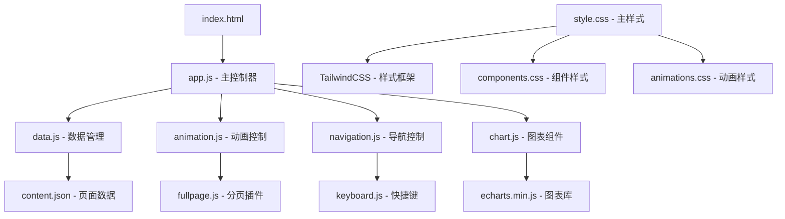

# Design Document

## Overview

本设计文档定义了《AI协作能力：大学生未来发展的新维度》网页版PPT的技术架构和实现方案。系统将采用现代Web技术栈，创建一个高质量的交互式演示平台，具备全屏分页、科技感视觉效果和流畅动画体验。

核心设计理念：模块化架构 + 数据驱动渲染 + 组件化开发，确保代码可维护性和扩展性。

## Steering Document Alignment

### Technical Standards (tech.md)
- 采用HTML5 + CSS3 + ES6+现代Web标准
- 通过CDN引入外部依赖，减少本地资源管理复杂度
- 模块化CSS架构，使用TailwindCSS提供一致的样式系统
- 响应式设计原则，确保多设备兼容性

### Project Structure (structure.md)
- 静态网页结构，便于部署和维护
- 资源文件分类组织（images/, styles/, scripts/, data/）
- 组件化开发模式，便于复用和测试

## Code Reuse Analysis

### Existing Components to Leverage
- **imgs/目录**: 直接复用现有的所有图片资源，保持路径引用一致性
- **Markdown内容**: 将现有内容转换为结构化JSON数据，便于渲染
- **外部链接**: 保持原有链接结构，确保功能完整性

### Integration Points
- **fullpage.js库**: 集成现代滚动分页功能
- **ECharts 5**: 集成数据可视化组件
- **TailwindCSS**: 集成现代CSS框架
- **Google Fonts**: 集成优质字体资源

## Architecture

采用 **前端MVC模式** + **组件化架构**，实现数据与视图分离，便于维护和扩展。

### Modular Design Principles
- **Single File Responsibility**: HTML负责结构，CSS负责样式，JS负责交互逻辑
- **Component Isolation**: 页面模板、动画控制器、数据管理器独立开发
- **Service Layer Separation**: 数据层(JSON)、渲染层(Templates)、交互层(Controllers)分离
- **Utility Modularity**: 工具函数按功能模块化组织



## Components and Interfaces

### Component 1: 主控制器 (app.js)
- **Purpose:** 应用初始化、页面渲染协调、全局状态管理
- **Interfaces:** 
  - `init()` - 应用初始化
  - `renderPage(pageIndex)` - 渲染指定页面
  - `updateNavigation(current, total)` - 更新导航状态
- **Dependencies:** data.js, animation.js, navigation.js
- **Reuses:** fullpage.js配置和事件处理

### Component 2: 数据管理器 (data.js)
- **Purpose:** 内容数据管理、页面数据解析、图片路径处理
- **Interfaces:**
  - `loadContent()` - 加载页面内容数据
  - `getPageData(index)` - 获取指定页面数据
  - `processImagePaths()` - 处理图片路径引用
- **Dependencies:** content.json
- **Reuses:** 现有markdown内容结构

### Component 3: 动画控制器 (animation.js)
- **Purpose:** 页面切换动画、视差效果、加载动画
- **Interfaces:**
  - `initAnimations()` - 初始化动画系统
  - `pageTransition(direction)` - 页面切换动画
  - `parallaxScroll(offset)` - 视差滚动效果
- **Dependencies:** CSS动画类、GSAP或原生动画API
- **Reuses:** Apple风格动画范式

### Component 4: 导航控制器 (navigation.js)
- **Purpose:** 页码导航、快捷键支持、进度指示
- **Interfaces:**
  - `setupKeyboard()` - 配置快捷键
  - `updateProgress(current, total)` - 更新进度指示
  - `jumpToPage(index)` - 跳转到指定页面
- **Dependencies:** app.js主控制器
- **Reuses:** 标准键盘事件处理

### Component 5: 图表组件 (chart.js)
- **Purpose:** ECharts图表渲染、主题配置、数据可视化
- **Interfaces:**
  - `renderChart(containerId, data, type)` - 渲染图表
  - `applyTheme()` - 应用黑红主题
  - `resizeCharts()` - 响应式图表调整
- **Dependencies:** echarts.min.js
- **Reuses:** 现有数据内容，转换为图表数据

## Data Models

### PageContent Model
```javascript
{
  id: "string", // 页面唯一标识
  type: "title|content|chart|image", // 页面类型
  title: "string", // 页面标题
  subtitle: "string", // 副标题（可选）
  content: "string|array", // 页面内容（文字或列表）
  images: ["string"], // 图片路径数组
  links: [{ // 外部链接数组
    text: "string",
    url: "string"
  }],
  animations: { // 动画配置
    entrance: "string", // 入场动画
    exit: "string", // 退场动画
    duration: "number" // 动画时长
  },
  layout: "string" // 页面布局类型
}
```

### ChartData Model
```javascript
{
  id: "string", // 图表唯一标识
  type: "line|bar|flowchart", // 图表类型
  title: "string", // 图表标题
  data: "object", // ECharts配置对象
  theme: { // 主题配置
    backgroundColor: "#000000",
    primaryColor: "#E31937",
    textColor: "#FFFFFF"
  }
}
```

### NavigationState Model
```javascript
{
  currentPage: "number", // 当前页面索引
  totalPages: "number", // 总页面数
  history: ["number"], // 访问历史
  bookmarks: ["number"] // 书签页面
}
```

## Error Handling

### Error Scenarios
1. **图片加载失败:** 
   - **Handling:** 显示占位符，记录错误日志
   - **User Impact:** 显示友好的错误提示，不影响整体体验

2. **外部库加载失败:**
   - **Handling:** 降级到基础功能，显示加载错误提示
   - **User Impact:** 基础浏览功能可用，高级动画功能不可用

3. **数据解析错误:**
   - **Handling:** 使用默认配置，记录错误详情
   - **User Impact:** 显示基础内容，部分功能可能受限

4. **浏览器兼容性问题:**
   - **Handling:** 特性检测 + 优雅降级
   - **User Impact:** 在不支持的浏览器中提供基础体验

## Testing Strategy

### Unit Testing
- 数据管理器的内容解析功能测试
- 动画控制器的状态管理测试  
- 导航控制器的事件处理测试
- 图表组件的渲染功能测试

### Integration Testing
- 页面切换流程测试
- 数据加载与渲染集成测试
- 动画与导航协调测试
- 响应式布局适配测试

### End-to-End Testing
- 完整PPT浏览流程测试
- 快捷键操作功能测试
- 多设备兼容性测试
- 性能和加载速度测试

### Manual Testing Checklist
- [ ] 所有页面内容完整显示
- [ ] 图片资源正确加载
- [ ] 外部链接正常跳转  
- [ ] 动画效果流畅自然
- [ ] 页码导航准确无误
- [ ] 响应式适配正常
- [ ] 浏览器兼容性良好