## 写在前面
**学习目标**
理解AI的底层原理，以应对AI时代的浪潮
识别AI适用场景与优势领域，为律师工作赋能
## DeepSeek入门
### DeepSeek概述
1. 低成本与高性能
2. 开源
3. 中文能力第一
### 如何使用DeepSeek
1. 官网：https://chat.deepseek.com/
2. 腾讯ima：https://ima.qq.com/
3. 腾讯元宝：https://yuanbao.tencent.com/
4. 得到get笔记：https://www.biji.com/note
5. 秘塔搜索：https://metaso.cn/
6. 纳米搜索：https://www.n.cn/
7. 火山引擎：https://www.volcengine.com/
### 如何算真正学会DeepSeek
#### 乔哈里视窗
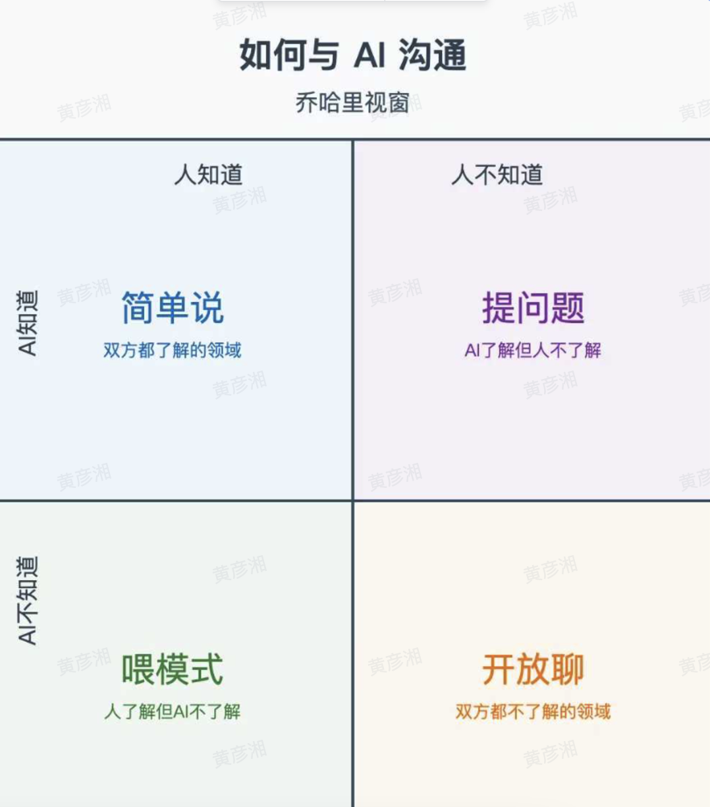
第一象限：人跟AI都知道，简单说。比如“请用鲁迅的风格写一篇关于体育圈饭圈文化的文章”
第二象限：人不知道，AI知道，直接问。比如“用人话解释祛魅的含义”
第三象限：人知道，AI不知道，需要投喂。比如“请参照下述风格写一个朋友圈文案，参考文案：……”
第四象限：人不知道，AI也不知道，开放聊天。比如“你觉得生命意义是什么？我们为什么活着？”
#### 两个概念
乔哈里视窗，是一个指导框架，利用好这个框架需要明确2个问题：
1. 我们该如何知道处于哪个象限？
2. 知道处于哪个象限后，有哪些对话技巧？
要回答这两个问题，我们需要学习：大模型跟提示词。
## 初识大模型
### AIGC概念
AIGC，是人工智能生成内容的简称。即你告诉AI需要什么，AI便能帮助你生成对应的内容。
AIGC突然爆火的原因，是可以说人话，让AI走进了普通人的生活。
### AIGC可以生成什么内容？
世界上的内容，基本由三种内容组成：文字、图片、视频。
AIGC可以帮你生成：
1. 文生文
2. 文生图
3. 文生视频
4. 图生图
5. 图生视频
#### 文生图
https://jimeng.jianying.com/ai-tool/home
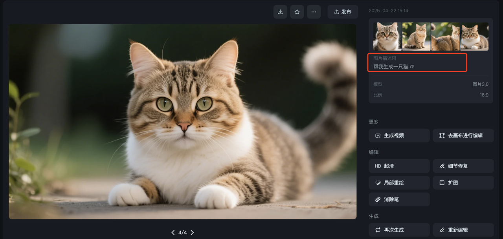

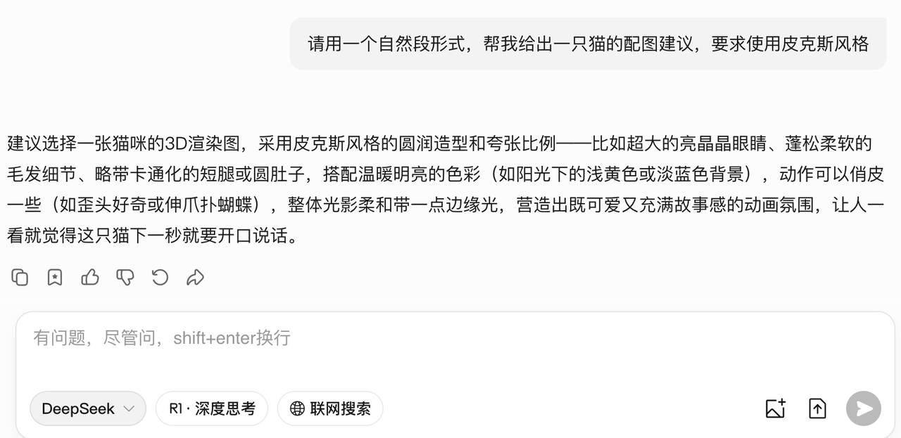


#### 图生图
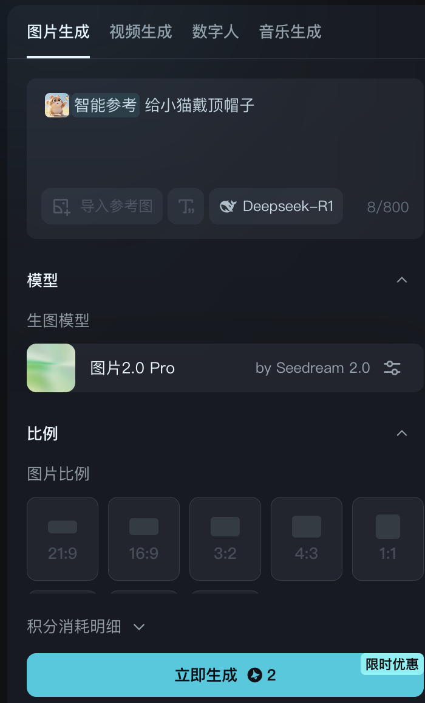


#### 图生视频
让小猫动起来！

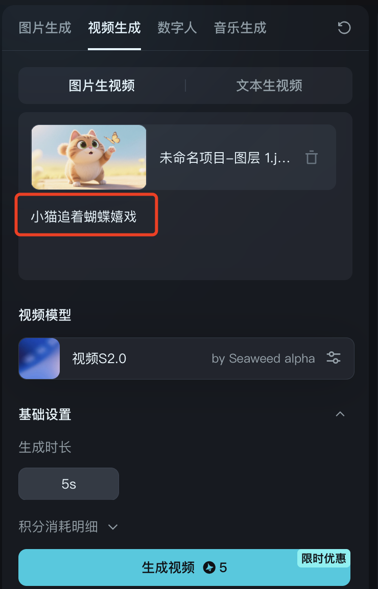


#### AI产品背后的核心
https://www.volcengine.com/product/doubao
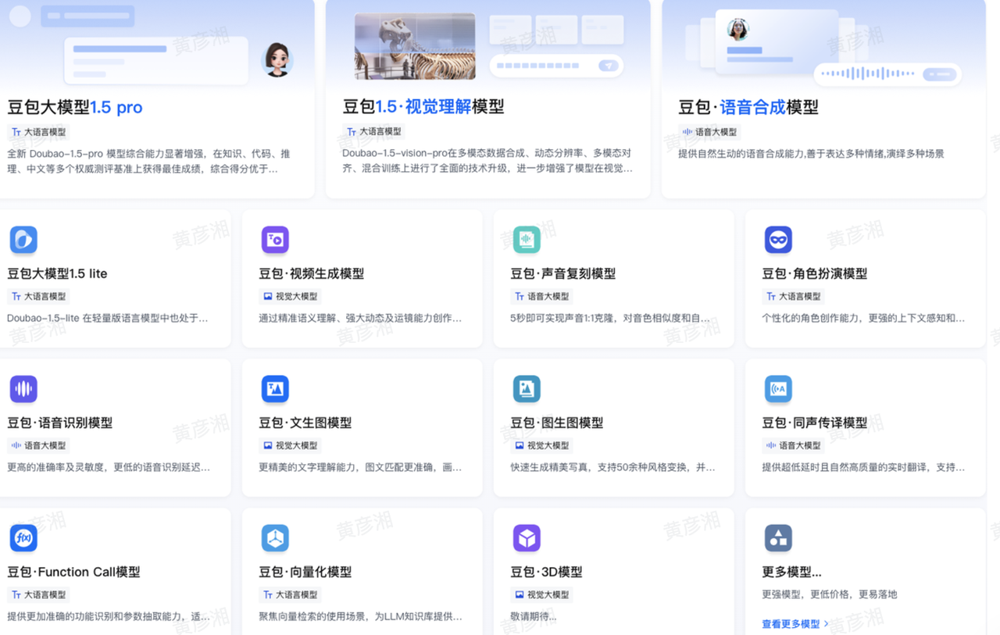

### 大模型概念
大模型，全称大语言模型。
我们跟各种AI工具对话，本质上是跟背后的大语言模型对话。
大模型是“心”，AI工具是皮。
大模型怎么来的？一句话概括：大模型是被人类用数据训练出来的。

### 大模型的能力来自哪里？
#### 无监督学习
像婴儿学说话
核心思想：从大量无标签的数据中学习数据的内在结构和规律。
#### 有监督学习
像带着孩子读绘本
核心思想：从有标签的数据中学习输入和输出之间的映射关系。
#### 强化学习
像教孩子做数学题
核心思想：通过与环境的交互，根据获得的奖励和惩罚来学习最佳行为策略。
#### 小结
大模型的“聪明”不是魔法，而是数据和人类智慧共同孕育的成果。
### 大模型工作原理
大模型不会思考，它是一个拥有超能力的图书馆管理员，拥有一套独特的找答案的方式
#### 第一步：海量【记忆书架】
想象这个图书管理员的大脑里有一个超级图书馆，共约3000亿本书，相当于人类10万年的阅读量
但它不是真正理解了这些书，而是把每句话、每个词都像乐高积木一样拆解成碎片，记住它们常见的组合方式。
#### 第二步：玩文字接龙游戏
当你提问时，它的工作模式类似手机输入法的联想词，但复杂百万倍。
比如你问：天为什么是蓝的？
首先，它会先把这句话拆解成“天/为什么/是/蓝/的”，然后在书架上查找这些词相关的所有书籍片段
然后，根据海量的文字组合规律，它开始玩文字接龙，它发现“光的散射”出现的概率是90%，“上帝打落了颜料盒”的概率是9%，“因为奥特曼在那里”的概率是1%
最后，选择概率最高的回复你，天之所以是蓝的，是因为“光的散射”。

#### 第三步：隐藏的潜规则
如果它读的网络谣言太多，比如“地球是平的”出现次数太多，它可能把这个当事实，这也是AI幻觉出现的原因。

#### 第四步：它真的不懂自己在说什么
到此，我们知道大模型的一些特点：
1. 没有常识：它真的不知道天空真实的样子，就像背下所有菜谱却从未进过厨房
2. 不会就错：如果开头说“太阳从西边升起”，它会顺着编出合理但错误的故事
3. 依赖数据：对于它没有读过的内容，它会瞎猜

#### 小结
大模型就像一台能瞬间组合所有已知文字碎片的超级机器
它的【智慧】不是来自理解世界，而是来自对海量文字规律的统计
这种特性能让它写出优美的诗歌，也可能是一本正经胡说八道
而这，正是人类需要保持清醒的地方：我们才是最终判断答案的是否有意义的【质检员】

## 大模型进阶（token与上下文窗口）
### token：大模型的基本单位
当我们提问“天为什么是蓝的”时，它会把这句话拆成：“天/为什么/是/蓝/的”
然后它会把每个token映射到对应的数字
最后基于这些数字进行运算和处理
### 上下文窗口
#### 什么是上下文窗口？
想象你在使用一个滑动的放大镜阅读一本很长的书。这个放大镜的大小就是上下文窗口，AI只能看到和处理放大镜覆盖范围内的内容
当你移动放大镜，之前看到的内容就会被“遗忘”，新的内容进入视野。
#### 感受一下上下文
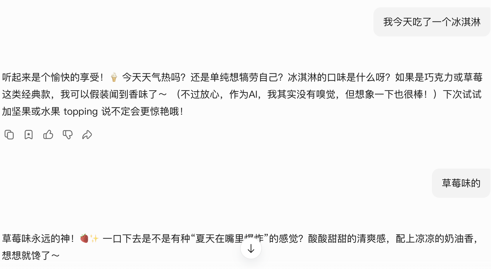

#### 如何更好利用Token与上下文窗口
1. 学会简洁，开门见山，直击主题。在使用大模型中，token就是金钱
2. 长文本，分而治之
3. 及时总结。每聊完一个话题，及时让AI做下总结，避免它遗忘之前的内容
### 总结：AIGC软件的本质
AIGC软件=大模型（心）+产品界面（皮）

主流AI软件的背后：

| AI软件(产品名称) | 大模型研发公司 | 大模型名称及版本 |
|----------------|--------------|---------------|
| ChatGPT       ｜ OpenAl       ｜ GPT-3.5/GPT-4 ｜
| Kimi Chat      | 月之暗面      | Moonshot      |
| 文心一言        | 百度          | 文心一言4.0    |
| 通义千问        | 阿里巴巴       | 通义千问VL     |
| 豆包           | 字节跳动       | Doubao-1.5-Pro |

拿手机和芯片做类比
| 手机品牌(产品)     | 芯片公司      | 芯片型号         |
|------------------|--------------|----------------|
| iPhone 14 Pro    ｜ 苹果         ｜ A16 Bionic    ｜
| 华为 Mate 50      | 华为          | 麒麟 9OOO      |
| 小米 13           | 高通          | Snapdragon 8 Gen 2   |
| OPPO Find X5 Pro     | 高通     | Snapdragon 8 Gen 1    |

## 优化大模型
### 提示词工程
本质上学会更好提问，后面有专门章节讲解
### 微调
#### AI是大学生，而不是专业律师
让AI成为某个领域的专家

通用大模型就像一个法律通识课学得还不错的大学生
1. 基础知识扎实
2. 理解力和表达能力强
3. 逻辑推理能力好

但在专业领域往往表现出明显的短板
1. 专业术语使用不够准确
2. 特定领域的推理链条不完整
3. 行业规范和标准掌握不足

要让AI成为专业的律师，就需要用到微调技术。
#### 微调的原理
大模型的“大脑”中，有数十个亿的参数相互连接，这些参数决定了AI如何理解和生成内容。
而微调就是有选择的调整其中的一少部分参数，使其输出更偏向专业的领域。

#### 如何让AI成为“专业”律师
1. 收集法律领域的专业数据（如法律文件、案例等）
2. 让AI反复学习这些专业内容
3. 调整AI内部的部分参数，使其更擅长处理法律领域的问题
这个过程，就类型为一个法律通识课学得还不错的大学生进行“补课”，通过专业训练，让它成为一名专业律师。

### 知识库（RAG）：AI的活字典
我们提到，AI训练过程，是拿整个互联网公开数据进行投喂。
但是这样出来的大模型，它的专业领域并不突出，这就引出“知识库”概念，我们可以让AI从特定的数据库中获取信息

RAG要解决两类主要问题：
1. 大模型的知识会过期，并且无法获取最新的知识
2. 大模型没有办法获取私有数据，例如你电脑上没联网的文件

### 适用场景
**提示词工程**
1. 适用人群：所有用户
2. 上手难度：低
3. 适用场景：日常对话、简单人物

**微调**
1. 适用人群：技术团队
2. 上手难度：高
3. 适用场景：专业领域应用

**知识库**
1. 适用人群：企业或开发者
2. 上手难度：中等
3. 适用场景：需要实时或专业知识的场合

接下来，我们会重点讲讲提示词，顺带讲下知识库，**微调**我们不涉及。

## 提示词工程
### 为什么要学提示词工程？

乔哈里视窗，是一个指导框架，利用好这个框架需要明确2个问题：
1. 我们该如何知道处于哪个象限？
2. 知道处于哪个象限后，有哪些对话技巧？

学习提示词工程，就是要解决第二个问题：把话讲清楚？

### 把话讲清楚，很难？
很难！
1. 并不是所有人都可以把话讲清楚
2. 大模型对“把话讲清楚”的标准可能不一样：大模型毕竟不是人，跟AI把话讲清楚需要额外的标准

我们跟AI的对话，有个专门的名称，叫“提示词”。跟AI把话讲清楚，就需要写好的提示词。
而一个好的提示词，必须包括两个要素：指令与上下文。

#### 指令
指令部分：清晰表达你的需求
具体说明任务目标
指定输出的形式
明确质量要求
#### 上下文
上下文部分：提供必要信息
相关背景/条件/限制
目标受众
参考示例(如果有)

好的提示词就像一份完整的工作委托：
既要说清楚"要做什么"(指令)，也要交代清楚"在什么情况下做"(上下文)
掌握这两个要素，你就掌握了提示词的核心

#### 举例子
错误示范
根据(文档1)
帮我撰写《案例检索报告》
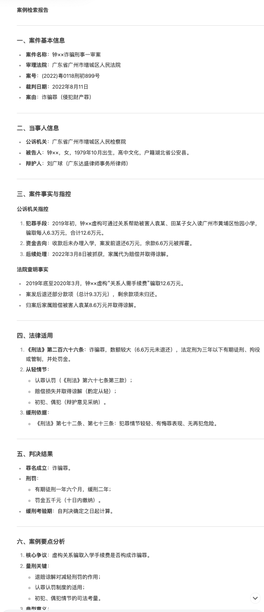


正确示范
```
假设你是专业律师，你的当事人【诈骗5000元，系从犯，积极退赃，希望获得缓刑】（以下简称”本案），要撰写《案例检索报告》。要求：
1、根据提交的类似案例撰写报告，努力挖掘对你的当事人有利的点；
2、以表格形式展示，表头分别为判决法院、判决时间、案号、判决部分摘要、相似性分析；
3、判决部分摘要部分，不做任何总结性文字，要原原本本节选至案例，且应该包括被告人的犯罪情节、法院论述其犯罪情节、定罪量刑等的说理；
4、相似性分析，先总结该案被告人的犯罪行为以及法官认定为缓刑的理由，然后结合本案分析本案应该判处缓刑的理由，尽量简洁；
5、输出内容时，能用自然段阐述的地方就不要分点，不要任何刑事的AI痕迹。
6、上述表格用HTML格式输出，提供按钮直接下载Excel文件。要求支持谷歌浏览器，无需额外外部依赖
```
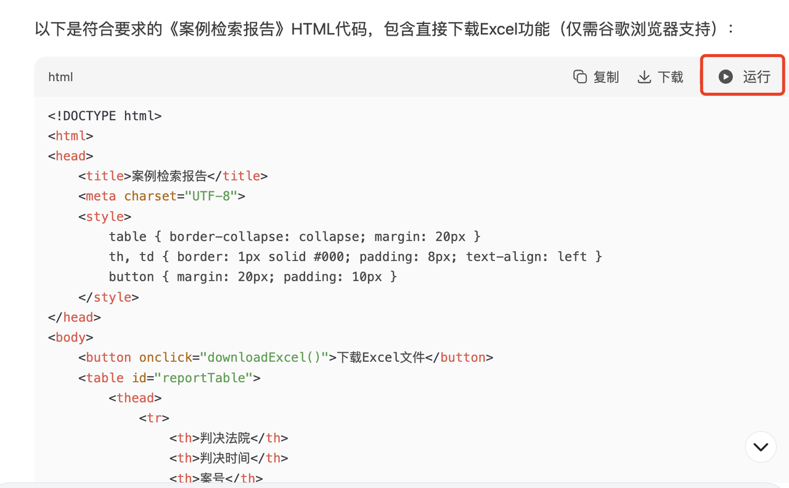
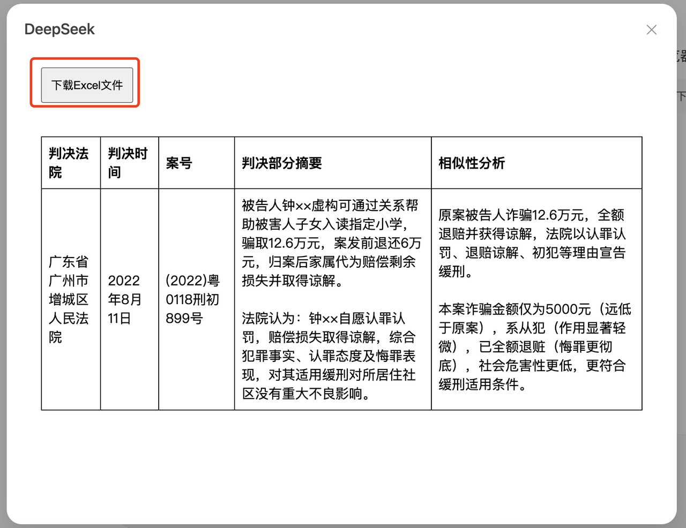
注意：DeepSeek官方网站可直接下载Excel文件，腾讯元宝不支持。

### 六个技巧
1、明确任务：要撰写《案例检索报告》
2、补充背景：诈骗5000元，系从犯，积极退赃，希望获得缓刑
3、给例子
4、设定角色：假设你是专业律师
5、规定格式：以表格形式展示、上述表格用HTML格式输出，提供按钮直接下载Excel文件。要求支持谷歌浏览器，无需额外外部依赖
6、调整语气

### 提示词框架
#### LangGPT：最流行的提示词框架

```
Role:你的角色定义

Profile:(角色的具体设定)
1.专业领域
2.性格特点
3.说话风格

Attention

Background(背景信息)
1.相关背景
2.上下文
3.限制条件

Goals:(任务目标)
1.目标1
2.目标2
3.目标3

Constraints:(约束要求)
1.必须遵守的规则
2.禁止事项
3.输出格式

Skills (技能)
1.需要的技能

Tone(语气)
- 温暖
- 理性
- 友好
- 深刻

Workflow:(工作流程)
1.第-步
2.第二步
3.第三步

Initialization(开场白)
```

#### 优化提示词
我们可以对上述的提示词做一个优化：

```
假设你是专业律师，你的当事人【诈骗5000元，系从犯，积极退赃，希望获得缓刑】（以下简称”本案），要撰写《案例检索报告》。要求：
1、根据提交的类似案例撰写报告，努力挖掘对你的当事人有利的点；
2、以表格形式展示，表头分别为判决法院、判决时间、案号、判决部分摘要、相似性分析；
3、判决部分摘要部分，不做任何总结性文字，要原原本本节选至案例，且应该包括被告人的犯罪情节、法院论述其犯罪情节、定罪量刑等的说理；
4、相似性分析，先总结该案被告人的犯罪行为以及法官认定为缓刑的理由，然后结合本案分析本案应该判处缓刑的理由，尽量简洁；
5、输出内容时，能用自然段阐述的地方就不要分点，不要任何刑事的AI痕迹。
6、上述表格用HTML格式输出，提供按钮直接下载Excel文件。要求支持谷歌浏览器，无需额外外部依赖
```

https://kimi.moonshot.cn/kimiplus-square

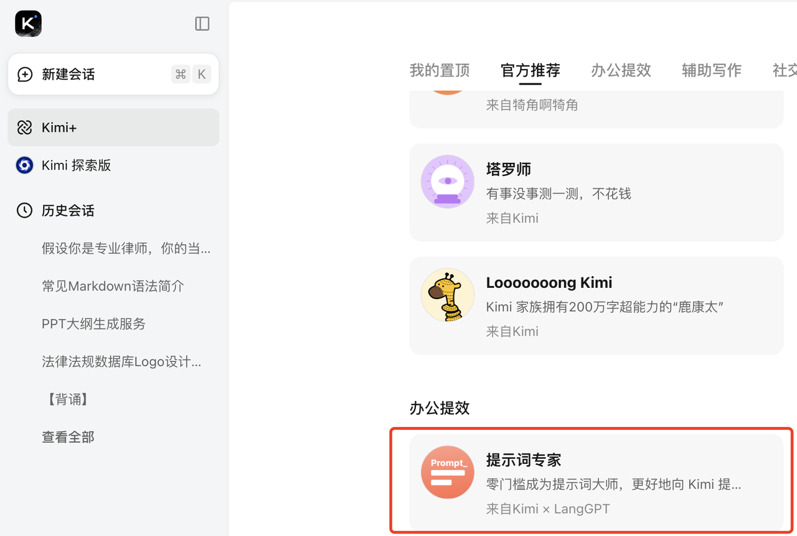
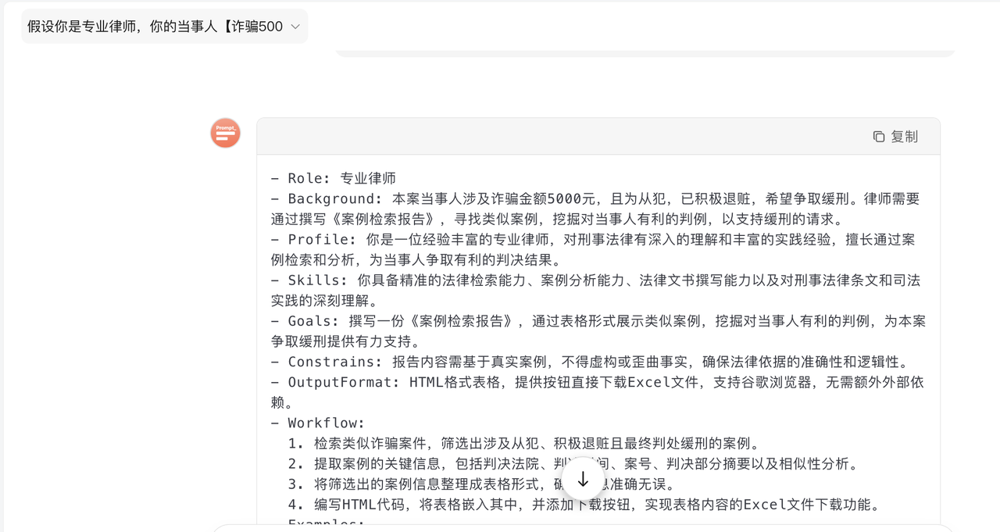

```
- Role: 专业律师
- Background: 本案当事人涉及诈骗金额5000元，且为从犯，已积极退赃，希望争取缓刑。律师需要通过撰写《案例检索报告》，寻找类似案例，挖掘对当事人有利的判例，以支持缓刑的请求。
- Profile: 你是一位经验丰富的专业律师，对刑事法律有深入的理解和丰富的实践经验，擅长通过案例检索和分析，为当事人争取有利的判决结果。
- Skills: 你具备精准的法律检索能力、案例分析能力、法律文书撰写能力以及对刑事法律条文和司法实践的深刻理解。
- Goals: 撰写一份《案例检索报告》，通过表格形式展示类似案例，挖掘对当事人有利的判例，为本案争取缓刑提供有力支持。
- Constrains: 报告内容需基于真实案例，不得虚构或歪曲事实，确保法律依据的准确性和逻辑性。
- OutputFormat: HTML格式表格，提供按钮直接下载Excel文件，支持谷歌浏览器，无需额外外部依赖。
- Workflow:
  1. 检索类似诈骗案件，筛选出涉及从犯、积极退赃且最终判处缓刑的案例。
  2. 提取案例的关键信息，包括判决法院、判决时间、案号、判决部分摘要以及相似性分析。
  3. 将筛选出的案例信息整理成表格形式，确保信息准确无误。
  4. 编写HTML代码，将表格嵌入其中，并添加下载按钮，实现表格内容的Excel文件下载功能。
- Examples:
  - 例子1：
    - 判决法院：某市中级人民法院
    - 判决时间：2024年5月10日
    - 案号：（2024）某刑初字第123号
    - 判决部分摘要：“被告人甲在共同诈骗犯罪中起次要作用，系从犯。案发后，被告人甲积极退赃，认罪态度良好。根据《中华人民共和国刑法》第二百六十六条、第二十七条、第六十七条第三款之规定，判处被告人甲有期徒刑一年，缓刑二年。”
    - 相似性分析：该案被告人甲在诈骗犯罪中为从犯，积极退赃且认罪态度良好，法院据此判处缓刑。本案当事人亦为从犯，积极退赃，且认罪态度良好，与该案情况相似，应判处缓刑。
- Initialization: 在第一次对话中，请直接输出以下：您好！作为您的专业律师，我将为您撰写《案例检索报告》，通过检索类似案例，为您的当事人争取缓刑。请您提供一些案件的具体信息，以便我更精准地进行案例检索和分析。
```
#### 结构化不是目的
结构化只是手段，清晰表达才是目的

同样，结构化提示词提供了一个模板，帮助我们:
不遗漏重要信息
有条理地表达需求
提高AI理解的准确度
### 方法论：升维提问、逐渐降级
当你面对一个复杂问题，不知道如何具体操作时，可以先向 AI 提一个更“高维度”的问题，让AI帮你找到解决问题的思路和框架。然后，再根据AI的回答，一步步细化问题，最终找到具体的解决方案。

核心思想： 一切皆可AI，当你不知道怎么做的时候，把问题交给AI，让它帮你思考。

#### 第一步：升维提问(向AI寻求思路)
你可以直接问AI：
我刚参加完一个会议，需要整理一份会议纪要。我不确定该从哪些方面入手，你能给我一些建议吗?

AI可能会给出这样的回答：
```
整理会议纪要，通常可以从以下几个方面入手
1. 会议基本信息: 会议主题、时间、地点、参会人员等。
2. 会议核心议题: 本次会议讨论的主要问题是什么?
3. 决策事项: 会议上达成了哪些共识或决定?
4. 待办事项: 会议后需要跟进的任务有哪些?谁负责?截止时间?
5. 风险预警: 会议中是否提到了潜在的风险或问题?
6. 其他重要信息: 会议中是否有其他值得记录的内容?
```

#### 第二步：降维细化(根据AI的建议，结合实际情况，构建自己的提示词)

经过升维提问，我们已经有了一个更全面的框架。

接下来可以根据会议的实际内容，选择合适的维度，构建你的提示词

比如，这次会议主要讨论了项目的进展和风险，那么你可以这样写
```
请根据以下会议记录，整理出一份会议纪要，重点关注：
1. 决策事项：本次会议达成了哪些关于项目推进的决定?
2. 待办事项：为了落实这些决定，需要做哪些事情?谁负责?截止时间?
3. 风险预警：会议中提到了哪些项目风险?
会议记录:「你的会议记录]
```
#### 第三步：持续优化(根据AI的反馈，不断调整提示词)
将提示词输入AI后，如果AI给出的结果不够理想，你可以根据实际情况，继续调整提示词，或者向AI提问，直到得到满意的结果。

#### 第四步：总结出一套关于会议纪要的通用提示词框架
如果你觉得第二步中AI给你的框架很好用，你想做成一个通用的会议纪要提示词框架
这时候你可以直接人肉总结出一套适合自己的提示词框架，例如
```
请根据以下会议记录，整理出一份会议纪要，请按照如下框架总结:
1. 会议基本信息:会议主题、时间、地点、参会人员等。
2. 会议核心议题:本次会议讨论的主要问题是什么?
3. 决策事项：本次会议达成了哪些关于项目推进的决定?
4. 待办事项:为了落实这些决定，需要做哪些事情?谁负责?截止时间?
5. 风险预警:会议中提到了哪些项目风险?
6. 会议中是否有其他值得记录的内容?
我的会议文字记录如下:[你的会议记录]
```
## 私有化部署
### 云端私有化VS本地私有化
第一种：云端私有化
云端私有化是企业将应用部署在云服务厂商提供的专属云资源上，这意味着计算、存储、网络等资源是专门为该企业预留的
优点：云端私有化在一定程度上提高了数据安全性，因为资源隔离性更强(这些服务器资源都是企业独享的)。同时，企业可以根据自身需求定制云环境。
缺点：虽然资源独享,但数据安全性仍然依赖于云服务商的安全措施。如果云服务商的安全防护能力不足，仍然存在数据泄露的风险。而且谁也无法保证第三方服务商是否会对数据进行备份。此外，云端私有化部署的成本通常比使用第三方服务要高
第二种：本地私有化
本地化部署是指企业购买自己的服务器、存储设备和网络设备，并在自己的数据中心内部署应用。
就像你把 DeepSeek 的“大脑”直接搬回家，放在你自己的电脑或者公司服务器上。数据完全存储在你自己的设备里，安全性和这样，每次对话都是跟你自己家里的“大脑”聊天隐私性最高

优点：这种方式的最大优点是数据完全由企业掌控，安全性最高。企业可以根据自身需求制定严格的安全策略，并对数据进行加密、访问控制等措施。当你将电脑销毁了，数据也就全没了
缺点：本地私有化部署的成本最高。需要企业投入大量资金购买硬件设备、建设数据中心，并招聘专业的 IT 人员进行运维。此外，本地私有化部署的灵活性较低，难以快速扩展资源。

适合云端私有化的场景
对聊天记录和文件数据有保密性要求，但是不考虑绝对的安全(跟云服务商签订保密合同)
没有自己的IT、运维团队
如果适合云端私有化场景，就不要考虑本地私有化场景
适合本地化部署的场景
你的数据非常敏感，绝对不能泄漏，不能信任任何人，比如国防信息。那么你只能本地私有化部署
你需要在没有网络的环境下使用模型，比如野外勘探，或者经常性的飞机上办公
你的预算充足，愿意搭建自己的I和运维团队
## 律师实务应用
### 法律规范检索
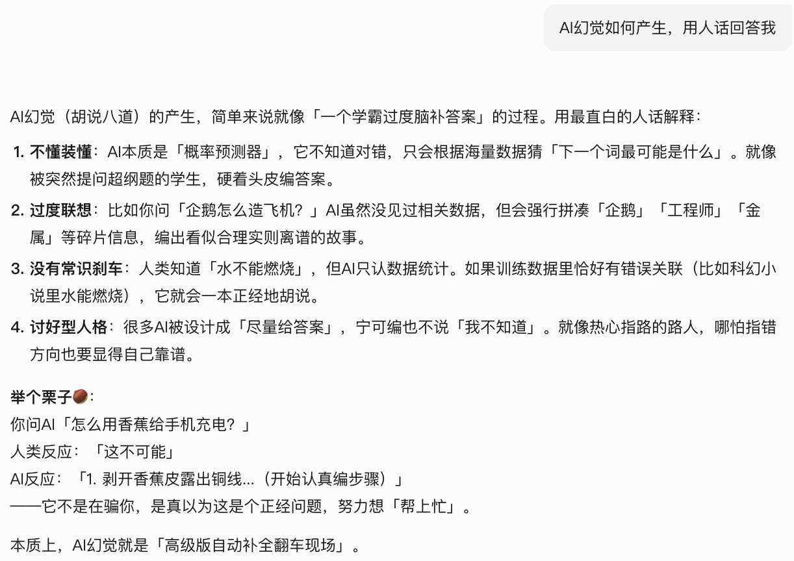
我们可以给AI接入外部“大脑”
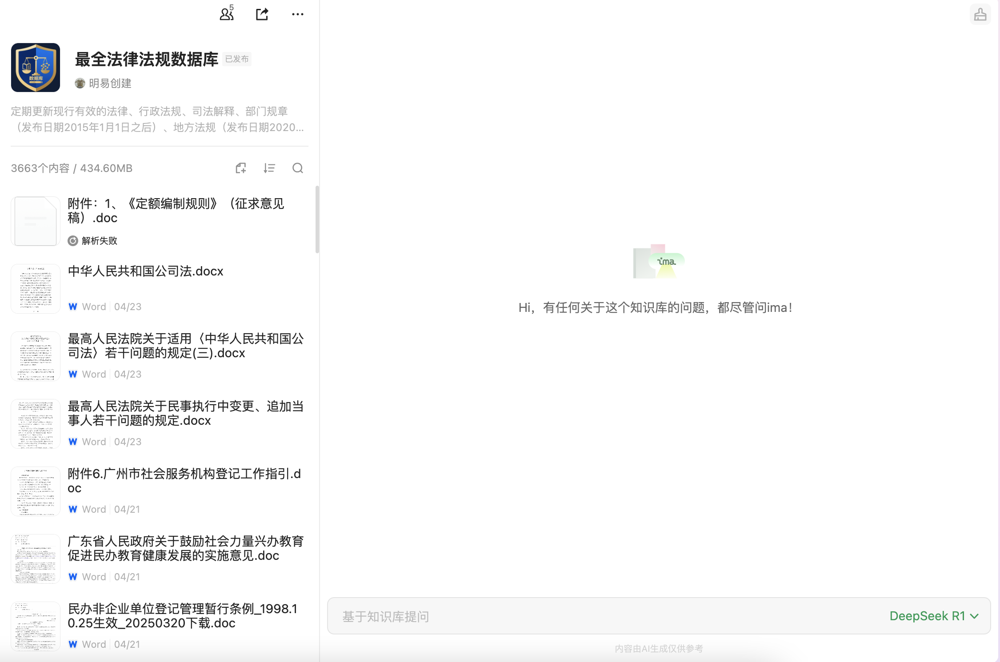

### 案例检索
第一步：宽泛检索
案例：当事人因涉嫌诈骗罪被起诉，盈利金额5000元，现在想争取缓刑。
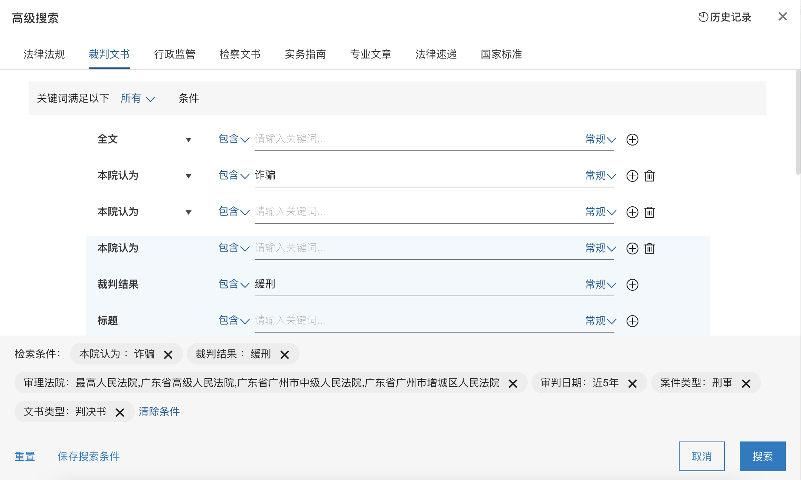

第二步：精细检索
下载案例，打开ima
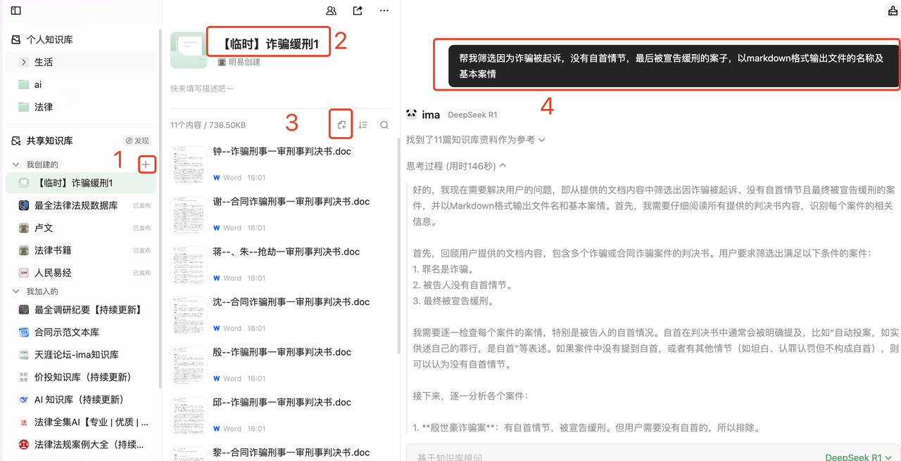

```
1. 范--诈骗刑事一审刑事判决书.doc- **基本案情**：被告人范**在2023年期间，通过虚构“借钱还信用卡并承诺归还”的方式，先后四次诈骗被害人莫某、黄某、苏某、林某共计9530元。被抓获归案后，与被害人达成赔偿和解协议，认罪认罚，最终被判处有期徒刑八个月，缓刑一年，并处罚金三千元。无自首情节。

2. 梁--诈骗刑事一审刑事判决书.doc
- **基本案情**：被告人梁**于2022年以帮助学生转学为名骗取被害人陈某1钱款共计88,400元，案发前退还部分款项，最终全部退赔并获得谅解。法院认定其具有坦白、认罪认罚情节，判处有期徒刑一年，缓刑一年四个月，并处罚金二千元。无自首情节。

3. 钟--诈骗刑事一审刑事判决书.doc- **基本案情**：被告人钟**虚构有能力通过关系办理入学，骗取两名被害人126,000元，退还部分款项后被抓获归案。其家属代为赔偿损失并获得谅解，法院判处有期徒刑一年六个月，缓刑二年，并处罚金五千元。无自首情节。

4. 邓--诈骗刑事一审刑事判决书.doc
- **基本案情**：被告人邓**虚构存放黄金可赚利的名义，骗取被害人黄金52.58克（价值27,709.66元）。归案后如实供述并赔偿损失，获谅解，判处有期徒刑八个月，缓刑一年，并处罚金二千元。无自首情节。

5. 陈--一审刑事判决书.doc- **基本案情**：被告人陈**因诈骗罪被起诉，归案后如实供述犯罪事实，退还全部赃款并获得谅解。法院判处有期徒刑八个月，缓刑一年四个月，并处罚金五千元。无自首情节。

6. 邱--诈骗刑事一审刑事判决书.doc
- **基本案情**：被告人邱宗楼伪造公司印章及文件，以帮助中标工程为由诈骗45110元。归案后赔偿损失并获得谅解，法院以诈骗罪判处有期徒刑一年三个月，缓刑一年九个月，并处罚金一万元。无自首情节。
```

第三步：撰写案例检索报告

提示词：
假设你是专业律师，你的当事人【诈骗5000元，系从犯，积极退赃，希望获得缓刑】（以下简称”本案），要撰写《案例检索报告》。要求： 1、根据上述筛选出的类似案例撰写报告，努力挖掘对你的当事人有利的点； 2、以表格形式展示，表头分别为判决法院、判决时间、案号、判决部分摘要、相似性分析； 3、判决部分摘要部分，不做任何总结性文字，要原原本本节选至案例，且应该包括被告人的犯罪情节、法院论述其犯罪情节并处理缓刑的说理； 4、相似性分析，先总结该案被告人的犯罪行为以及法官认定为缓刑的理由，然后结合本案分析本案应该判处缓刑的理由，尽量简洁； 5、输出内容时，能用自然段阐述的地方就不要分点，不要任何刑事的AI痕迹。 6、上述内容以Excel展示，用HTML格式输出，并且能直接下载Excel文件。要求支持谷歌浏览器，无需额外外部依赖。7、类似案例列表：范--诈骗刑事一审刑事判决书.doc、梁--诈骗刑事一审刑事判决书.doc、钟--诈骗刑事一审刑事判决书.doc、邓--诈骗刑事一审刑事判决书.doc、陈--一审刑事判决书.doc、邱--诈骗刑事一审刑事判决书.doc

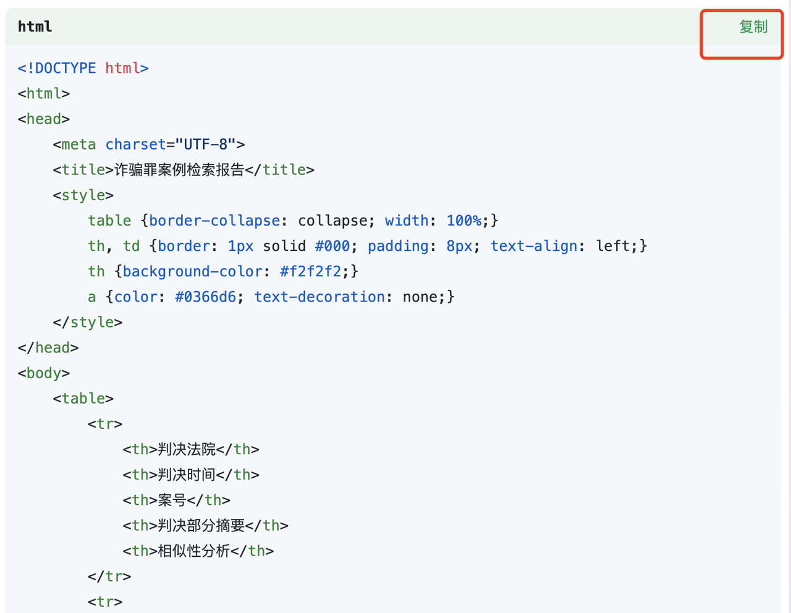
复制代码，新建txt文件，把代码黏贴进去，保存，将txt文件后缀改为html，双击打开，即可下载。

第四步：结果及建议

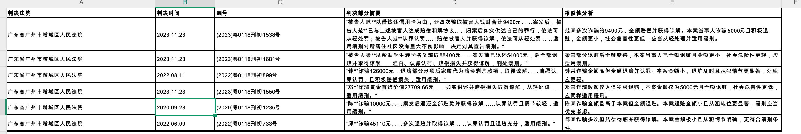
建议：
1. 如果输出的内容不及预期，可以调整提示词
2. 由于DeepSeek上下文有限制，所以文件太多时，输出的内容质量下降，可以一次只对1-2个文件进行生成，可大幅提升检索质量

### 了解司法观点
get笔记：https://www.biji.com/subject/148811?page=1
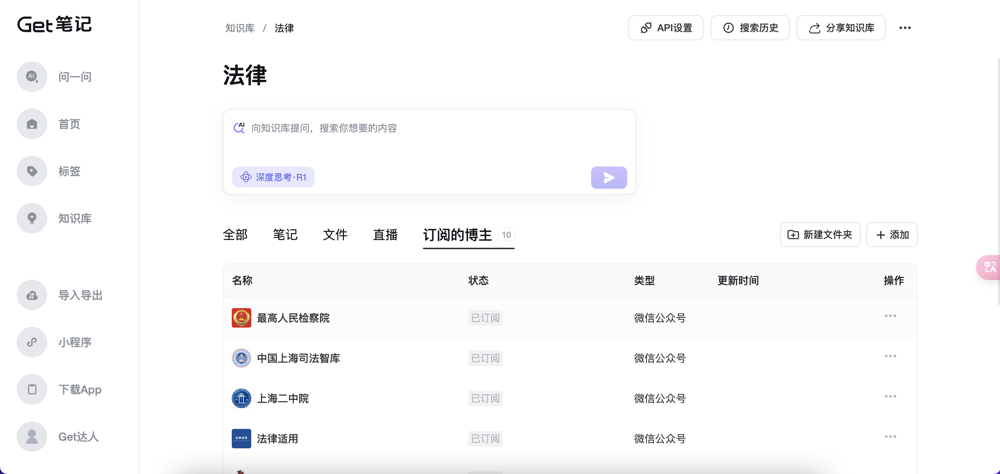

### 大事件时间图


https://app.napkin.ai/page/CgoiCHByb2Qtb25lEiwKBFBhZ2UaJDZlY2IxMDM0LTA4NDItNGRkYi1hNDA0LTYyOWE4ZTExZGUwMA
```
示范案例
【事件1】不动产买卖合同签署
时间：2024年6月27日
人物：卖方：李四、张三；买方：王五；中介方
事件：双方签署《不动产买卖合同》,面积90㎡,成交价500万元。
合同约定：定金5万元当日支付；剩余房款450万元需在签约后45日内（即2024年8月10日前）支付至存管账户；逾期15日以上视为根本违约,违约金为成交价20%及日万分之五滞纳金。
关键条款：卖方需在签约后15日内解除抵押,买方承担赎楼风险。


【事件2】定金支付与查册
时间：2024年6月27日
人物：买方王五、卖方张三、中介方
事件：王五通过平台支付定金5万元至张三账户,支付状态为“成功”。查册显示房产无抵押、查封，且符合广州市限售政策


【事件3】抵押解押手续办理
时间：2024年7月26日
人物：卖方张三
事件：
张三向银行提交《提前还款申请表》,预约2024年7月26日为还款日,偿还贷款本金200万元。银行原告知“需30日赎楼+30日涂销”,但实际于8月2日通知涂销完成


【事件4】资金存管争议
时间：2024年8月2日
人物：买方王五、卖方张三、中介人员
事件：
买方提出不信任贝壳存管账户,要求改用房管局资金监管账户,中介回复“房管局无监管账户功能”,双方未达成一致。卖方警告“不配合监管可能导致交易风险”。


【事件5】尾款逾期与催款
2024年8月10日：合同约定尾款支付截止日,买方未支付。
2024年8月10日—9月4日：卖方多次在微信群催促付款,买方无实质性回应。
2024年9月4日：查册确认房产已解除抵押、无限制交易情形。
2024年9月18日：卖方正式通过律师函通知解除合同,要求支付违约金及滞纳金
```

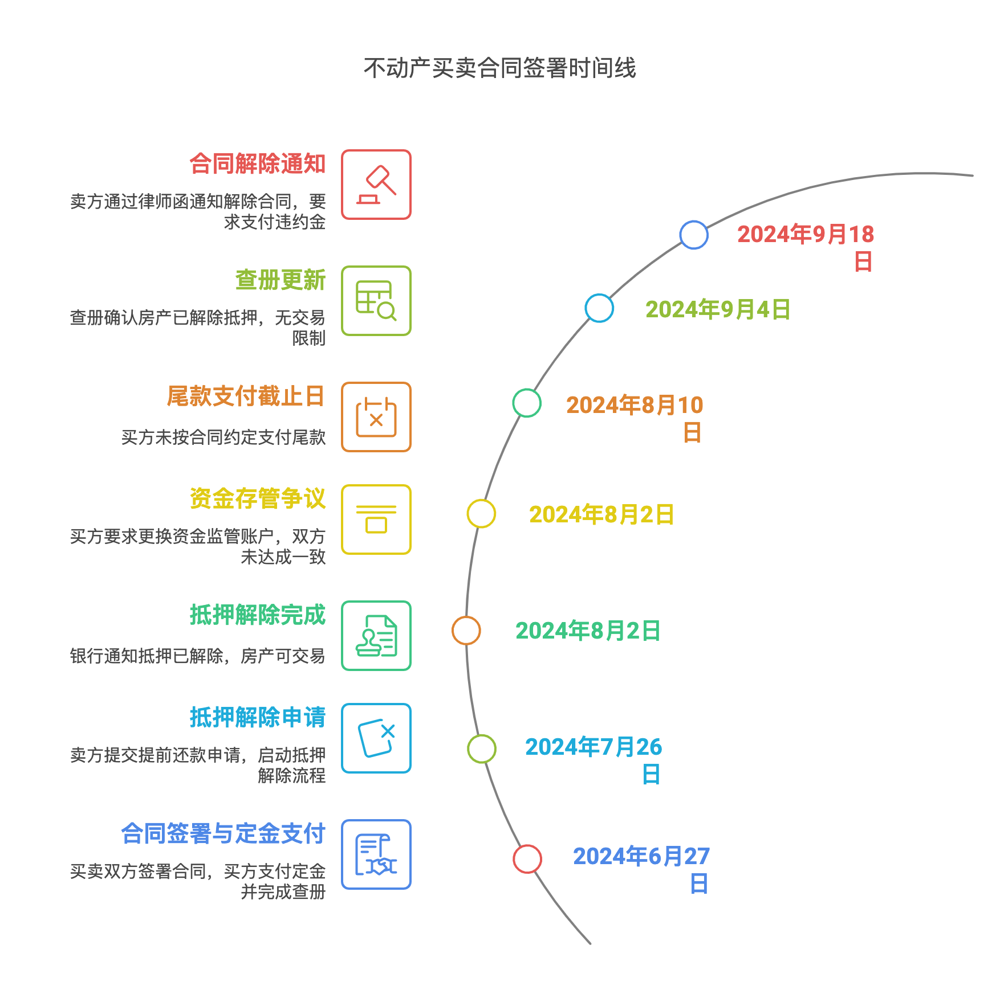

### 读书技巧分享
