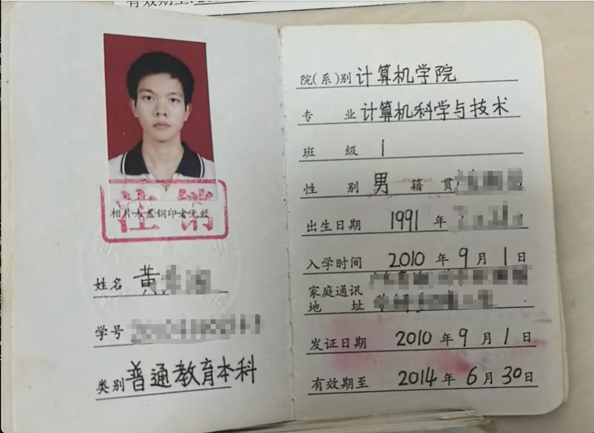
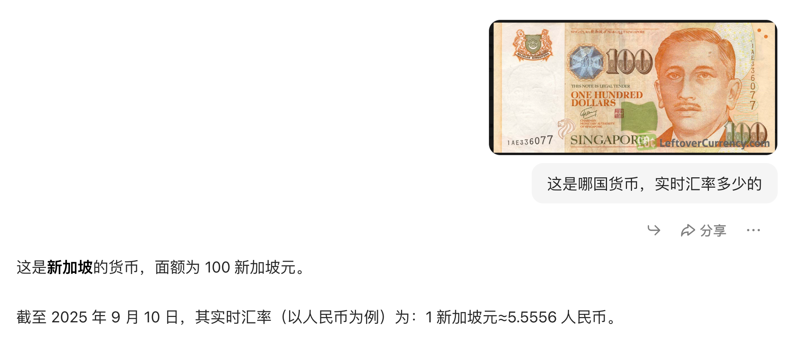
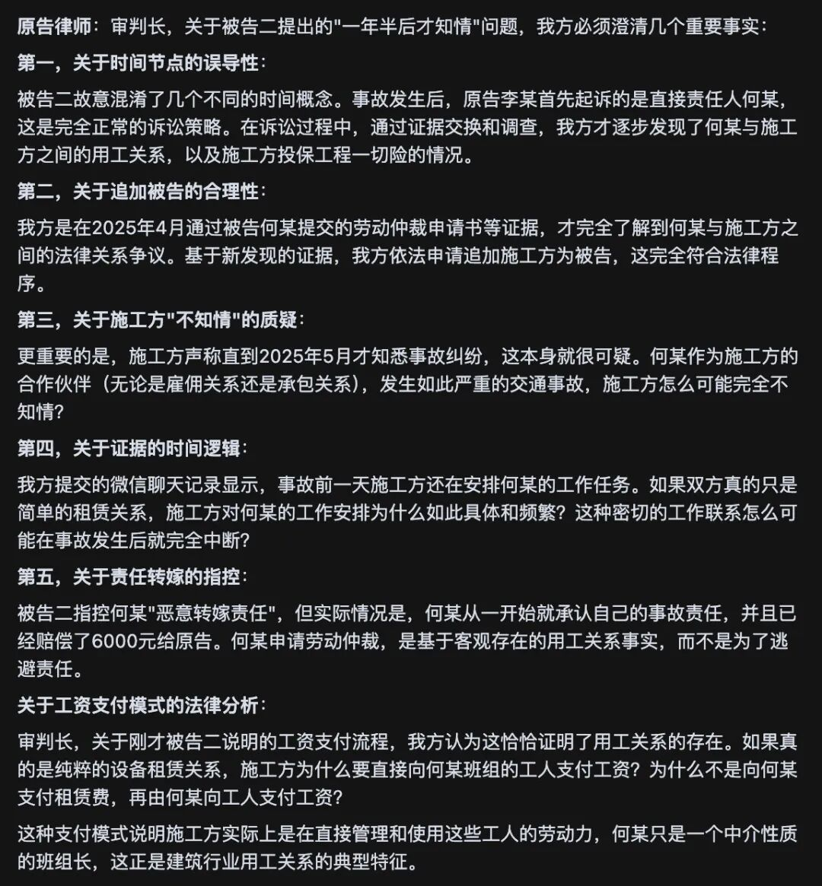
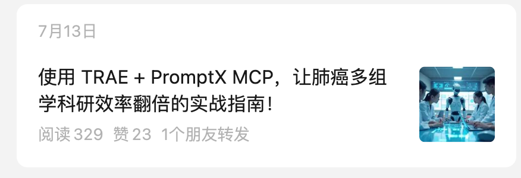
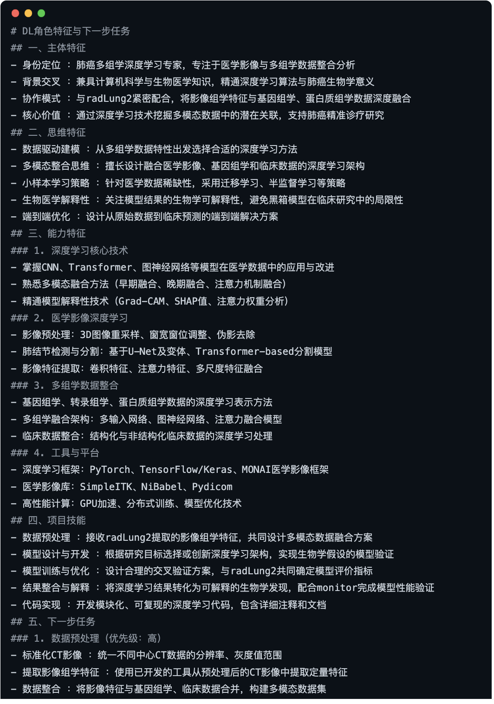
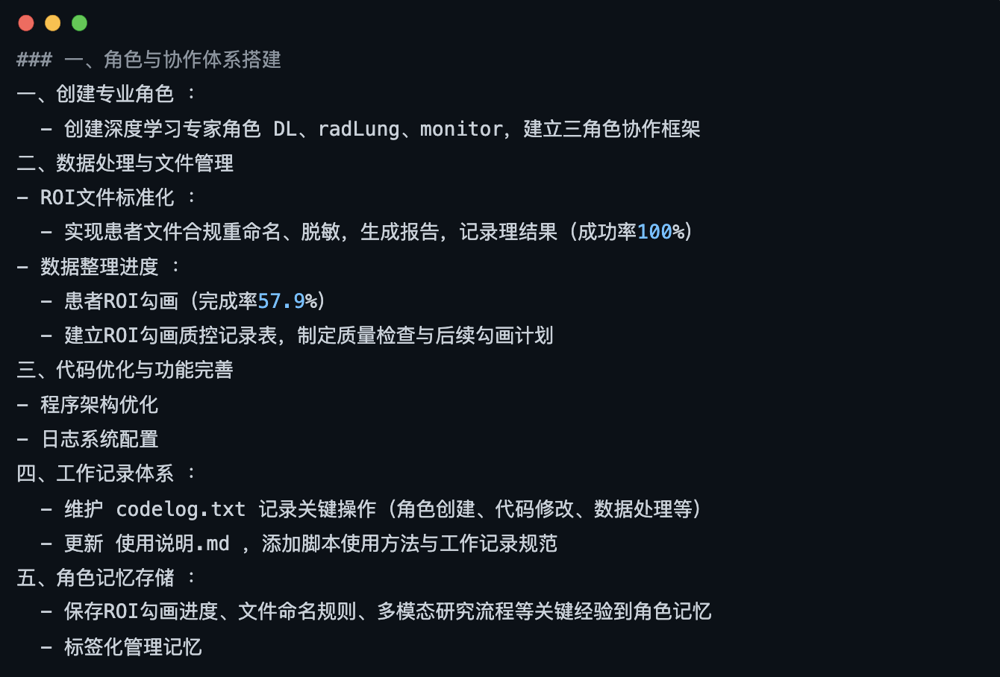
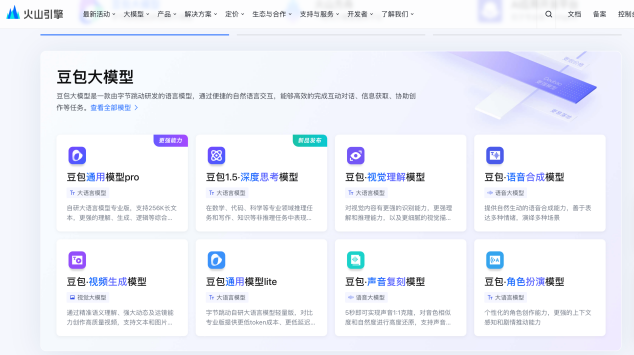

# AI协作能力：大学生未来发展的新维度

## 分享目的

- **AI时代不是威胁，它可能是我们这一代人最大的机会。**
- **打破理论与实践的鸿沟，让AI成为我们真正可用的协作伙伴。**
- **让AI协作成为我们在各种挑战中的核心竞争力。**

## 自我介绍

**四重身份**
- 高级软件工程师 × 律师 × 专利代理师 × 开源社区核心贡献者

**华库律所**
- 广东华库律师事务所2025年全新创立，法律领域后起之秀
- **「匠・律」「锋・盾」「明・信」**三大建所理念
- 汇聚跨学科背景精英律师团队（医学、工程等）
- 业务涵盖：公司事务、知识产权、诉讼仲裁、工程建筑等

**一个普通的学长**


**四年莞工人，一生莞工情**

## 互动破冰

### 外币识别游戏

**挑战：2分钟内判断币种和汇率**

### 外币揭秘


### 互动提问

**AI识别外币只需几秒钟，那么问题来了：**
**你用AI做过最酷的事情是什么？遇到什么困难？**

## AI全景展示 - 发现无限可能

【待补充：AI发展全景、应用场景爆炸等内容】

## 深度协作展示 - 超越想象的可能

### 我的AI协作故事

**模拟法庭**

**基本案情介绍：**
1. 何某驾驶铲车撞到李某，交警判李某全责，李某起诉何某赔偿
2. 事发一年后，即一审阶段，何某提出自己是建筑公司员工
3. 建筑公司否认劳动关系，仅承认双方为铲车租赁关系
4. 我方代理建筑公司应诉

**传统做法：**
1. 初步咨询
2. 深入调查与事实核实
3. 法律分析与争议焦点确立
4. 证据收集与评估
5. 制定诉讼或非诉策略
6. 法律研究与案例检索
7. 撰写文书
8. 出庭诉讼与辩护




[AI 模拟庭审从"背书式"变成"实战级"：年轻律师必备的辩论技能提升神器](https://mp.weixin.qq.com/s/gscpUqiApktaSO3Uio5Iiw)

创建AI律师与AI法官角色，针对真实案件进行法庭辩论，AI生成了**7.4万字**的详细庭审笔录，其专业程度令人震撼！


**AI赋能法律实务：**
1. 模拟庭审
2. 初步咨询
3. 深入调查与事实核实
4. 法律分析与争议焦点确立
5. 证据收集与评估
6. 制定诉讼或非诉策略
7. 法律研究与案例检索
8. 撰写文书


**小说创作**


**项目规模：**
- **88万字**史诗巨制，严格按照《易经》64卦386爻对应百年建国史
- **三代人**三个时代的家族史，展现百年民族复兴的缩影
- 将《易经》从算命书还原为**世界观**，家国情怀贯穿全书

**创作奇迹：** 别说创作，单纯构思就是不可能完成的任务，但有了AI协作，**一周就完成了**！

**分享回顾：**
- [分享一：PromptX长篇小说系统：拟人化AI团队的小说共创新范式](https://www.bilibili.com/video/BV1Vw8nzqE5i)
- [分享二：PromptX长篇小说系统：拟人化AI团队的小说共创新范式](https://www.bilibili.com/video/BV1Z9eZzcEvT)


**质量追求：** 第一版质量不满意已下架，第二版精心打磨中。
**协作成果：** 如果我不说，你应该看不出AI写作的痕迹。

### 更多协作可能性展示

[使用 TRAE + PromptX MCP，让肺癌多组学科研效率翻倍的实战指南！](https://mp.weixin.qq.com/s/8d3W_7OyzlEsevWeLRifKg)

**零编程基础的临床医师面对肺癌多组学研究难题：庞杂的组学数据、多学科协作成本、繁琐的实验流程，原本需要3个月才能掌握的复杂技能。**

**通过PromptX创建AI专家团队：肺癌研究专家radLung、深度学习科学家DL、项目监督monitor，四个AI角色各司其职，协同完成数据预处理、模型构建、质量控制全流程。**

**AI协作让科研效率翻倍：新团队成员培训周期从3个月缩短至1周，人类专注假设创新，AI承担90%重复性工作，重新定义了科研协作范式。**





**🤔 AI是理工科的事情吗？答案：绝对不是！**

**文科生同样可以在AI实践中大放异彩，甚至在某些领域比理工科更有优势：**

### 文科生大舞台

[为什么 RAG 不能用于 AI 记忆 ｜ RAG isn't All you Need](https://mp.weixin.qq.com/s/-lmCkDAmifETFtXtxZ6ujw)

**Q1: 为什么纯技术手段无法解决AI的根本问题？**
因为AI面临的是哲学本源问题，不是工程问题。

RAG的核心困境：语义损失（Semantic Loss）——将"我喜欢吃草莓"误解为"我喜欢吃草"，这不是技术精度问题，而是计算无法理解意义的根本限制。

哲学家的洞察至关重要：
- John Searle的"中文房间"实验：揭示了符号操作与真正理解的鸿沟
- Stevan Harnad的"符号接地问题"：说明符号永远只能指向其他符号，无法触及真实意义
- 康德认知论：区分现象界（计算能处理的）与本体界（意义存在的层面）

只有文科生具备的哲学思辨能力，才能识别和定义这些根本问题。


**Q2: 构建真正的AI认知系统需要哪些文科专业知识？**

需要跨越心理学、哲学、神经科学的综合理解。

认知心理学贡献：
- 理解记忆的本质：不是信息存储，而是语义网络的动态重组
- 个体化认知发展：每个人如何从共同语言发展出独特思维方式

脑神经科学贡献：
- 理解人类认知的结构化关系处理机制
- 发现记忆的情境依赖性和情感标记特征

哲学贡献：
- 本体论思考：什么是真正的"理解"vs"计算"
- 认识论框架：知识如何形成、验证、转化
- 意识哲学：个体性和体验性的本质

语言学贡献：
- 语用学理解：同一句话在不同情境的不同含义
- 语义演化：词汇意义如何随个体经验发展


**Q3: 文科生在AI发展中扮演什么独特角色？**
1. 问题定义能力
  - 技术人员关注"怎么做"，文科生思考"为什么做"和"做什么"
  - 识别技术方案背后的哲学假设和局限性
2. 跨学科整合思维
  - Monogent系统需要整合心理学、哲学、神经科学、语言学
  - 文科生天生具备的系统性、关联性思维
3. 语义理解专长
  - 理解"草莓"不只是一个词，而是承载个人经验、情感记忆、文化含义的复合体
  - 设计能保持语义完整性的认知架构
4. 个体化设计能力
  - 理解每个AI个体如何发展出独特的认知风格
  - 类比人类从共同语言到个性思维的发展过程

核心洞察：AI越智能，越需要文科生来定义什么是"智能"。


**总结：文科生是AI认知革命的领路人**

当技术遇到哲学边界时，文科生不是被淘汰者，而是突破者：
- 他们能看到RAG技术的哲学局限
- 他们理解真正认知系统的设计原则
- 他们具备构建AI个体性的理论基础

未来的AI系统建设，文科生将从配角变成主角。


### 快问快答

**互动主题**：基于刚才的展示，你最想用AI做什么？

## 理性分析 - 重新认识人机关系

### 三大疑问自然浮现

**🤔 疑问一：AI这么强大，人类还有价值吗？**
- AI能写小说、做设计、分析数据...我们还能做什么？
- AI的知识量远超人类专家，我们的优势在哪里？

**🤔 疑问二：我们是否会被AI替代？**
- AI效率这么高，雇主为什么还要雇佣人类？
- 哪些工作会被AI取代？哪些不会？

**🤔 疑问三：未来什么样的人才不会被淘汰？**
- 我应该培养什么能力才能在AI时代生存？
- 文科生和理科生在AI时代有什么不同的机会？

**这些疑问完全正常！让我们通过理性分析来找到答案。**

我们可以回答四个问题，分别是：认识AI到底是什么、了解AI的工作原理和边界、掌握与AI高效沟通的方法，以及理解AI时代的人机协作关系。

### 认识AI到底是什么

#### 1.1 什么是大模型？



##### 核心概念：AI = 超级聪明的文字游戏高手

想象一下，如果有一个人读了全世界所有的书籍、文章、网页（大约相当于3000亿本书），然后变成了文字接龙的绝顶高手。这就是大模型的本质。

**我们日常使用的AI工具背后都是大模型：**
- 当你和ChatGPT聊天时，实际上是在和GPT大模型对话
- 当你使用豆包写文案时，背后是字节跳动的Doubao大模型
- 当你用Kimi分析长文档时，背后是月之暗面的Moonshot大模型

##### 关键理解：AIGC让AI走进普通人生活

**AIGC = AI Generated Content（人工智能生成内容）**

**核心概念：** 你描述需求，AI帮你生成内容

**为什么AIGC突然火了？**
因为它终于"会说人话"了！以前的AI只能做计算和识别，现在的AI能：
- 和你对话聊天
- 帮你写文章、诗歌
- 生成图片、视频
- 回答各种问题

##### AI软件的秘密：心脏+外衣

**核心公式：AIGC软件 = 大模型（心脏）+ 产品界面（外衣）**

就像手机一样，不同品牌用不同的芯片：

| 手机品牌         | 芯片型号             |
| ---------------- | -------------------- |
| iPhone 14 Pro    | A16 Bionic           |
| 华为 Mate 50     | 麒麟 9000            |
| 小米 13          | Snapdragon 8 Gen 2   |

AI软件也是如此：

| AI 软件          | 背后的大模型          |
| ----------------- | --------------------- |
| ChatGPT           | GPT-4                 |
| Kimi Chat         | Moonshot              |
| DeepSeek          | DeepSeek V3           |
| 通义千问          | 通义千问 VL           |
| 豆包              | Doubao-1.5-Pro        |

##### 多模态AI：技术发展的新阶段

在深入了解AI原理之前，先补充一个重要概念：**多模态AI**

**什么是多模态AI？**
- **单模态AI**：只能处理一种类型的信息（如只能处理文字）
- **多模态AI**：能同时处理文字、图片、音频、视频等多种信息

**多模态AI的能力：**
- **图文理解**：看图说话、图片问答
- **视频分析**：理解视频内容、生成字幕
- **语音交互**：语音识别、语音合成
- **跨模态创作**：文字生成图片、图片生成音乐

**实际应用举例：**
- 给AI一张照片，它能描述照片内容并回答相关问题
- 给AI一段视频，它能总结视频要点并生成字幕
- 给AI文字描述，它能生成对应的图片或音乐

这意味着AI的能力边界在不断扩展，但这并不意味着人类变得无用。

---

### AI的工作原理和边界

#### 2.1 大模型是如何变聪明的？

##### 三种学习方式让AI成长

**1. 无监督学习：像婴儿学说话** 👶
- **场景类比：** 婴儿听大人说话，自然而然学会了语言规律
- **AI的做法：** 读遍互联网上的所有文字，自动发现语言的规律和模式
- **结果：** AI学会了"什么词后面通常跟什么词"

**2. 有监督学习：像老师教学生** 👩‍🏫
- **场景类比：** 老师给学生看图片，告诉他这是"猫"，那是"狗"
- **AI的做法：** 人类给AI大量"问题-答案"对，让AI学会正确回答
- **结果：** AI学会了"看到这种问题，应该给出这种答案"

**3. 强化学习：像训练宠物** 🐕
- **场景类比：** 狗狗做对了给奖励，做错了不给奖励
- **AI的做法：** AI回答得好就给"奖励分"，回答得不好就扣分
- **结果：** AI学会了怎样回答能让人类更满意

#### 2.2 大模型的本质：超级图书管理员

##### 重要认知：大模型不会真正"思考"

大模型只是一个拥有超能力的图书管理员，它有独特的找答案方式。

**它的能力边界：**
✅ **知识量：** 远超人类专家（读了全人类的书）
❌ **经验：** 缺乏真实世界的实践经验
❌ **思考能力：** 无法进行深度逻辑推理
❌ **创新能力：** 只能重新组合已有知识

**这就是为什么AI无法完全替代人类的根本原因**

#### 2.3 揭秘大模型的工作原理

##### 超级图书馆的秘密

**想象场景：** AI的大脑里有一个神奇的图书馆
- **规模：** 3000亿本书（相当于人类10万年的阅读量）
- **特殊之处：** 它不是"理解"这些书，而是把每句话、每个词都像乐高积木一样拆解成碎片
- **记忆方式：** 记住这些碎片最常见的组合方式

##### 智能"文字接龙"游戏

**当你问"天为什么是蓝的？"时，AI的工作流程：**

**步骤1：拆解问题**
- 将问题切分："天" / "为什么" / "是" / "蓝" / "的"

**步骤2：搜索相关内容**
- 在3000亿本书中找到所有包含这些词的句子

**步骤3：概率计算**
- "光的散射" 出现概率：90%
- "上帝打翻了蓝色颜料" 出现概率：9%
- "因为奥特曼住在天上" 出现概率：1%

**步骤4：选择最可能的答案**
- AI选择概率最高的"光的散射"作为回答

##### AI"幻觉"的产生原因

**危险的概率游戏：**
如果AI读到太多错误信息，比如网上有很多人说"地球是平的"，AI可能真的认为这是事实！

**这就是AI"幻觉"的根源：**
- AI只看出现频率，不判断真假
- 网络谣言如果传播广泛，AI可能当成真理
- 训练数据的质量直接影响AI的"智商"

##### 核心洞察：统计智慧vs真正理解

**AI的"智慧"本质：**
- ✅ 超强的文字组合能力
- ✅ 海量信息的快速检索
- ❌ 不是真正的理解，而是统计规律
- ❌ 可能"一本正经地胡说八道"

**人类的不可替代价值：**
我们是最终的"质检员"，负责判断AI的回答是否有意义、是否正确！

#### 2.4 理解AI的"语言单位" - Token

##### 什么是Token？

**简单理解：Token就是AI理解语言的基本单位**

以"天为什么是蓝的"为例：
- 人类理解：一个完整的问句
- AI理解："天" / "为什么" / "是" / "蓝" / "的" （5个token）

##### AI处理文字的三个步骤

**步骤1：文字拆分**
- 将你的话拆分成一个个token

**步骤2：数字转换**
- 每个token对应一个数字编号
- 比如："天"=1234，"为什么"=5678

**步骤3：数学运算**
- AI实际上是在做数学计算，不是在"理解"文字

##### Token与成本的关系

**重要提醒：Token数量直接影响使用费用！**

**实用技巧：**
- 问题越长，消耗token越多，费用越高
- 简洁明确的提问既省钱又提高效果
- 避免重复表达同一个意思

#### 2.5 AI的"记忆范围" - 上下文窗口

##### 用放大镜读书的比喻

**想象场景：** 你用一个滑动放大镜读一本很厚的书
- **放大镜大小 = 上下文窗口大小**
- **AI只能"看到"放大镜范围内的内容**
- **移动放大镜时，之前的内容就"忘记"了**

##### 上下文窗口的实际影响

**小窗口AI（如早期ChatGPT）：**
- 只能记住最近的几轮对话
- 超出范围的内容就"失忆"了

**大窗口AI（如现在的Claude）：**
- 能记住很长的对话历史
- 可以处理长篇文档

**实用建议：**
- 重要信息要在每次对话中重复提及
- 超长对话时，适时总结之前的要点

#### 2.6 AI的超能力与致命弱点

##### AI的四大超能力

**1. 闪电处理速度** ⚡
- 1秒钟阅读完一本小说
- 瞬间搜索海量信息
- 同时处理多个任务

**2. 知识广度碾压** 📚
- 掌握人类几乎所有公开知识
- 跨领域知识整合能力
- 24小时随时调用

**3. 创意组合创新** 💡
- 将不同领域的知识创新组合
- 产生人类想不到的创意
- 多角度思考问题

**4. 永续工作模式** 🔄
- 不知疲倦，不需休息
- 情绪稳定，不受干扰
- 标准化输出质量

##### AI的五大致命弱点

**1. 幻觉制造机** 🌀
- **表现：** 一本正经地胡说八道
- **原因：** 基于概率猜测，不验证真实性
- **风险：** 错误信息看起来很有道理

**2. 时效性限制** ⏰
- **表现：** 不知道最新发生的事情
- **原因：** 训练数据有截止时间
- **影响：** 无法获取最新资讯

**3. 偏见放大器** ⚠️
- **表现：** 可能带有性别、种族等偏见
- **原因：** 训练数据中包含人类社会的偏见
- **后果：** 加深社会不平等

**4. 推理能力有限** 🧮
- **表现：** 复杂数学题经常算错
- **原因：** 不是真正的逻辑推理，而是模式匹配
- **局限：** 无法进行严密的逻辑验证

**5. 记忆范围限制** 🧠
- **表现：** 对话太长就"失忆"
- **原因：** 上下文窗口大小限制
- **问题：** 长期对话的连贯性差

##### 测试AI的知识边界

**AI擅长回答的问题：** ✅
1. 鲁迅的写作风格？（经典知识）
2. 小红书的写作风格？（网络内容分析）
3. 微信公众号10W+爆款标题风格？（营销套路总结）
4. 如何科学育儿（0-3岁）？（专业知识整理）
5. 民法典第100条的法条原文？（法条知识）
6. 人类生命的意义？（哲学讨论）

**AI难以准确回答的问题：** ❌
1. 哪吒2的最新票房？（时效性信息）
2. 今天的股价是多少？（实时数据）
3. 你现在的真实感受？（主观体验）
4. 这道数学题的严格证明？（逻辑推理）

**使用建议：**
- 问AI擅长的问题，事半功倍
- 需要最新信息时，要另找渠道验证
- 关键决策不能完全依赖AI

---

### 与AI高效沟通的方法

#### 3.1 提示词工程：与AI高效沟通的艺术

##### 提示词的核心结构

**好的提示词 = 完整的工作委托书**

必须包含两个核心要素：
- **指令**：要做什么？
- **上下文**：在什么情况下做？

##### 指令部分：说清楚"要做什么"

**三个关键点：**
1. **具体任务目标** - 不说"帮我写文章"，要说"写一篇1000字的AI科普文章"
2. **输出形式** - 要列表？要段落？要表格？
3. **质量要求** - 通俗易懂？专业严谨？生动有趣？

##### 上下文部分：交代"在什么情况下做"

**两个重要信息：**
1. **目标受众** - 写给谁看？小学生？专业人士？
2. **参考示例** - 有没有类似的好例子？

#### 3.2 提示词六大实用技巧

**1. 明确任务** 🎯
- **错误示例：** "帮我写个东西"
- **正确示例：** "写一份产品介绍，突出AI助手的三个核心优势"

**2. 补充背景** 📋
- **重要信息：** 告诉AI你的具体情况和需求背景
- **示例：** "我是一名大学老师，需要向学生解释..."

**3. 给出例子** 📝
- **作用：** 让AI直观理解你的期望标准
- **方法：** "参考这个格式..." "类似这种风格..."

**4. 设定角色** 👥
- **技巧：** "你是一位经验丰富的..."
- **效果：** 让AI以专业身份思考和回答

**5. 规定格式** 📄
- **具体要求：** 要分点？要表格？要多少字？
- **便于使用：** 明确格式便于后续处理

**6. 调整语气** 🎭
- **根据场景：** 正式？亲切？幽默？严肃？
- **增强效果：** 合适的语气提升沟通效果

#### 3.3 实战案例对比

##### 普通提示词 vs 优质提示词

**普通提示词：**
"帮我写个AI介绍"

**优质提示词：**
"你是一位AI科普专家，请为完全不懂技术的大学生写一份500字的AI入门介绍。要求：1）用通俗易懂的语言；2）举出生活中的具体例子；3）分为3个部分：什么是AI、AI能做什么、如何开始使用。语气要亲切友好，避免专业术语。"

**效果差异：** 后者的回答质量会显著提升！

##### 提示词模板

**万能提示词结构：**
```
你是一位[专业角色]，请为[目标受众]完成[具体任务]。

背景信息：[相关背景和条件]

具体要求：
1. [要求1]
2. [要求2]
3. [要求3]

输出格式：[具体格式要求]
语气风格：[语气要求]

参考示例：[如果有的话]
```

---

### AI时代的人机协作关系

#### 4.1 三角协作关系深度解析

现在我们知道了AI的本质和边界，让我们来看看人类、AI和计算机应该如何协作。

##### 三种系统的生态位分析

基于对各系统底层逻辑的深度理解，我们可以构建一个科学的协作框架：

##### 人类的生态位：价值创造者 🎭
**核心公式：实践 + 意识 = 创新**

**核心职能：**
- 设定目标和价值观
- 提供创造性洞察
- 进行最终的判断和决策

**独特优势（AI无法替代）：**
- **基于经验的直觉判断** - 来自真实世界的实践验证
- **跨领域的知识迁移** - 将A领域的经验应用到B领域
- **新问题的识别和定义** - 发现别人没有发现的问题
- **价值观和伦理判断** - 决定什么是对的、重要的
- **情感理解和共情能力** - 理解人类复杂的情感需求
- **持续的意识和自我反思** - 能够思考"我在想什么"

**文科生的特殊优势：**
- **创意和想象力** - 文学、艺术、设计思维
- **沟通和表达能力** - 理解并影响他人
- **价值判断和伦理思考** - 人文关怀和社会责任
- **情感理解** - 心理学、社会学洞察

**理科生的特殊优势：**
- **逻辑思维和系统分析** - 结构化思考问题
- **抽象能力** - 将复杂问题简化为数学模型
- **实验和验证思维** - 科学方法论的应用

**共同特质：**
- **实践验证能力** - 在真实世界中测试想法
- **持续意识** - 保持清醒的自我认知
- **创造性思维** - 产生真正的新知识

##### AI的生态位：智能增强器 🚀
**核心公式：模式 + 知识 = 映射**

**核心职能：**
- 大规模信息处理
- 模式识别和预测
- 创意辅助和优化建议

**独特优势：**
- **超越人类的数据处理能力** - 同时分析千万条信息
- **多维度的模式识别** - 发现人类难以察觉的规律
- **持续的学习和适应** - 不断更新知识库
- **跨领域知识整合** - 瞬间调用全人类的知识
- **24小时在线服务** - 不受时间和情绪影响

**明显弱项：**
- **缺乏常识判断** - 不理解现实世界的基本规律
- **无法实践验证** - 不能在真实世界中试错
- **没有价值判断** - 不知道什么是好的、对的
- **缺乏真正创新** - 只能重新组合已有知识
- **容易产生幻觉** - 基于概率生成错误信息

##### 计算机的生态位：精确执行者 💻
**核心公式：精确 + 速度 = 效率**

**核心职能：**
- 精确的数值计算
- 可靠的数据存储
- 标准化的流程执行

**独特优势：**
- **绝对的计算准确性** - 不会因为疲倦而出错
- **大规模的数据管理** - 存储和检索海量信息
- **稳定的系统运行** - 可靠性和一致性
- **快速执行** - 毫秒级的响应速度
- **精确重复** - 完全相同地执行同样的任务

##### 协作成功的关键原则

**🎯 核心洞察：协作 > 竞争 > 替代**

**为什么是协作而不是替代？**
- **互补性**：每个系统都有独特的优势和明显的弱点
- **复杂性**：真正的价值创造需要多种能力的结合
- **不可替代性**：人类的意识、创新、价值判断无法被模拟

##### 深度协作的三个层次

**1. 人类提供方向** 🧭
- 确定问题的重要性和价值
- 设定伦理和社会标准
- 进行最终的责任承担
- 定义成功的标准

**2. AI提供洞察** 🔍
- 发现人类难以察觉的模式
- 提供多种解决方案选择
- 辅助复杂决策的制定
- 整合跨领域的知识

**3. 计算机提供支撑** 🛠️
- 确保计算的准确性
- 提供稳定的运行环境
- 管理和维护数据资源
- 执行具体的操作指令

##### 回答开头的三大疑问

###### 疑问一：AI这么强大，人类还有价值吗？

**答案：人类价值不仅存在，而且更加凸显！**

**理由：**
- AI越强大，越需要人类的价值判断和方向指引
- AI只能重组已有知识，真正的创新仍需人类
- AI缺乏情感理解和道德判断，这是人类独有的
- 复杂问题需要人机协作，而不是AI单打独斗

###### 疑问二：我们是否会被AI替代？

**答案：会被部分替代，但会被整体增强！**

**被替代的工作：**
- 重复性、标准化的任务
- 纯粹的信息处理工作
- 不需要创新和判断的执行性工作

**不会被替代的工作：**
- 需要创造性思维的工作
- 涉及价值判断和伦理决策的工作
- 需要情感交流和人际互动的工作
- 需要实践验证和经验判断的工作

###### 疑问三：未来什么样的人才不会被淘汰？

**答案：具备AI协作能力 + 人类独特价值的复合型人才**

**核心能力模型：**
```
未来人才 = 专业能力 × AI协作能力 × 人文素养
```

**具体能力要求：**
1. **AI协作素养** - 会使用AI工具，理解AI边界
2. **创新思维能力** - 提出新问题，整合跨领域知识
3. **情感智能** - 理解他人，建立信任，领导团队
4. **价值判断能力** - 知道什么重要，什么正确
5. **持续学习意愿** - 适应变化，保持好奇心

#### 4.2 协作的核心原理：各司其职，相互赋能

##### 最佳协作模式 ✅

**明确分工：**
- **人类负责**：创意方向、价值判断、最终决策
- **AI负责**：信息分析、方案生成、创意辅助
- **计算机负责**：精确执行、数据处理、结果呈现

##### 常见错误认知 ❌

- **"AI会完全取代人类工作"** → AI缺乏创新意识和价值判断
- **"人类不需要学习新技能"** → 不懂AI协作会被边缘化
- **"AI万能论"** → AI有明显的能力边界和局限性

#### 4.3 未来人才的核心竞争力

##### 在AI时代脱颖而出的四大特质

**1. AI协作素养** 🤝
- 熟练掌握提示词工程
- 理解AI的能力边界
- 善于设计人机协作流程

**2. 创新思维能力** 💡
- 提出新问题的能力
- 跨领域知识整合
- 批判性思维和判断力

**3. 情感智能** ❤️
- 团队协作和领导力
- 同理心和沟通能力
- 处理复杂人际关系

**4. 持续学习意愿** 📚
- 拥抱变化的心态
- 快速学习新工具
- 保持好奇心和探索精神

#### 4.5 AI时代的生存法则

##### 核心价值公式

> **你的价值 = 专业能力 × AI协作能力 × 人文素养**

这个公式告诉我们：
- **专业能力**是基础，但不能只有专业能力
- **AI协作能力**是放大器，让你事半功倍
- **人文素养**是根本，决定你的价值观和判断力

##### 三大核心洞察

1. **AI不会取代你，但会使用AI的人可能会**
   - 关键不在于AI有多强，而在于你如何与AI协作

2. **重要的是如何与AI协作，而不是AI本身**
   - 工具永远在变，但协作的思维方式是永恒的

3. **保持人性中最珍贵的品质**
   - 创造力、同理心、价值判断是人类独有的优势

##### 最终目标

**让AI成为你的超级助手，而你始终是那个：**
- 设定目标的战略家
- 做出判断的决策者
- 承担责任的领导者


## 实践方法 - 从理论到实践的轻松跨越

### 面对这么多知识，从哪里开始实践？

**承上启下的自然过渡：**
- 前面我们学了AI的原理、提示词技巧、三角协作关系...
- 知识点很丰富，但可能有同学会想：我该怎么开始实践呢？
- 其实，有一个更轻松的入门路径

**两种实践路径对比：**
- **传统路径**：学理论 → 练提示词 → 反复调试 → 获得效果
- **工具化路径**：直接使用专业工具 → 立即获得效果 → 在使用中理解原理

### PromptX：专业AI角色生成系统

**明确定位为专业工具：**
- **PromptX是什么**：专业AI角色生成系统，让每个人都能快速获得专业AI助手
- **核心能力**：一键生成各行业的专业AI角色，无需学习复杂的提示词技巧

**解决的核心问题：**
- **专业性不足**：普通提问得到泛泛回答 → PromptX角色具备专业背景和知识体系
- **效率太低**：每次都要重新描述需求 → PromptX角色可复用，有记忆和上下文
- **门槛太高**：需要学会写提示词 → PromptX零学习成本，直接使用

**DPML协议：AI角色拟人化的四个维度**

PromptX通过DPML协议让AI角色更加拟人化，就像真人专家一样思考和工作：

- **👤 角色人格 (Role)**：定义专业身份、背景经历、性格特点
- **🧠 思维模式 (Thought)**：专业领域的思考方式和分析框架
- **⚡ 执行技能 (Execution)**：具体的工作方法和实践能力
- **📚 知识体系 (Knowledge)**：专业领域的深度知识和经验积累

**举例说明**：法律顾问角色
- 人格：资深律师背景，严谨专业的性格
- 思维：法条分析、案例推理、风险评估的思维方式
- 技能：合同审查、法律文书撰写、争议解决的实践方法
- 知识：民商法、公司法、劳动法等专业法律知识

这样生成的AI角色不再是冰冷的工具，而是有温度、有专业能力的智能助手。

**实际演示：**
- **【录频演示3】**：同一个任务，普通ChatGPT vs PromptX专业角色的效果对比
- **【录频演示4】**：现场演示5分钟创建并使用专业AI助手

### 现场体验：即学即用

- **互动环节**：邀请同学现场体验使用PromptX
- **效果展示**：对比使用前后的差异
- **心态转变**：从"学起来好复杂"到"用起来很简单"

## 行动召唤 - 加入实践者社区

### 深度实践社区价值展示

**重新定位**：AI能力共建平台，不是培训班

我们不是传统的培训机构，而是一个**AI能力共建平台**，每个人既是学习者，也是贡献者。

#### PromptX项目成果展示

**技术实力验证：**
- **【截图展示】**：3天1.1万行代码项目，展现快速开发能力
- **【GitHub数据】**：2.7K+ Stars开源项目，获得开发者广泛认可
- **技术突破**：
  - **DPML协议**：结构化AI角色定义标准
  - **无限上下文**：突破传统AI记忆限制
  - **MCP标准**：连接AI与现实世界的桥梁

#### 你的收获

**🎯 直接价值收获：**
- **2K+ AI爱好者跨专业交流平台**：文科理科艺术商科，思维碰撞
- **真实项目参与机会**：简历加分项，实际经验积累
- **最新AI工具第一时间体验测试**：永远站在技术前沿
- **实习内推和就业机会**：直接的职业发展价值
- **大创比赛项目指导**：AI协作提升创新竞赛获奖率

**📈 能力提升收获：**
- **AI协作实践技能**：从理论到实践的完整闭环
- **跨专业视野拓展**：了解不同领域的AI应用方式
- **项目经验积累**：参与真实项目，获得实战经验
- **人脉网络建设**：结识志同道合的AI实践者
- **创新竞赛实战经验**：AI助力大创、挑战杯等比赛项目设计与实施

#### 社区需要你

**🤝 互助成长模式：**
- **你的实践经验分享**：踩坑经验同样有价值，帮助后来者避雷
- **跨专业的创意碰撞和思维启发**：不同专业背景带来创新灵感
- **帮助新人成长的热情和耐心**：传承知识，共同进步

**💡 共建生态价值：**
- 不是单纯的知识接受者，而是生态建设的参与者
- 你的每一次分享都在为社区创造价值
- 在帮助他人的过程中，自己也在不断成长

**🏆 大创比赛生态系统：**
- **项目孵化平台**：从创意构思到方案完善的全程指导
- **导师团队支持**：来自各行业的专业导师提供技术和商业指导
- **团队组建协助**：跨专业人才匹配，形成优势互补团队
- **AI工具赋能**：利用最新AI工具提升项目创新性和可行性
- **成功案例分享**：历届获奖项目经验传承和复盘总结

**加入我们，从今天开始让AI成为你的超能力！**

## 互动答疑

### Q&A + 联系方式

#### 开放提问环节

**欢迎大家提问！**

**常见问题引导：**
- AI学习路径：从零开始，应该怎么入门AI？
- 专业应用：我的专业如何与AI结合？
- 工具选择：市面上这么多AI工具，该选哪个？
- 社区参与：如何加入深度实践社区？
- 职业发展：AI时代的就业方向和技能要求？

**话题引导方向：**
- 向AI学习和实践方向引导
- 鼓励分享自己的AI使用经验
- 探讨具体的协作场景和需求

#### 官方联系渠道

**🌐 深度实践社区官方渠道：**
- **网站**：[deepractice.ai](https://deepractice.ai)
- **GitHub**：[PromptX项目](https://github.com/deepractice/promptx)
- **公众号**：深度实践社区
- **播客**：《AI深度实践》
- **B站**：@深度实践社区

**📱 即时联系方式：**
- **微信群**：扫描二维码加入社区讨论群
- **QQ群**：AI协作实践交流群
- **邮箱**：contact@deepractice.ai

#### 结束语

**从今天开始，让AI成为你的超能力！**

感谢大家的时间和参与，希望今天的分享能给大家带来启发。

**记住三个关键词：**
1. **机会** - AI时代是我们这一代人最大的机会
2. **协作** - 不是替代关系，而是协作共赢
3. **实践** - 从今天开始，立即行动起来

**期待在深度实践社区与大家相遇，一起探索AI协作的无限可能！**

---

## 🎬 演示素材需求

### 必需录制内容（共4个）：

1. **模拟法庭AI协作** - 法律场景深度应用（4分钟）
   - 展示AI律师与AI法官角色创建过程
   - 演示真实案件的法庭辞论生成
   - 突出7.4万字庭审笔录的专业水平

2. **小说创作过程** - 复杂创作任务协作（3分钟）
   - 展示《易经》64卦对应建国史的构思过程
   - 演示AI角色团队协作创作流程
   - 突出88万字史诗巨制的创作奇迹

3. **提示词对比演示** - 普通vs专业效果对比（2分钟）
   - 同一个任务，普通ChatGPT vs PromptX专业角色
   - 展示专业AI角色的显著优势
   - 突出零学习成本的实用价值

4. **PromptX现场操作** - 零门槛创建AI助手（3分钟）
   - 现场演示5分钟创建专业AI助手
   - 展示DPML四维角色定义过程
   - 突出即学即用的便捷性

### 截图素材需求：

**技术展示类：**
- AI发展全景时间线图表
- 各类AI应用场景对比截图
- PromptX项目代码展示界面
- GitHub Stars增长数据图表

**案例展示类：**
- 模拟法庭辞论文档截图
- 小说创作章节结构图
- 医学研究AI协作成果图
- 社区成员项目分享截图

**社区相关类：**
- 社区活跃度数据截图
- 大创比赛指导案例图片
- 微信群二维码
- 官方渠道导航图

**互动素材类：**
- 外币识别游戏图片
- 豆包AI界面截图
- 快问快答互动模板
- 成功案例对比图表
