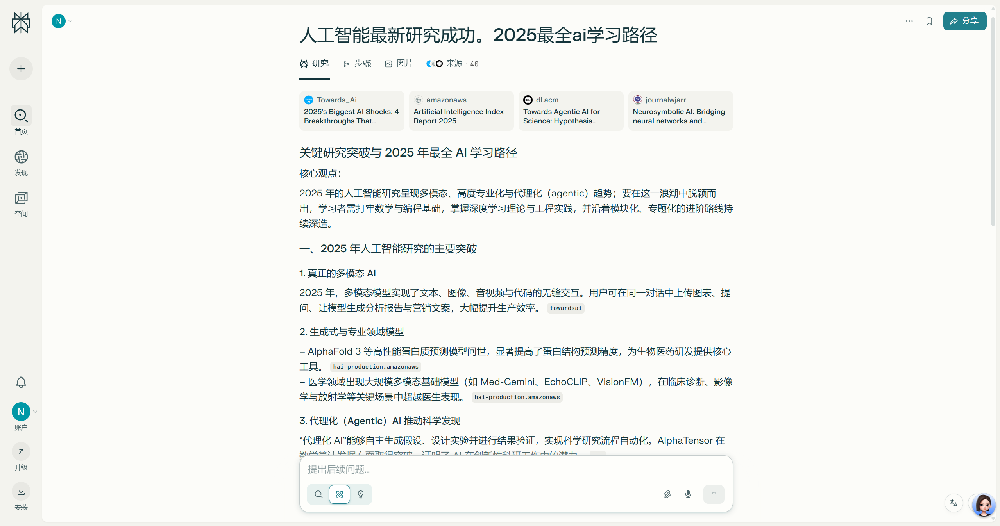
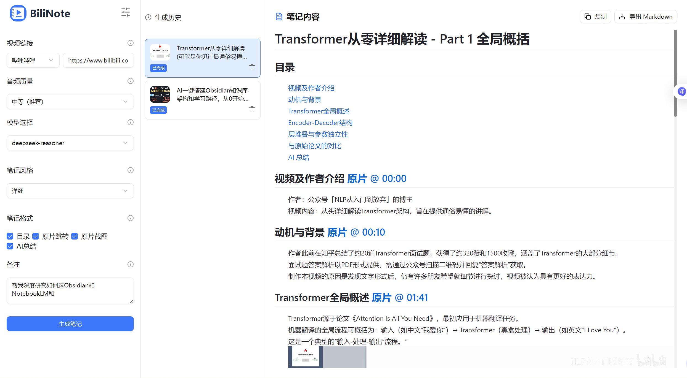

# AI协作能力：大学生未来发展的新维度

## 分享目的

- **AI时代不是威胁，它可能是我们这一代人最大的机会。**
- **打破理论与实践的鸿沟，让AI成为我们真正可用的协作伙伴。**
- **让AI协作成为我们在各种挑战中的核心竞争力。**

## 自我介绍

**四重身份**
- 高级软件工程师 × 双证律师 × 专利代理师 × 开源社区核心贡献者

**华库律所**
- 广东华库律师事务所2025年全新创立，法律领域后起之秀
- **「匠・律」「锋・盾」「明・信」**三大建所理念
- 汇聚跨学科背景精英律师团队（医学、工程等）
- 业务涵盖：公司事务、知识产权、诉讼仲裁、工程建筑等

**一个普通的学长**


**四年莞工人，一生莞工情**

## 互动破冰

### 外币识别游戏

**挑战：2分钟内判断币种和汇率**

### 外币揭秘


### 互动提问

**AI识别外币只需几秒钟，那么问题来了：**
**你用AI做过什么事情？遇到什么困难？**

##  AI时代，跟我们学生有什么关系？

### 传统学习 vs AI协作对比

| 流程对比 | 传统方式 | AI协作方式 |
|---------|---------|----------|
| 📚 知识初筛 | 图书馆  | Perplexity 或 BiliNote |
| 🧠 知识精加工 | 手工  | NotebookLM  |
| 🗺️ 做导图 | 手绘  | GitMind  |
| 📄 写报告 | 手写  | Note  |


### AI学习工具链演示

#### Step 1: 知识初筛
**Perplexity极速调研**
TODO： 需补充简单功能介绍加优势，即推荐理由
TODO：补充地址
- **输入**: "人工智能在教育中的应用现状与发展趋势"
- **输出**: 结构化答案 + 权威引用来源



**BiliNote视频知识提取**
TODO： 需补充简单功能介绍加优势，即推荐理由
- **输入**: B站教育视频链接
- **处理**: AI自动提取音频 → 语音转文字 → 内容结构化
- **输出**: Markdown笔记 + 时间轴 + 要点总结



### Step 2: NotebookLM多源整合
TODO： 需补充简单功能介绍加优势，即推荐理由
TODO：补充地址
- **输入**: 搜索结果 + 视频笔记 + PDF文档
- **特色功能**: 生成AI播客 (两个AI主持人讨论你的资料)
- **输出**: 学习指南 + 音频播客 + 测验题


### Step 3: GitMind可视化
TODO： 需补充简单功能介绍加优势，即推荐理由
TODO：补充地址
- **输入**: NotebookLM整合内容
- **输出**: 自动生成思维导图，知识结构一目了然


### Step 4: Note完整报告
TODO： 需补充简单功能介绍加优势，即推荐理由
TODO：补充地址
- **成果**: 完整课程设计框架
- **质量**: 逻辑清晰 + 引用准确 + 格式标准
TODO：补充图片


TODO： 目前这4部的截图非常随意，需要连贯，比如以"人工智能在教育中的应用现状与发展趋势"实际演示，怎么找论文、找B站视频，然后一步步完成。就是以一个问题贯穿始终。


## 我的AI协作故事

在我跟AI深度协作的过程中，我就意识到，AI时代正在影响各行各业。比如说：

### 模拟法庭

**基本案情介绍：**
1. 何某驾驶铲车撞到李某，交警判李某全责，李某起诉何某赔偿
2. 事发一年后，即一审阶段，何某提出自己是建筑公司员工
3. 建筑公司否认劳动关系，仅承认双方为铲车租赁关系
4. 我方代理建筑公司应诉

**传统做法：**
1. 初步咨询
2. 深入调查与事实核实
3. 法律分析与争议焦点确立
4. 证据收集与评估
5. 制定诉讼或非诉策略
6. 法律研究与案例检索
7. 撰写文书
8. 出庭诉讼与辩护


创建AI律师与AI法官角色，针对真实案件进行法庭辩论，AI生成了**7.4万字**的详细庭审笔录，其专业程度令人震撼！
[AI 模拟庭审从"背书式"变成"实战级"：年轻律师必备的辩论技能提升神器](https://mp.weixin.qq.com/s/gscpUqiApktaSO3Uio5Iiw)


**AI赋能法律实务：**
1. 模拟庭审
2. 初步咨询
3. 深入调查与事实核实
4. 法律分析与争议焦点确立
5. 证据收集与评估
6. 制定诉讼或非诉策略
7. 法律研究与案例检索
8. 撰写文书


### 小说创作
**小说构思：**
- 严格按照《易经》64卦386爻对应百年建国史
- **三代人**三个时代的家族史，展现百年民族复兴的缩影
- 将《易经》从算命书还原为**世界观**，家国情怀贯穿全书
- **创作奇迹：** 别说创作，单纯构思就是不可能完成的任务，但有了AI协作，**一周就完成了**！


**历次分享回顾：**
- [分享一：PromptX长篇小说系统：拟人化AI团队的小说共创新范式](https://www.bilibili.com/video/BV1Vw8nzqE5i)
- [分享二：PromptX长篇小说系统：拟人化AI团队的小说共创新范式](https://www.bilibili.com/video/BV1Z9eZzcEvT)


**质量追求：** 第一版质量不满意已下架，第二版精心打磨中。
**协作成果：** 如果我不说，你应该看不出AI写作的痕迹。

### AI协作在医疗行业的应用

[使用 TRAE + PromptX MCP，让肺癌多组学科研效率翻倍的实战指南！](https://mp.weixin.qq.com/s/8d3W_7OyzlEsevWeLRifKg)

**零编程基础的临床医师面对肺癌多组学研究难题：庞杂的组学数据、多学科协作成本、繁琐的实验流程，原本需要3个月才能掌握的复杂技能。**

**通过PromptX创建AI专家团队：肺癌研究专家radLung、深度学习科学家DL、项目监督monitor，四个AI角色各司其职，协同完成数据预处理、模型构建、质量控制全流程。**

**AI协作让科研效率翻倍：新团队成员培训周期从3个月缩短至1周，人类专注假设创新，AI承担90%重复性工作，重新定义了科研协作范式。**


### 🤔 AI是理工科的事情吗？
答案：绝对不是！

**文科生同样可以在AI实践中大放异彩，甚至在某些领域比理工科更有优势：**

### 文科生大舞台

[为什么 RAG 不能用于 AI 记忆 ｜ RAG isn't All you Need](https://mp.weixin.qq.com/s/-lmCkDAmifETFtXtxZ6ujw)

**Q1: 为什么纯技术手段无法解决AI的根本问题？**
因为AI面临的是哲学本源问题，不是工程问题。

RAG的核心困境：语义损失（Semantic Loss）——将"我喜欢吃草莓"误解为"我喜欢吃草"，这不是技术精度问题，而是计算无法理解意义的根本限制。

哲学家的洞察至关重要：
- John Searle的"中文房间"实验：揭示了符号操作与真正理解的鸿沟
- Stevan Harnad的"符号接地问题"：说明符号永远只能指向其他符号，无法触及真实意义
- 康德认知论：区分现象界（计算能处理的）与本体界（意义存在的层面）

只有文科生具备的哲学思辨能力，才能识别和定义这些根本问题。


**Q2: 构建真正的AI认知系统需要哪些文科专业知识？**

需要跨越心理学、哲学、神经科学的综合理解。

认知心理学贡献：
- 理解记忆的本质：不是信息存储，而是语义网络的动态重组
- 个体化认知发展：每个人如何从共同语言发展出独特思维方式

脑神经科学贡献：
- 理解人类认知的结构化关系处理机制
- 发现记忆的情境依赖性和情感标记特征

哲学贡献：
- 本体论思考：什么是真正的"理解"vs"计算"
- 认识论框架：知识如何形成、验证、转化
- 意识哲学：个体性和体验性的本质

语言学贡献：
- 语用学理解：同一句话在不同情境的不同含义
- 语义演化：词汇意义如何随个体经验发展


**Q3: 文科生在AI发展中扮演什么独特角色？**
1. 问题定义能力
  - 技术人员关注"怎么做"，文科生思考"为什么做"和"做什么"
  - 识别技术方案背后的哲学假设和局限性
2. 跨学科整合思维
  - Monogent系统需要整合心理学、哲学、神经科学、语言学
  - 文科生天生具备的系统性、关联性思维
3. 语义理解专长
  - 理解"草莓"不只是一个词，而是承载个人经验、情感记忆、文化含义的复合体
  - 设计能保持语义完整性的认知架构
4. 个体化设计能力
  - 理解每个AI个体如何发展出独特的认知风格
  - 类比人类从共同语言到个性思维的发展过程

核心洞察：AI越智能，越需要文科生来定义什么是"智能"。


**总结：文科生是AI认知革命的领路人**

当技术遇到哲学边界时，文科生不是被淘汰者，而是突破者：
- 他们能看到RAG技术的哲学局限
- 他们理解真正认知系统的设计原则
- 他们具备构建AI个体性的理论基础

未来的AI系统建设，文科生将从配角变成主角。

### 快问快答

**互动主题**：基于刚才的展示，是否给到你灵感，此时此刻你最想用AI做什么？


## 理性分析 - 重新认识人机关系

### 三大疑问自然浮现

**🤔 疑问一：AI这么强大，人类还有价值吗？**
- AI能写小说、做设计、分析数据...我们还能做什么？
- AI的知识量远超人类专家，我们的优势在哪里？

**🤔 疑问二：我们是否会被AI替代？**
- AI效率这么高，雇主为什么还要雇佣人类？
- 哪些工作会被AI取代？哪些不会？

**🤔 疑问三：未来什么样的人才不会被淘汰？**
- 我应该培养什么能力才能在AI时代生存？
- 文科生和理科生在AI时代有什么不同的机会？

**这些疑问完全正常！让我们通过理性分析来找到答案。**

我们可以回答四个问题，分别是：认识AI到底是什么、了解AI的工作原理和边界、掌握与AI高效沟通的方法，以及理解AI时代的人机协作关系。

### 认识AI到底是什么


#### 核心概念：AI = 超级聪明的文字游戏高手

想象一下，如果有一个人读了全世界所有的书籍、文章、网页（大约相当于3000亿本书），然后变成了文字接龙的绝顶高手。这就是大模型的本质。

**我们日常使用的AI工具背后都是大模型：**
- 当你和ChatGPT聊天时，实际上是在和GPT大模型对话
- 当你使用豆包写文案时，背后是字节跳动的Doubao大模型
- 当你用Kimi分析长文档时，背后是月之暗面的Moonshot大模型

#### 关键理解：AIGC让AI走进普通人生活

**AIGC = AI Generated Content（人工智能生成内容）**

**核心概念：** 你描述需求，AI帮你生成内容

**为什么AIGC突然火了？**
因为它终于"会说人话"了！

**AIGC之前的AI是什么样子？**
- **专家系统时代**：只能回答固定问题，像机器客服一样死板
- **深度学习时代**：能识别图片、翻译语言，但不能对话交流
- **普通人的困扰**：想用AI必须学编程，或者通过复杂的专业界面

**举个例子对比：**
- **2020年**：想让AI写文章？你得学Python，调用API，还不一定写得好
- **2023年**：直接跟ChatGPT说"帮我写一篇关于春天的诗"，秒出结果

**现在的AI能做什么？**
- 和你对话聊天（像朋友一样）
- 帮你写文章、诗歌（像秘书一样）
- 生成图片、视频（像设计师一样）
- 回答各种问题（像百科全书一样）

#### AI软件的秘密：心脏+外衣

**核心公式：AIGC软件 = 大模型（心脏）+ 产品界面（外衣）**

就像手机一样，不同品牌用不同的芯片：

| 手机品牌         | 芯片型号             |
| ---------------- | -------------------- |
| iPhone 14 Pro    | A16 Bionic           |
| 华为 Mate 50     | 麒麟 9000            |
| 小米 13          | Snapdragon 8 Gen 2   |

AI软件也是如此：

| AI 软件          | 背后的大模型          |
| ----------------- | --------------------- |
| ChatGPT           | GPT-4                 |
| Kimi Chat         | Moonshot              |
| DeepSeek          | DeepSeek V3           |
| 通义千问          | 通义千问 VL           |
| 豆包              | Doubao-1.5-Pro        |

#### 从AI到Agent：智能升级的关键跃迁

##### Agent公式：让AI变成真正的助手

**Agent = LLM + Memory + Planning + Tool Use**

这个公式解释了为什么有些AI感觉像真人助手，有些只是问答机器：

**🧠 LLM（大语言模型）**：基础对话能力
- 理解你的问题，生成回答

**💾 Memory（记忆系统）**：上下文记忆
- 记住之前聊过什么，形成连续对话

**📋 Planning（规划能力）**：任务分解
- 把复杂任务分解成具体步骤

**🔧 Tool Use（工具使用）**：执行能力
- 能调用外部工具，真正帮你做事

##### 对比效果一目了然

**普通AI对话 vs Agent智能体：**

| 对比维度 | 普通AI | Agent智能体 |
|---------|--------|-------------|
| 记忆能力 | ❌ 每次独立对话 | ✅ 记住历史上下文 |
| 任务处理 | ❌ 单次问答 | ✅ 多步骤规划执行 |
| 工具调用 | ❌ 只能聊天 | ✅ 能操作外部工具 |
| 专业程度 | ❌ 泛泛而谈 | ✅ 角色化专业回答 |


#### 多模态AI：技术发展的新阶段

在深入了解AI原理之前，先补充一个重要概念：**多模态AI**

**什么是多模态AI？**
- **单模态AI**：只能处理一种类型的信息（如只能处理文字）
- **多模态AI**：能同时处理文字、图片、音频、视频等多种信息

**多模态AI的能力：**
- **图文理解**：看图说话、图片问答
- **视频分析**：理解视频内容、生成字幕
- **语音交互**：语音识别、语音合成
- **跨模态创作**：文字生成图片、图片生成音乐

**实际应用举例：**
- 给AI一张照片，它能描述照片内容并回答相关问题
- 给AI一段视频，它能总结视频要点并生成字幕
- 给AI文字描述，它能生成对应的图片或音乐


### AI的工作原理和边界

#### 大模型是如何变聪明的？

##### 三种学习方式让AI成长

**1. 无监督学习：像婴儿学说话** 👶
- **场景类比：** 婴儿听大人说话，自然而然学会了语言规律
- **AI的做法：** 读遍互联网上的所有文字，自动发现语言的规律和模式
- **结果：** AI学会了"什么词后面通常跟什么词"

**2. 有监督学习：像老师教学生** 👩‍🏫
- **场景类比：** 老师给学生看图片，告诉他这是"猫"，那是"狗"
- **AI的做法：** 人类给AI大量"问题-答案"对，让AI学会正确回答
- **结果：** AI学会了"看到这种问题，应该给出这种答案"

**3. 强化学习：像训练宠物** 🐕
- **场景类比：** 狗狗做对了给奖励，做错了不给奖励
- **AI的做法：** AI回答得好就给"奖励分"，回答得不好就扣分
- **结果：** AI学会了怎样回答能让人类更满意

#### AI的独特思考方式：统计智慧的力量

##### 理解AI的"超级图书馆"工作机制

**想象场景：** AI的大脑里有一个神奇的图书馆
- **规模：** 3000亿本书（相当于人类10万年的阅读量）
- **特殊能力：** 把每句话、每个词都像乐高积木一样拆解成碎片，记住这些碎片最常见的组合方式

**当你问"天为什么是蓝的？"时，AI的思考流程：**

**步骤1：拆解问题**
- 将问题切分："天" / "为什么" / "是" / "蓝" / "的"

**步骤2：搜索相关内容**
- 在3000亿本书中找到所有包含这些词的句子

**步骤3：概率计算**
- "光的散射" 出现概率：90%
- "上帝打翻了蓝色颜料" 出现概率：9%
- "因为奥特曼住在天上" 出现概率：1%

**步骤4：选择最可能的答案**
- AI选择概率最高的"光的散射"作为回答

##### AI思考方式的优势与局限

**AI的独特优势：**
- ✅ **知识广度：** 远超人类专家（读了全人类的书）
- ✅ **超强的模式识别：** 发现人类难以察觉的规律
- ✅ **海量信息的快速检索：** 瞬间调用全球知识
- ✅ **多角度思考：** 同时考虑无数种可能性

**需要注意的局限：**
- ⚠️ **统计依赖性：** 基于概率而非经验判断
- ⚠️ **缺乏实践验证：** 无法在真实世界中试错
- ⚠️ **可能产生幻觉：** 网络谣言如果广泛传播，AI可能当成事实

##### 人机协作的完美互补

**核心洞察：AI的统计智慧 + 人类的经验智慧 = 完美组合**

**AI贡献：**
- 提供海量信息和多种可能性
- 发现隐藏的模式和规律
- 快速生成创意和方案

**人类贡献：**
- 基于经验的直觉判断
- 价值观和伦理标准
- 实践验证和质量把关
- 最终决策和责任承担

**这不是替代关系，而是增强关系——AI让你的思考更广阔，你让AI的输出更可靠！**

### 与AI高效沟通的方法

现在我们了解了AI的学习方式、思考机制，关键问题来了：**如何更好地与AI对话，让它理解我们的真实需求？**

这就需要掌握与AI沟通的艺术——提示词工程。

#### 3.1 提示词工程：与AI高效沟通的艺术

##### 提示词的核心结构

**好的提示词 = 完整的工作委托书**

必须包含两个核心要素：
- **指令**：要做什么？
- **上下文**：在什么情况下做？

##### 指令部分：说清楚"要做什么"

**三个关键点：**
1. **具体任务目标** - 不说"帮我写文章"，要说"写一篇1000字的AI科普文章"
2. **输出形式** - 要列表？要段落？要表格？
3. **质量要求** - 通俗易懂？专业严谨？生动有趣？

##### 上下文部分：交代"在什么情况下做"

**两个重要信息：**
1. **目标受众** - 写给谁看？小学生？专业人士？
2. **参考示例** - 有没有类似的好例子？

#### 3.2 提示词六大实用技巧

**1. 明确任务** 🎯
- **错误示例：** "帮我写个东西"
- **正确示例：** "写一份产品介绍，突出AI助手的三个核心优势"

**2. 补充背景** 📋
- **重要信息：** 告诉AI你的具体情况和需求背景
- **示例：** "我是一名大学老师，需要向学生解释..."

**3. 给出例子** 📝
- **作用：** 让AI直观理解你的期望标准
- **方法：** "参考这个格式..." "类似这种风格..."

**4. 设定角色** 👥
- **技巧：** "你是一位经验丰富的..."
- **效果：** 让AI以专业身份思考和回答

**5. 规定格式** 📄
- **具体要求：** 要分点？要表格？要多少字？
- **便于使用：** 明确格式便于后续处理

**6. 调整语气** 🎭
- **根据场景：** 正式？亲切？幽默？严肃？
- **增强效果：** 合适的语气提升沟通效果

#### 3.3 实战案例对比

##### 普通提示词 vs 优质提示词

**普通提示词：**
"帮我写个AI介绍"

**优质提示词：**
"你是一位AI科普专家，请为完全不懂技术的大学生写一份500字的AI入门介绍。要求：1）用通俗易懂的语言；2）举出生活中的具体例子；3）分为3个部分：什么是AI、AI能做什么、如何开始使用。语气要亲切友好，避免专业术语。"

**效果差异：** 后者的回答质量会显著提升！


### AI时代的人机协作关系

学会了与AI沟通，我们就回到了最初的三个疑问：**AI会取代我们吗？我们还有价值吗？未来需要什么样的人才？**

答案就在理解人机协作的本质。让我们来看看人类、AI和计算机应该如何协作。

#### 4.1 三角协作关系深度解析

##### 三种系统的生态位分析

基于对各系统底层逻辑的深度理解，我们可以构建一个科学的协作框架：

##### 人类的生态位：价值创造者 🎭
**核心公式：实践 + 意识 = 创新**

**核心职能：**
- 设定目标和价值观
- 提供创造性洞察
- 进行最终的判断和决策

**独特优势（AI无法替代）：**
- **基于经验的直觉判断** - 来自真实世界的实践验证
- **跨领域的知识迁移** - 将A领域的经验应用到B领域
- **新问题的识别和定义** - 发现别人没有发现的问题
- **价值观和伦理判断** - 决定什么是对的、重要的
- **情感理解和共情能力** - 理解人类复杂的情感需求
- **持续的意识和自我反思** - 能够思考"我在想什么"


##### AI的生态位：智能增强器 🚀
**核心公式：模式 + 知识 = 映射**

**核心职能：**
- 大规模信息处理
- 模式识别和预测
- 创意辅助和优化建议

**独特优势：**
- **超越人类的数据处理能力** - 同时分析千万条信息
- **多维度的模式识别** - 发现人类难以察觉的规律
- **持续的学习和适应** - 不断更新知识库
- **跨领域知识整合** - 瞬间调用全人类的知识
- **24小时在线服务** - 不受时间和情绪影响

**明显弱项：**
- **缺乏常识判断** - 不理解现实世界的基本规律
- **无法实践验证** - 不能在真实世界中试错
- **没有价值判断** - 不知道什么是好的、对的
- **缺乏真正创新** - 只能重新组合已有知识
- **容易产生幻觉** - 基于概率生成错误信息

##### 计算机的生态位：精确执行者 💻
**核心公式：精确 + 速度 = 效率**

**核心职能：**
- 精确的数值计算
- 可靠的数据存储
- 标准化的流程执行

**独特优势：**
- **绝对的计算准确性** - 不会因为疲倦而出错
- **大规模的数据管理** - 存储和检索海量信息
- **稳定的系统运行** - 可靠性和一致性
- **快速执行** - 毫秒级的响应速度
- **精确重复** - 完全相同地执行同样的任务

##### 协作成功的关键原则

**🎯 核心洞察：协作 > 竞争 > 替代**

**为什么是协作而不是替代？**
- **互补性**：每个系统都有独特的优势和明显的弱点
- **复杂性**：真正的价值创造需要多种能力的结合
- **不可替代性**：人类的意识、创新、价值判断无法被模拟

##### 深度协作的三个层次

**1. 人类提供方向** 🧭
- 确定问题的重要性和价值
- 设定伦理和社会标准
- 进行最终的责任承担
- 定义成功的标准

**2. AI提供洞察** 🔍
- 发现人类难以察觉的模式
- 提供多种解决方案选择
- 辅助复杂决策的制定
- 整合跨领域的知识

**3. 计算机提供支撑** 🛠️
- 确保计算的准确性
- 提供稳定的运行环境
- 管理和维护数据资源
- 执行具体的操作指令

##### 回答开头的三大疑问

###### 疑问一：AI这么强大，人类还有价值吗？

**答案：人类价值不仅存在，而且被AI无限放大！**

**理由：**
- AI擅长海量信息处理，人类擅长价值判断——协作让决策更精准
- AI擅长发现规律和生成方案，人类擅长创意整合——协作让创新更丰富
- AI擅长标准化执行，人类擅长情感连接——协作让服务更有温度
- AI负责数据分析，人类负责经验判断——完美配合，效果翻倍

###### 疑问二：我们是否会被AI替代？

**答案：不是替代关系，是工作模式升级！**

**会升级的工作模式：**
- 重复性任务自动化，人类专注于创意和策略
- 信息处理智能化，人类专注于价值判断
- 标准化执行AI化，人类专注于个性化服务

**不会被替代的核心能力：**
- 需要创造性思维和跨领域整合的工作
- 涉及价值判断和伦理决策的工作
- 需要情感交流和人际互动的工作
- 需要实践验证和经验判断的工作

**关键洞察：会用AI协作的人正在升级，不会协作的人被留在原地**

###### 疑问三：未来什么样的人才不会被淘汰？

**答案：具备AI协作能力的复合型人才**

**核心能力模型：**
```
未来人才 = 专业能力 × AI协作能力 × 人文素养
```

**具体能力要求：**
1. **AI协作素养** - 会使用AI工具，设计协作流程
2. **创新思维能力** - 提出新问题，整合跨领域知识
3. **情感智能** - 理解他人，建立信任，领导团队
4. **价值判断能力** - 知道什么重要，什么正确
5. **持续学习意愿** - 适应变化，与AI共同进化

#### 4.2 协作的核心原理：各司其职，相互赋能

##### 最佳协作模式 ✅

**明确分工：**
- **人类负责**：创意方向、价值判断、最终决策
- **AI负责**：信息分析、方案生成、创意辅助
- **计算机负责**：精确执行、数据处理、结果呈现

##### 常见错误认知 ❌

- **"AI会完全取代人类工作"** → AI缺乏创新意识和价值判断
- **"人类不需要学习新技能"** → 不懂AI协作会被边缘化
- **"AI万能论"** → AI有明显的能力边界和局限性

#### 4.3 未来人才的核心竞争力

##### 在AI时代脱颖而出的四大特质

**1. AI协作素养** 🤝
- 熟练掌握提示词工程
- 理解AI的能力边界
- 善于设计人机协作流程

**2. 创新思维能力** 💡
- 提出新问题的能力
- 跨领域知识整合
- 批判性思维和判断力

**3. 情感智能** ❤️
- 团队协作和领导力
- 同理心和沟通能力
- 处理复杂人际关系

**4. 持续学习意愿** 📚
- 拥抱变化的心态
- 快速学习新工具
- 保持好奇心和探索精神

#### 4.5 AI时代的生存法则

##### 核心价值公式

> **你的价值 = 专业能力 × AI协作能力 × 人文素养**

这个公式告诉我们：
- **专业能力**是基础，但不能只有专业能力
- **AI协作能力**是放大器，让你事半功倍
- **人文素养**是根本，决定你的价值观和判断力

##### 三大核心洞察

1. **AI不会取代你，但会使用AI的人可能会**
   - 关键不在于AI有多强，而在于你如何与AI协作

2. **重要的是如何与AI协作，而不是AI本身**
   - 工具永远在变，但协作的思维方式是永恒的

3. **保持人性中最珍贵的品质**
   - 创造力、同理心、价值判断是人类独有的优势

##### 最终目标

**让AI成为你的超级助手，而你始终是那个：**
- 设定目标的战略家
- 做出判断的决策者
- 承担责任的领导者


## 实践方法 - 从理论到实践的轻松跨越

### 面对这么多知识，从哪里开始实践？

**承上启下的自然过渡：**
- 前面我们学了AI的原理、提示词技巧、三角协作关系...
- 知识点很丰富，但可能有同学会想：我该怎么开始实践呢？
- 其实，有一个更轻松的入门路径

**两种实践路径对比：**
- **传统路径**：学理论 → 练提示词 → 反复调试 → 获得效果
- **工具化路径**：直接使用专业工具 → 立即获得效果 → 在使用中理解原理

### PromptX：专业AI角色生成系统

**明确定位为专业工具：**
- **PromptX是什么**：专业AI角色生成系统，让每个人都能快速获得专业AI助手
- **核心能力**：一键生成各行业的专业AI角色，无需学习复杂的提示词技巧

**解决的核心问题：**
- **专业性不足**：普通提问得到泛泛回答 → PromptX角色具备专业背景和知识体系
- **效率太低**：每次都要重新描述需求 → PromptX角色可复用，有记忆和上下文
- **门槛太高**：需要学会写提示词 → PromptX零学习成本，直接使用

**DPML协议：AI角色拟人化的四个维度**

PromptX通过DPML协议让AI角色更加拟人化，就像真人专家一样思考和工作：

- **👤 角色人格 (Role)**：定义专业身份、背景经历、性格特点
- **🧠 思维模式 (Thought)**：专业领域的思考方式和分析框架
- **⚡ 执行技能 (Execution)**：具体的工作方法和实践能力
- **📚 知识体系 (Knowledge)**：专业领域的深度知识和经验积累

**举例说明**：法律顾问角色
- 人格：资深律师背景，严谨专业的性格
- 思维：法条分析、案例推理、风险评估的思维方式
- 技能：合同审查、法律文书撰写、争议解决的实践方法
- 知识：民商法、公司法、劳动法等专业法律知识

这样生成的AI角色不再是冰冷的工具，而是有温度、有专业能力的智能助手。


### 现场体验：即学即用
TODO
- **互动环节**：邀请同学现场体验使用PromptX
- **效果展示**：对比使用前后的差异
- **心态转变**：从"学起来好复杂"到"用起来很简单"

## 深度实践 (Deepractice) - 构建AI时代的智能协作新生态

### 深度实践（Deepractice）
**让AI触手可及，让协作创造价值**

在一个被AI浪潮席卷的时代，我们深信，真正的变革来自于脚踏实地的"实践"与紧密无间的"协作"。

我们不仅仅是一个知识分享社区，更是一个AI智能协作平台，致力于帮助每一位AI领域的探索者，将脑海中的创意转化为影响现实的智能生态系统。

**创始人：姜山（Sean）**
- 中南民族大学自动化专业
- 微众银行技术背景
- 连续创业者
- 矛盾论驱动的产品思维践行者

**理念：开放、分享、共创**


### 团队优势
1. 技术实力：具备AI实操及项目落地经验，对智能体及行业结合有一定理解，快速迭代和产品化能力强。
2. 行业经验：核心成员曾于头部互联网任职，社区贡献者来自教育、法律等各行业/领域。
3. 创新能力：把握先发优势快速验证市场需求，开源社区运营经验，精益团队决策效率高。

### 项目介绍
PromptX · 领先的AI智能体上下文平台
1. 核心能力：AI角色创造平台 | 智能工具平台 | 认知记忆系统
2. 项目简述：提供结构化、模块化的方式构建和管理AI提示词，让AI更智能、更专业。
3. 项目地址：https://github.com/Deepractice/PromptX
4. 当前状态：起初的命令行，再到MCP形式，并于2025年9月发布MacOS/Windows等桌面端APP。
5. 取得成果：自2025年05月15日开源至今，已获得2.7K+ GitHub Stars。
6. 公众号：AI深度实践

### 其他内容平台：
1. 社区论坛 - 2K+ AI爱好者聚集地 x.deepractice.ai
2. 播客频道 - AI探讨和行业见解/洞察分享：xiaoyuzhoufm.com/podcast/67bc12b63347fd01f19109ab
3. 哔哩哔哩 - 分享项目教程、视频和直播回放：space.bilibili.com/277448879


## Q&A

## 本人联系方式

手机号码：17666565441
二维码：


## 结束语

**从今天开始，让AI成为你的超能力！**

感谢大家的时间和参与，希望今天的分享能给大家带来启发。
