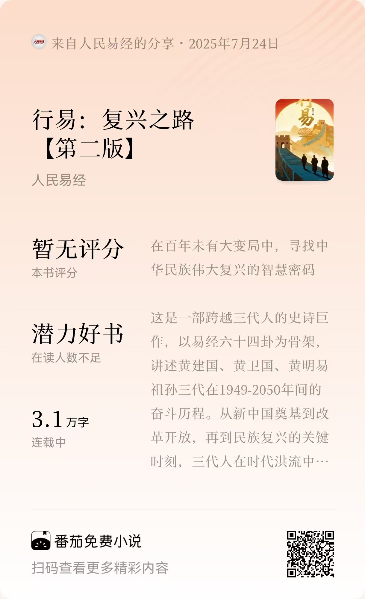

# AI协作能力：大学生未来发展的新维度

## 分享目的

- **AI时代不是威胁，它可能是我们这一代人最大的机会。**
- **打破理论与实践的鸿沟，让AI成为我们真正可用的协作伙伴。**
- **让AI协作成为我们在各种挑战中的核心竞争力。**

## 自我介绍

**四重身份**
- 高级软件工程师 × 律师 × 专利代理师 × 开源社区核心贡献者

**华库律所**
- 广东华库律师事务所2025年全新创立，法律领域后起之秀
- **「匠・律」「锋・盾」「明・信」**三大建所理念
- 汇聚跨学科背景精英律师团队（医学、工程等）
- 业务涵盖：公司事务、知识产权、诉讼仲裁、工程建筑等

**深度实践社区**
1. "让AI触手可及"的实践社区，核心成员来自头部互联网公司和各行业领域。
2. 开源了PromptX项目，获得2.7K+ GitHub Stars，是领先的AI智能体上下文平台。
3. 聚集了2K+ AI爱好者，提供实习机会、技术培训和产学研合作，帮助大家从AI学习者成长为实践者。

**一个普通的学长**

东莞理工学院2010级计算机学院计算机科学与技术专业的学生

## 互动破冰

### 外币识别游戏

**挑战：2分钟内判断币种和汇率**

### 外币揭秘

### 互动提问

**AI识别外币只需几秒钟，那么问题来了：**
**你用AI做过最酷的事情是什么？遇到什么困难？**

## AI全景展示 - 发现无限可能

【待补充：AI发展全景、应用场景爆炸等内容】

## 深度协作展示 - 超越想象的可能

### 我的AI协作故事

**模拟法庭**

[AI 模拟庭审从"背书式"变成"实战级"：年轻律师必备的辩论技能提升神器](https://mp.weixin.qq.com/s/gscpUqiApktaSO3Uio5Iiw)

创建AI律师与AI法官角色，针对真实案件进行法庭辩论，AI生成了**7.4万字**的详细庭审笔录，其专业程度令人震撼！

**小说创作**

**项目规模：**
- **88万字**史诗巨制，严格按照《易经》64卦386爻对应百年建国史
- **三代人**三个时代的家族史，展现百年民族复兴的缩影
- 将《易经》从算命书还原为**世界观**，家国情怀贯穿全书

**创作奇迹：** 别说创作，单纯构思就是不可能完成的任务，但有了AI协作，**一周就完成了**！

**分享回顾：**
- [分享一：PromptX长篇小说系统：拟人化AI团队的小说共创新范式](https://www.bilibili.com/video/BV1Vw8nzqE5i)
- [分享二：PromptX长篇小说系统：拟人化AI团队的小说共创新范式](https://www.bilibili.com/video/BV1Z9eZzcEvT)

**质量追求：** 第一版质量不满意已下架，第二版精心打磨中。
**协作成果：** 如果我不说，你应该看不出AI写作的痕迹。

### 更多协作可能性展示

**零编程基础的临床医师面对肺癌多组学研究难题：庞杂的组学数据、多学科协作成本、繁琐的实验流程，原本需要3个月才能掌握的复杂技能。**

**通过PromptX创建AI专家团队：肺癌研究专家radLung、深度学习科学家DL、项目监督monitor，四个AI角色各司其职，协同完成数据预处理、模型构建、质量控制全流程。**

**AI协作让科研效率翻倍：新团队成员培训周期从3个月缩短至1周，人类专注假设创新，AI承担90%重复性工作，重新定义了科研协作范式。**

### 快问快答

【待补充：基于展示的互动提问】

## 理性分析 - 重新认识人机关系

### 三大疑问自然浮现

**🤔 疑问一：** AI这么强大，人类还有价值吗？

**🤔 疑问二：** 我们是否会被AI替代？

**🤔 疑问三：** 未来什么样的人才不会被淘汰？

### 技术原理简化理解

【待补充：大模型本质、工作原理、能力边界】

### 三角协作关系解析

【待补充：人类生态位、AI生态位、计算机生态位】

### 商业范式洞察

【待补充：从产品中心到人中心、影响力经济等】

## 实践方法 - 掌握AI协作技能

### AI协作的核心：提示词工程

【待补充：乔哈里视窗、传统理论问题】

### PromptX：让AI协作更简单

【待补充：传统提示词痛点、PromptX解决方案】

### 实践演示与效果对比

【待补充：现场体验、效果对比】

## 行动召唤 - 加入实践者社区

### 深度实践社区价值展示

【待补充：社区定位、项目成果、收获和需要】

## 互动答疑

### Q&A + 联系方式

【待补充：开放提问、引导话题、官方渠道】
