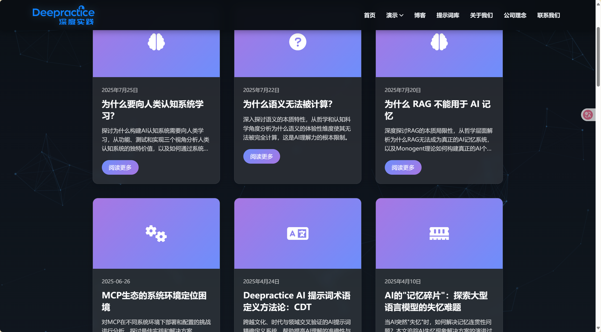
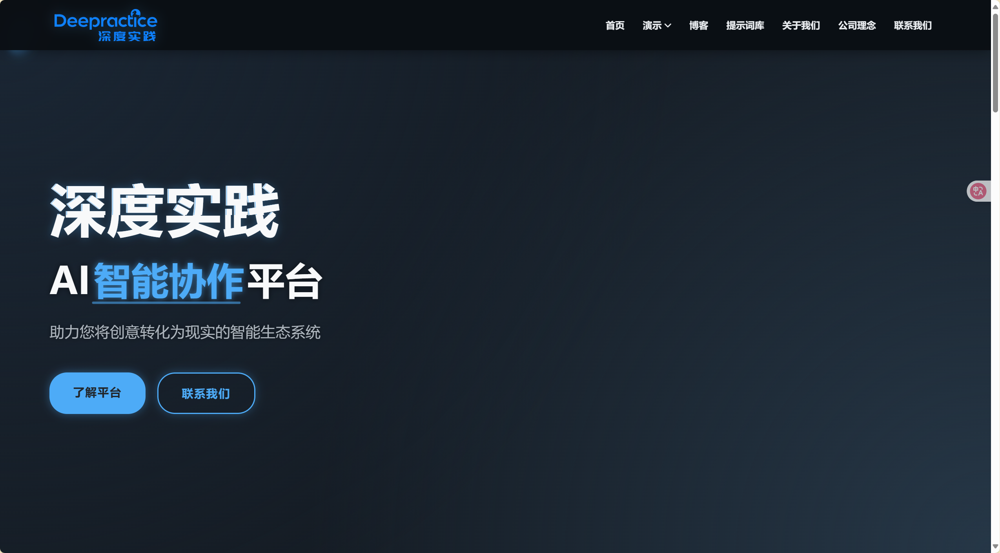
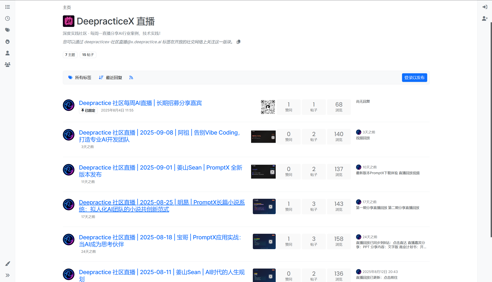

# Part 6: 深度实践 (Deepractice) - 构建AI时代的智能协作新生态

---

## 一、我们的使命：从创意到现实的智能生态系统

### 深度实践（Deepractice）
**让AI触手可及，让协作创造价值**

在一个被AI浪潮席卷的时代，我们深信，真正的变革来自于脚踏实地的"实践"与紧密无间的"协作"。

我们不仅仅是一个知识分享社区，更是一个AI智能协作平台，致力于帮助每一位AI领域的探索者，将脑海中的创意转化为影响现实的智能生态系统。

### 创始人：姜山（Sean）
- 中南民族大学自动化专业
- 微众银行技术背景
- 连续创业者
- 矛盾论驱动的产品思维践行者

*[Banner图：协作与智能理念 - 官网首页]*

---

## 二、我们的理念：开放、分享、共创

我们坚信，开源与分享是推动技术进步的核心动力。深度实践社区建立在以下核心理念之上：

### 🧠 深度思考 (Deep Thinking)
我们不停留在表面，通过深度的技术文章和分析，探讨AI发展的本质问题。

### 💪 动手实践 (Practice)
理论需要通过实践来检验和升华。我们鼓励并组织社区成员动手解决真实世界的问题。

### 🌐 开放分享 (Open Sharing)
我们的一切知识沉淀，从技术文章到直播分享，都向社区开放，我们相信分享是最好的学习方式。

*[博客或技术文章精选截图]*

---

## 三、我们在做什么

### 1. PromptX开源项目
**GitHub地址：** [https://github.com/Deepractice/PromptX]
- 开源AI协作框架
- DPML协议（结构化prompt语言）
- DeeChat(企业级 Agent 客户端)
- Monogent(AI 个体认知系统)
- [GitHub Stars数量 - 2.7k]

### 2. 官方网站
**网址：deepractice.ai**

- [技术文档地址 - AI深度实践]
- [博客地址 - xiaoyuzhoufm.com/podcast/67bc12b63347fd01f19109ab]

### 3. B站技术直播
**直播时间：** [每周一晚上8点]
- 每周技术分享
- 现场编程
- [B站账号 - deepracticex7]

---

## 三、社区文化与理念

### 开源精神
- 所有核心代码开源
- 知识共享
- 社区协作

### 核心理念（这是我真实的想法）
- **矛盾论思维**：用马克思主义矛盾论指导产品决策
- **奥卡姆剃刀**：追求最简洁的解决方案
- **不画饼**：只做能落地的事
- **不收费**：开源影响力是商业模式

---

## 四、社区成果

### 项目成果
1. **PromptX框架**
   - [实际版本数 - 17]
   - [下载量 - 10000]
   - [贡献者数量 - 需要补充]

### 社区规模
- **成员数量：** [2000+]
- **活跃度：** [需要填写实际数据]
- **GitHub贡献者：** [需要填写实际数据]

---

## 五、实践平台规划

### 当前状态
- 微信群组织
- GitHub协作
- 直播分享

### 未来规划（我的真实计划）
1. **在线实践平台**
   - [具体功能规划 - 需要补充]
   - [上线时间 - 需要补充]

2. **社区生态建设**
   - [具体计划 - 需要补充]

---

## 六、如何参与

### 加入方式
1. **GitHub参与**
   - Fork PromptX项目
   - 提交PR
   - [项目地址 - 需要补充]

2. **社区参与**
   - **微信群：** [二维码位置]
   - **QQ群：** [群号 - 如果有]
   - **Discord：** [链接 - 如果有]

3. **直播参与**
   - **B站关注：** [账号信息]
   - **直播时间：** [具体时间]

### 学习路径
1. 了解PromptX
2. 参与开源项目
3. 实践AI协作
4. [其他步骤 - 需要补充]

---

## 七、需要补充的信息

### 📸 截图素材位置
- [ ] GitHub项目截图
- [ ] 网站截图
- [ ] B站直播截图
- [ ] 社区活跃度截图
- [ ] 项目成果展示

### 📊 具体数据
- [ ] GitHub Stars数量
- [ ] 社区成员数量
- [ ] 直播观看数据
- [ ] 项目参与人数
- [ ] 就业/实习数据（如果有统计）

### 🔗 链接地址
- [ ] GitHub项目地址
- [ ] 官网具体页面
- [ ] B站账号链接
- [ ] 知乎专栏地址
- [ ] 公众号二维码

### 📝 内容补充
- [ ] 具体项目案例
- [ ] 成员成功故事（如果愿意分享）
- [ ] 企业合作案例（如果有）
- [ ] 技术文章列表

---

## 八、Sean的话（这是我想说的）

"深度实践不是培训机构，我们不收费。

我们是一群相信开源力量的人，
相信分享能创造更大的价值。

PromptX是我3天写出1.1万行代码的作品，
但更重要的是，它属于整个社区。

如果你也相信AI协作的未来，
如果你想真正掌握AI而不是被AI取代，
欢迎加入深度实践。

让我们一起，让AI触手可及。"

---

## 九、演讲备注

### 时间控制（5分钟）
- 1分钟：介绍深度实践是什么
- 1分钟：展示PromptX和开源成果
- 1分钟：介绍直播和内容平台
- 1分钟：说明如何参与
- 1分钟：行动召唤

### 重点强调
1. **完全免费** - 不是培训机构
2. **开源精神** - 代码和知识都开放
3. **真实项目** - 不是demo是生产代码
4. **立即行动** - 今天就能开始

### 情绪设计
- 开始：理性介绍（这是什么）
- 中间：价值展示（能得到什么）
- 结尾：情感共鸣（一起改变世界）

---

*注：标记为[需要补充]的地方，请根据实际情况填写真实数据*