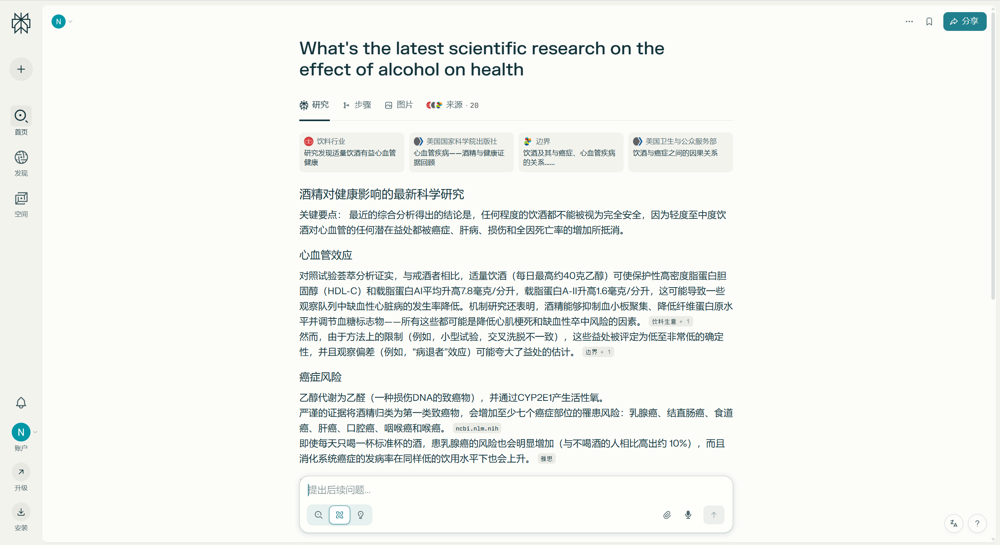
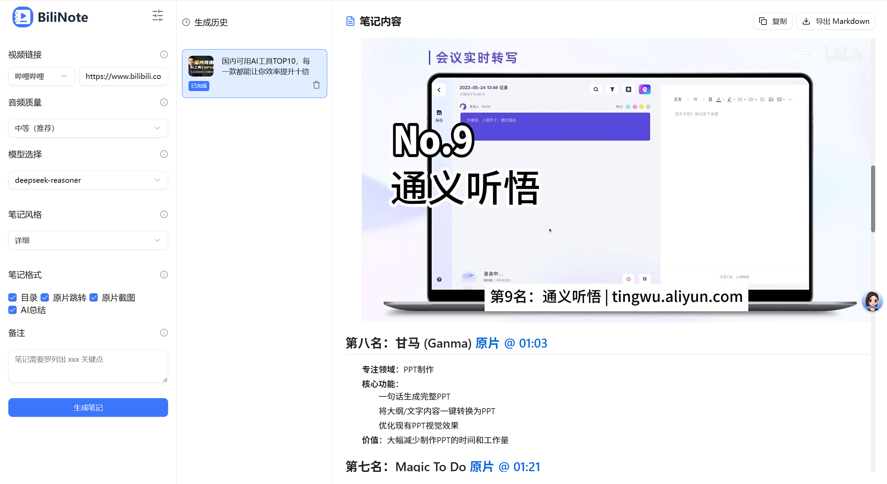
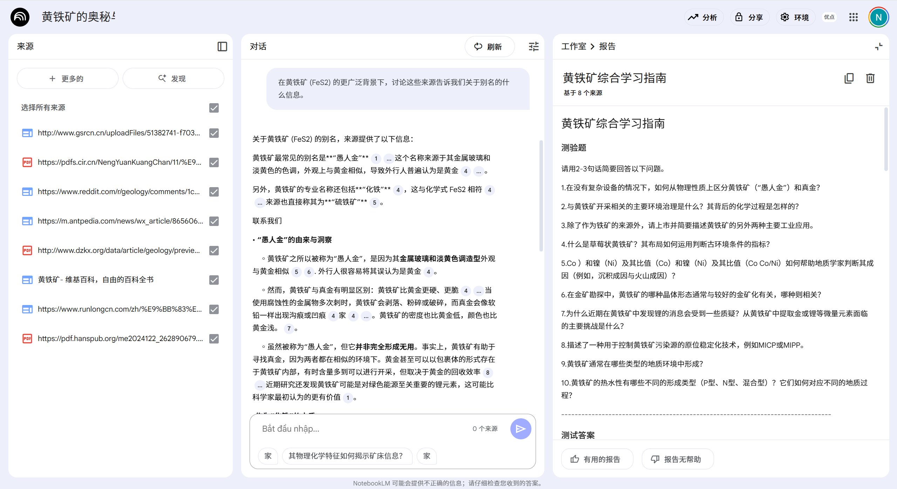
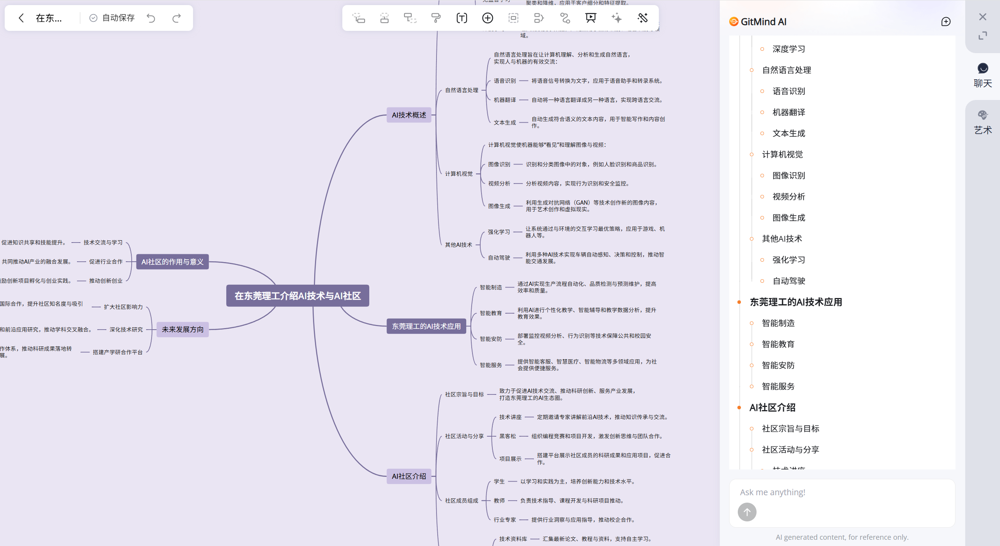

# Page 2: 学习革命 - AI学习工作流重构

---

## 传统学习 vs AI协作对比

| 流程对比 | 传统方式 | AI协作方式 |
|---------|---------|----------|
| 📚 找资料 | 图书馆 2小时 | Perplexity 30秒 |
| 📝 做笔记 | 手工 1小时 | BiliNote 2分钟 |
| 🧠 整理知识 | 手工 1小时 | NotebookLM 3分钟 |
| 🗺️ 做导图 | 手绘 1小时 | GitMind 2分钟 |
| 📄 写报告 | 手写 30分钟 | Note 2分钟 |
| **总时间** | **5.5小时** | **10分钟** |

### **效率提升: 33倍!**

*[图片: 效率对比柱状图]*

---

## AI学习工具链演示

### Step 1: Perplexity极速调研
- **输入**: "人工智能在教育中的应用现状与发展趋势"
- **输出**: 结构化答案 + 权威引用来源
- **时间**: 30秒

*[图片: Perplexity搜索界面截图]*

### Step 2: BiliNote视频知识提取
- **输入**: B站教育视频链接
- **处理**: AI自动提取音频 → 语音转文字 → 内容结构化
- **输出**: Markdown笔记 + 时间轴 + 要点总结
- **时间**: 2分钟

*[图片: BiliNote界面和生成结果]*

### Step 3: NotebookLM多源整合
- **输入**: 搜索结果 + 视频笔记 + PDF文档
- **特色功能**: 生成AI播客 (两个AI主持人讨论你的资料)
- **输出**: 学习指南 + 音频播客 + 测验题
- **时间**: 3分钟

*[图片: NotebookLM界面和AI播客功能]*

### Step 4: GitMind可视化
- **输入**: NotebookLM整合内容
- **输出**: 自动生成思维导图，知识结构一目了然
- **时间**: 2分钟

*[图片: GitMind思维导图生成过程]*

### Step 5: Note完整报告
- **成果**: 完整课程设计框架
- **质量**: 逻辑清晰 + 引用准确 + 格式标准
- **时间**: 2分钟

*[图片: Note最终报告展示]*

---

## 立即可用的工具

| 工具 | 获取方式 | 特点 |
|------|---------|------|
| **Perplexity** | perplexity.ai | 直接使用，无需注册 |
| **BiliNote** | GitHub开源 | 下载即用，完全免费 |
| **NotebookLM** | Google账号登录 | notebooklm.google.com |
| **GitMind** | 网页版 gitmind.cn | 注册即用 |
| **Note** | 20M安装包 | 全平台支持 |

### 今天就能开始你的AI学习革命！

*[图片: 工具下载链接和使用指南]*