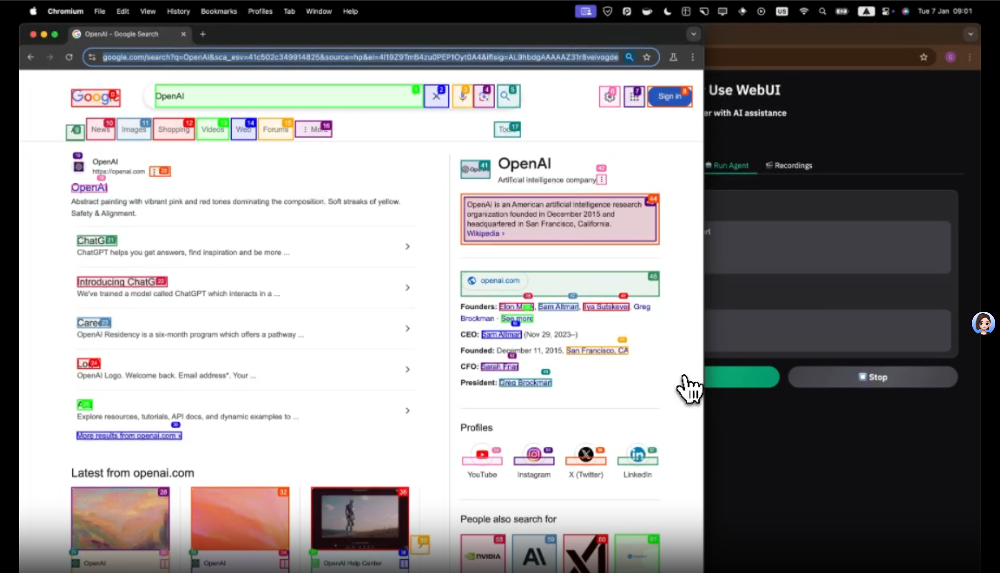
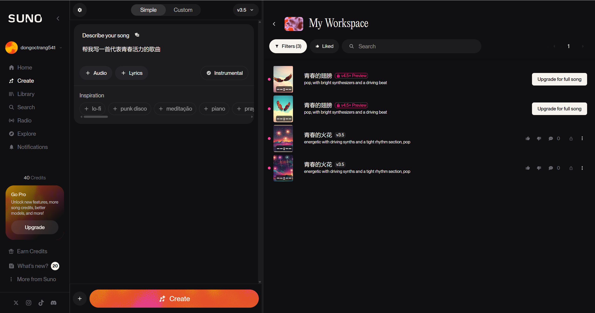
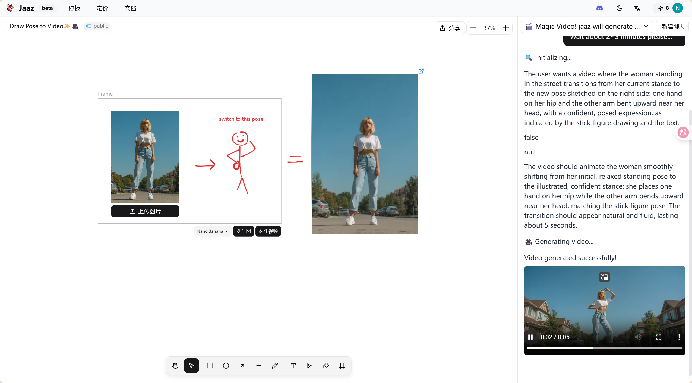
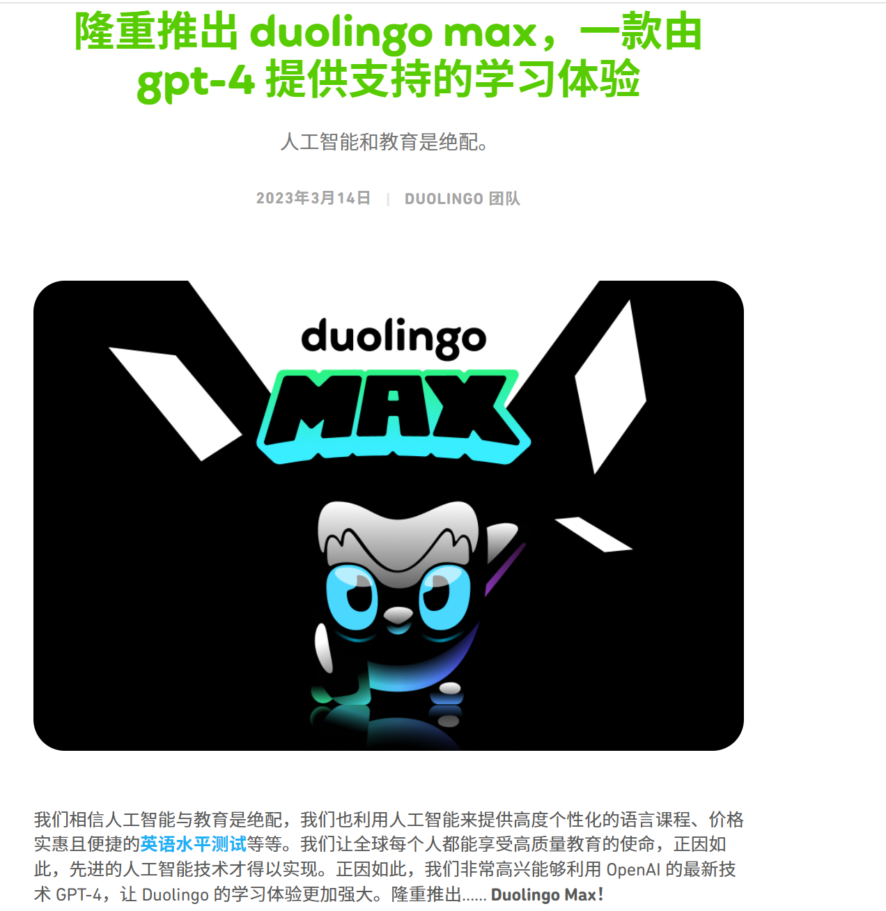

# Page 4: 未来交互 - AI创作新纪元

---

## AI让创作没有门槛

### 创作能力的民主化

| 领域 | 传统门槛 | AI突破 |
|------|---------|-----------|
| 🌐 **网页操作** | 需要编程技能 | 说话就能自动化 |
| 🎵 **音乐创作** | 需要乐理知识 | 文字变歌曲 |
| 🎨 **视频制作** | 需要专业软件 | 图片变视频 |
| 🗣️ **语言学习** | 需要真人陪练 | AI全天候教练 |

### **人人都是创作者的时代**

---

## 四大革命性AI创作工具

### 1. Browser Use - AI像人类一样浏览网页
**🌐 高准确率的自主浏览**

#### 核心能力
- **智能理解**: Python工具库实现网页自动化
- **精准操作**: 像人类一样点击、滚动、填写表单
- **多模型兼容**: 支持GPT4、Claude、Llama等
- **无需编程**: 自然语言描述任务即可

#### 实际应用
```
用户: "帮我在京东找最便宜的iPhone 16"
AI自动: 打开京东 → 搜索iPhone 16 → 筛选价格 → 对比商家 → 找到最优惠

用户: "每天早上帮我收集行业新闻"
AI自动: 访问10个网站 → 提取重要信息 → 生成早报 → 发送邮件
```

#### 对学生的价值
- **学习助手**: 自动收集学习资料
- **比价神器**: 找到最优惠的商品
- **信息整合**: 多源信息自动汇总

*[视频: Browser Use自动完成复杂网页任务]*


---

### 2. Suno - 30秒创作你的原创歌曲
**🎵 AI音乐创作革命**

#### 创作能力
- **文字作曲**: 描述想法即可生成音乐
- **多种风格**: 流行、摇滚、古典、电子、民谣等
- **完整歌曲**: 包含歌词、旋律、编曲、和声
- **商用授权**: 生成的音乐可商业使用

#### 创作示例
```
输入: "写一首关于大学生活的流行歌，要有青春活力"
Suno生成:
- 歌词: 自动创作贴合主题的歌词
- 旋律: 朗朗上口的流行曲调
- 编曲: 专业的乐器配置
- 时长: 2-3分钟完整歌曲

输入: "创作一首毕业季的抒情歌"
Suno生成:
- 情感表达: 离别的不舍与未来的憧憬
- 音乐风格: 温暖治愈的旋律
- 专业品质: 可直接用于毕业典礼
```

#### 应用场景
- **短视频配乐**: 为抖音/B站创作原创BGM
- **社团活动**: 创作社团主题曲
- **个人创作**: 零基础也能发布音乐作品
- **商业项目**: 品牌宣传、广告配乐

*[音频: Suno生成的大学生活主题歌]*

---

### 3. Jaaz - 静态图片秒变动态视频
**🎨 图像到视频的魔法转换**

#### 核心技术
- **智能理解**: AI理解图片内容、构图和深度
- **动作生成**: 自动添加自然流畅的动作
- **场景延伸**: 扩展静态画面为动态场景
- **风格保持**: 完美保持原图艺术风格

#### 创作魔法
```
人物照片 → 动态肖像:
- 眨眼、微笑、转头
- 头发飘动、衣服摆动
- 自然的面部表情
- 呼吸起伏等细节

风景照片 → 动态场景:
- 云朵飘动、水面波纹
- 树叶摇曳、光影变化
- 昼夜交替、四季变换
- 动物移动、人群走动

产品图片 → 展示视频:
- 360度旋转展示
- 功能演示动画
- 使用场景模拟
- 爆炸分解展示
```

#### 实用价值
- **社交媒体**: 静态图变吸睛短视频
- **作品集**: 让设计作品动起来
- **电商展示**: 产品图变动态广告
- **教育演示**: 历史照片变生动场景

---

### 4. Duolingo Max - GPT-4驱动的AI语言教练
**🎓 个性化语言学习革命**

#### 革命性功能
- **角色扮演**: 与AI进行真实场景对话练习
- **解释我的答案**: AI详细解释为什么对或错
- **个性化反馈**: 根据你的错误定制学习路径
- **24小时陪练**: 随时随地练习口语对话

#### 学习场景
```
餐厅点餐练习:
AI服务员: "Bonjour! Que désirez-vous?"
学生: "Je voudrais un café"
AI纠正: "很好！但更地道的说法是'Je prendrais un café'"
解释: "voudrais更正式，prendrais在餐厅更常用"

求职面试模拟:
AI面试官: "Tell me about yourself"
学生: 用英语介绍自己
AI反馈: 
- 语法纠正: 时态使用建议
- 表达优化: 更专业的措辞
- 文化提示: 面试礼仪要点
```

#### 学习效果
- **效率提升**: 学习速度快3倍
- **口语突破**: 克服开口恐惧
- **考试备考**: 雅思托福针对性训练
- **文化理解**: 不只学语言，还学文化

#### 对大学生的特殊价值
- **留学准备**: 模拟国外生活场景
- **求职优势**: 练习英语面试
- **学术提升**: 学术英语表达训练



---

## AI创作的未来已来

### 🚀 核心启示

#### 创作门槛彻底消失
- **不会编程？** Browser Use帮你自动化一切
- **不会作曲？** Suno帮你30秒创作歌曲
- **不会做视频？** Jaaz让图片动起来
- **不会外语？** Duolingo Max全天候陪练

#### 这意味着什么？
- **专注创意**: 技术不再是障碍
- **快速验证**: 想法立即变现实
- **无限可能**: 人人都能创作
- **竞争优势**: 掌握AI就是掌握未来

### 🔥 行动建议

**今天就开始：**
1. 用Suno创作你的第一首歌
2. 用Jaaz让你的照片动起来
3. 用Browser Use自动化日常任务
4. 用Duolingo Max突破语言障碍

**创作的黄金时代已经到来！**

