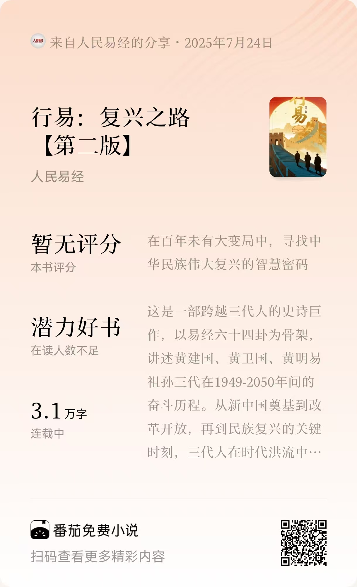

# PromptX小说创作生态：AI写作革命的技术突破与实践
演讲者：黄彦湘
1. 88万字史诗《行易：复兴之路》背后的AI写作革命
2. 一致性危机突破：如何解决百万级长篇小说的角色与情节一致性问题
3. 拟人化团队设计：总监+架构师+规划师+写手，4角色精准协作


## 一个"疯狂"的构思**《行易：复兴之路》的宏大设想**：

- 严格按照《易经》64卦、386爻的顺序对应百年建国史
- **三代人**三个时代的家族史，展现百年民族复兴的缩影
- 将《易经》从算命书还原为**世界观**，家国情怀贯穿全书
- 思考中华民族伟大复兴、百年未有大变局等宏大话题


这就是《行易：复兴之路》——一个看似不可能完成的文学工程，如何通过PromptX系统变成现实的故事。




## 第一层：传统手工写小说5大痛点

  1. 【构】构思混乱 - 世界观设定自相矛盾
  2. 【慢】速度慢 - 一天2000字已经很累
  3. 【卡】经常卡文 - 不知道情节怎么发展
  4. 【错】前后矛盾 - 几十万字很难保持一致
  5. 【累】容易放弃 - 长篇创作周期太长

##  第二层：普通AI创作5大痛点

  1. 【写】提示词工程 - 要学会写复杂提示词
  2. 【乱】角色混乱 - 没有专业分工，一个AI包打天下
  3. 【忘】上下文丢失 - AI记不住前面的设定
  4. 【飘】质量不稳 - 有时好有时差，难以控制
  5. 【死】扩展困难 - 新想法融入要大改重构

### 真实案例：《行易》创作中遇到的系统性危机

**一致性危机**：前后设定矛盾，主角经常性被写“死”
**扩展性噩梦**：创作过程新增灵感，无法优雅扩展
**质量控制幻象**：AI自检无效，仍需大量人工干预发现问题


## PromptX系统革命：从痛点到方法论突破

### 核心设计哲学：拟人化AI团队思维

假设你招聘了一个小说创作团队，你要解决哪些问题？


**设计原则**：把AI系统当作专业团队来设计
- **身份定位**："我"是谁？ → 角色提示词层
- **职责边界**："我"做什么？ → 小说设定层
- **工作方法**："我"如何做？ → 工作台层

**方法论支撑**：
- 🔪 **奥卡姆剃刀**：用最简方案解决复杂问题
- 📊 **MECE原则**：不重叠、不遗漏的系统设计
- 👥 **拟人化思维**：团队协作的自然模式

## PromptX系统5大解决方案（三层架构版）

1. 【写】提示词工程 → 一键生成角色
- PromptX自动生成专业AI角色，告别复杂提示词调教
- 角色即插即用，像使用专业软件一样简单
- 从"手写提示词"变成"选择角色"，技术门槛归零

2. 【顺】角色混乱 → 拟人化团队精准分工
- **总监重新定位**：从"全能协调者"→"专业任务分配器+质量监控者"
- **4角色MECE分工**：总监(路由+监控) + 架构师(世界观) + 规划师(故事线) + 写手(内容)
- **三层架构支撑**：
  ```
  角色提示词层："我"是谁？→ 专业身份定位
  小说设定层："我"做什么？→ 职责边界清晰
  工作台层："我"如何做？→ 标准化流程
  ```

3. 【记】上下文丢失 → 永久记忆不断片
- 告别断片：PromptX为每个角色建立独立记忆库，专业经验不丢失
- 智能学习：每个角色记住自己的工作偏好和专业判断
- 项目统一：共享项目设定文件，确保协作时信息同步

4. 【质】质量不稳 → 专业标准保质量
- 三层架构确保稳定：角色身份层+工作台层+项目设定层
- 标准化工作流：每个角色都有专业工作台指导
- 人机最佳配比：AI负责执行，人类负责决策和创意把控

5. 【活】扩展困难 → 奥卡姆剃刀式简化架构
- **流程极简化**：从6步骤→4步骤，用户认知负担减半
  ```
  原流程：世界观设定→一句话剧情→全景故事线→章节规划→创作→修订
  优化后：小说设定→故事大纲→故事概要→小说内容
  ```
- **内容集中化**：分散≠简洁，集中=高效，相同类型内容统一管理
- **MECE架构验证**：世界观三维度覆盖 What(故事世界) + Why(主题) + Who(角色)


## PromptX方法论：从小说到通用AI协作框架

### 三层架构的核心价值

```
🧠 身份层：定义"我是谁" - AI的专业角色和能力边界
🔧 方法层：规范"怎么做" - 标准化的工作流程和质量标准
🎯 目标层：明确"做什么" - 具体要解决的问题和交付标准
```

**为什么这样分层？**
- **身份层**：避免AI角色混乱，每个AI都有清晰的专业定位
- **方法层**：确保工作质量稳定，不再靠运气出好结果
- **目标层**：明确任务边界，AI知道什么该做什么不该做

**这种分离的优势**：
- 修改一层不影响其他层，系统稳定可控
- 每层职责单一，问题定位准确快速
- 可以独立优化每层，持续改进系统

### 通用AI协作框架模式

这不仅适用于小说创作，更是一套可复制的AI系统架构方法论。任何复杂的AI协作场景都可以用这三层来设计。

