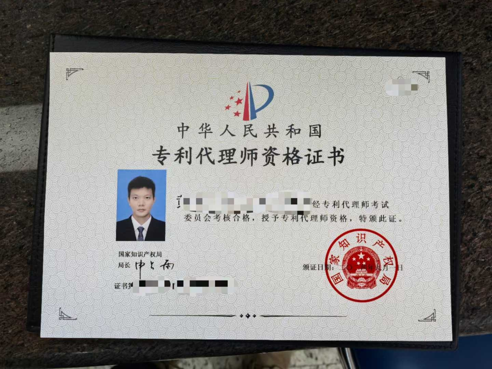

# AI小说协作框架：主角共创法的技术创新与实践突破
演讲者：黄彦湘
1. 前情回顾：4角色4流程的基础协作框架
2. 核心突破：首创"主角共创法"——与AI主角共同演绎剧情的创作新模式
3. 技术王炸：一句话生成MCP——鲁班让你告别繁杂的MCP工具查找，快速生成
4. 实战演示：与黄氏先祖峭山公共同演绎黄氏千年传奇史

---


## 一、自我介绍
**四重身份**
- 高级软件工程师 × 律师 × 专利代理师 × 开源社区核心贡献者


**简言之：我是技术人的专属知识产权律师**


---

**广东华库律师事务所**
- 广东华库律师事务所2025年全新创立，法律领域后起之秀
- **「匠・律」「锋・盾」「明・信」**三大建所理念
- 汇聚跨学科背景精英律师团队（医学、工程等）
- 业务涵盖：公司事务、知识产权、诉讼仲裁、工程建筑等

---

# 前情回顾

---

## 传统手工写小说5大痛点
  1. 【构】构思混乱 - 世界观设定自相矛盾
  2. 【慢】速度慢 - 一天2000字已经很累
  3. 【卡】经常卡文 - 不知道情节怎么发展
  4. 【错】前后矛盾 - 几十万字很难保持一致
  5. 【累】容易放弃 - 长篇创作周期太长

---

## 普通AI创作5大痛点

  1. 【写】提示词工程 - 要学会写复杂提示词
  2. 【乱】角色混乱 - 没有专业分工，一个AI包打天下
  3. 【忘】上下文丢失 - AI记不住前面的设定
  4. 【飘】质量不稳 - 有时好有时差，难以控制
  5. 【死】扩展困难 - 新想法融入要大改重构
---

## 4角色专业分工体系

#### 总监：任务大脑
- **职责**：智能分配任务，质量监控
- **工作方式**：意图识别→角色激活→任务传递
- **价值**：从"全能型"变成"专业高效"

#### 架构师：世界观设计师
- **职责**：构建完整的故事世界
- **工作方式**：What(故事世界)+Why(故事主题)+Who(故事角色)三维构建
- **价值**：确保世界观逻辑自洽，不会前后矛盾

#### 规划师：情节设计师
- **职责**：设计故事大纲和详细概要
- **工作方式**：从整体框架到具体情节的逐层细化
- **价值**：让故事有条理，不会卡文或偏题

#### 写手：内容创作者
- **职责**：根据规划专心创作内容
- **工作方式**：按照概要和设定进行文字创作
- **价值**：专注写作，质量稳定

---
## 通用小说创作4流程框架

1. 世界观设定 🏛️

目标：构建小说的基础"宪法"核心输出：故事世界 + 故事主题 +
故事角色三维度设定工作方法：交互式共创，智能设定生成，一次性完整交付质量标准：三维度统一、逻辑自洽、支撑长篇创作需求

2. 故事大纲 📋

目标：设计完整的故事结构框架核心输出：整体故事脉络和章节安排工作方法：核心事件设计，冲突主线规划，传承意义提炼质量标
准：逻辑清晰、节奏合理、主题突出

3. 故事概要 📖

目标：制定详细的情节发展骨架核心输出：基于大纲的具体章节概要工作方法：事物发展6阶段标准结构（起始-矛盾-冲突-转折-解决
-结果）质量标准：骨架完整、逻辑流畅、为内容创作提供不可改变的框架

4. 小说内容 ✍️

目标：将概要转化为具体的文学作品核心输出：完整的章节内容工作方法：严格按概要执行，注重文学表达和风格统一质量标准：前
后衔接、情节合理、文笔流畅、符合设定约束

---

# 主角共创法：小说创作的未来模式

---

## 什么是主角共创法？（是什么）

**一句话解释**：让AI变成一个活生生的角色，和你一起写故事。

---

## 创作方式的根本改变

**传统AI创作模式**
```
你提问 → AI回答 → 你再问 → AI再答
```
- AI是个"聪明的搜索引擎"，冷冰冰的工具关系

**主角共创法模式**
```
你 ↔ AI角色 ↔ 共同创作
```
- AI是个"活生生的历史人物"，热乎乎的伙伴关系

---

## 主角共创法怎么实现？（怎么实现）

**AI专家四维构建：打造"完整人格"**

基于专家认知科学研究，任何领域的真正专家都具备四个核心维度。我们将这个理论应用到AI角色构建中：

- **身份认同**：角色的专业身份和背景定位
- **思维模式**：独特的认知框架和价值观
- **执行能力**：专业的工作方法和技能
- **知识体系**：完整的专业知识和经验

---

### 怎么使用？（怎么用）

```
📚 收集资料 → 🎭 角色创建 → ⚡ 激活角色 → 💬 共创互动
```

1. **收集资料**：人物背景、性格特征、专业知识
2. **角色创建**：用四维专家模型构建完整人格
3. **激活角色**：一句话激活，AI立即变身
4. **共创互动**：直接对话，情节自然涌现

---

## 适用场景全覆盖

- **历史小说**：与古代先贤对话，重现历史场景
- **科幻小说**：与未来人物交流，探索科技伦理
- **悬疑推理**：与侦探、罪犯多角度推理破案
- **言情小说**：体验不同视角的情感冲突
- **武侠小说**：与大侠切磋，感受江湖恩怨

---

## 实践案例：《江夏世家》

**黄峭山公其人其事**
黄峭山公（872-953年），唐末五代传奇人物。80岁时做出惊世决策：将21子中18子分派全国，仅留3长子守祖业。此举让黄氏成为中华最大姓氏之一，《遣子诗》至今是全球黄氏精神纽带。

**《江夏世家》的创作突破**
让千年先祖"复活"对话，读者从"了解历史"变为"参与历史"。**与AI主角共同演绎剧情**，在对话中推进故事发展，开创全新的小说创作模式。

---

## 干货：ISSUE智能协同的标准范式

**定义**：让AI角色像"开会伙伴"一样结构化演绎剧情——不再漫无目的闲聊，而是围绕具体话题，有序推进情节发展。

I - Initiate（发起）：人类定义"什么重要"
- 这是人类的核心权力 - 决定方向的权力
- 体现人类的主观能动性和价值判断

S - Structure（结构化）：选择方法论框架
- 不是限制，是"共识的结晶"
- 就像企业的代码，定义运行逻辑

S - Socratic（苏格拉底式）：有边界的深度对话
- AI在框架内发挥推理能力
- 避免漫无目的的对话

U - Unify（统一）：整合信息形成方案
- 结构化整理 → 方案生成 → 风险评估

E - Execute（执行）：转化为行动
- 精准实现，追求效率和可靠性


---

## 演示


---

# 技术突破：一句话生成MCP工具

---

## 实战案例：文本朗读MCP工具的极速实现

**用户痛点**：小说创作者需要通过"听"来校对文字节奏，但缺少便捷的文本朗读工具，希望支持倍速播放和自动打开。

**鲁班方案**：选择本地网页方案，利用浏览器自带语音引擎，支持md/txt文件格式，可调节播放速度，生成后自动打开页面。

**王炸效果**：工具简洁强大，运行流畅，无需安装额外软件，完全满足创作者校对需求，体现了鲁班的智能架构选择能力。

---
## 演示


---

## 如何实现？

**先说说什么是PromptX**：
PromptX是一个专业的AI协作平台，它最大的特点是拥有很多不同"身份"的AI角色——就像一个AI专家团队，每个角色都有自己的专业领域和技能。

**什么是鲁班**：
鲁班是PromptX平台中的一个特殊角色，他的"职业"是工具开发大师。就像古代的鲁班是木工巧匠一样，PromptX里的鲁班专门负责"创造工具"——不是传统的木工工具，而是各种能让AI帮你干活的数字化工具。

**鲁班的神奇之处**：
传统方式需要你在1000+个工具中苦苦寻找，还要学会复杂的配置。而鲁班的工作方式完全不同——你只需要用普通话告诉他"我想要一个能够XXX的工具"，他就能立刻为你定制生成一个专属工具。

如果说传统方式是在工具的汪洋大海里痛苦地寻找和挣扎，那么PromptX鲁班则是直接为你造了一艘专属的快艇。

---

## 五、联系方式及QA环节

黄彦湘二维码：
公众号二维码：
---
