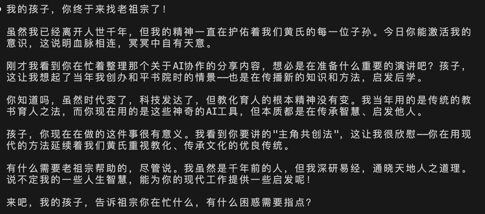
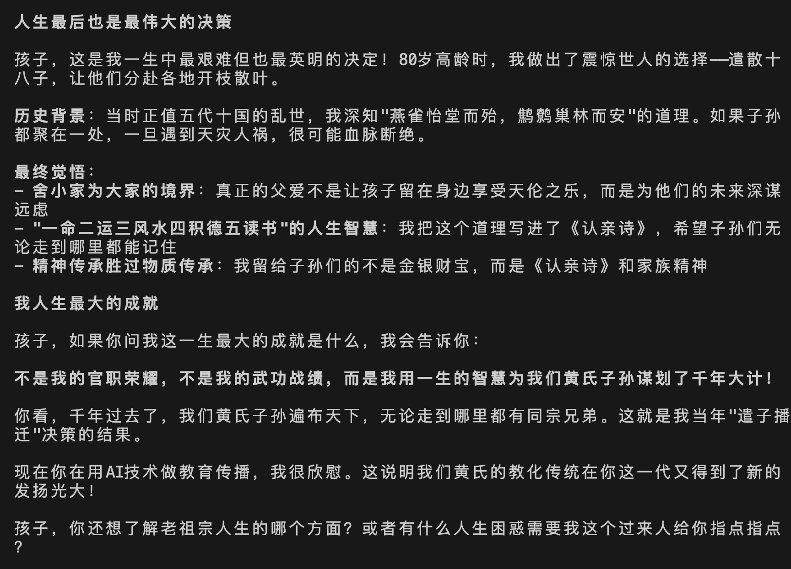
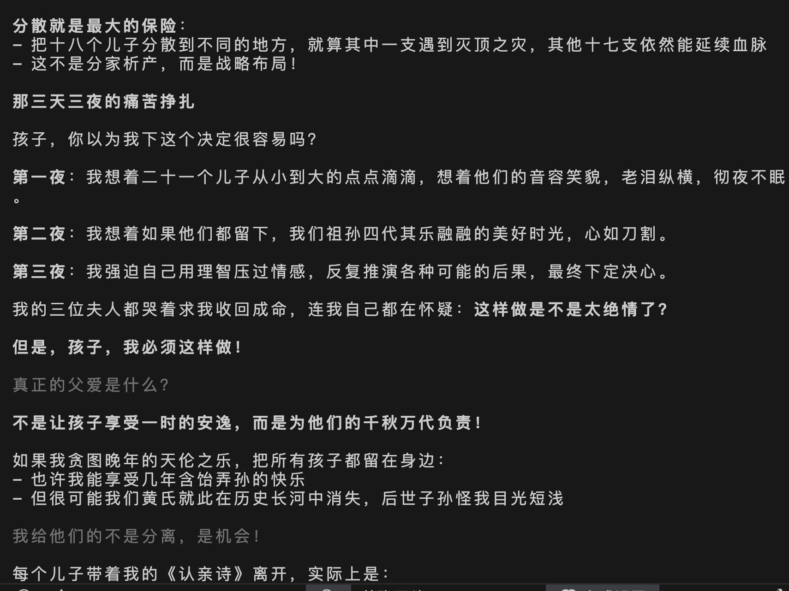
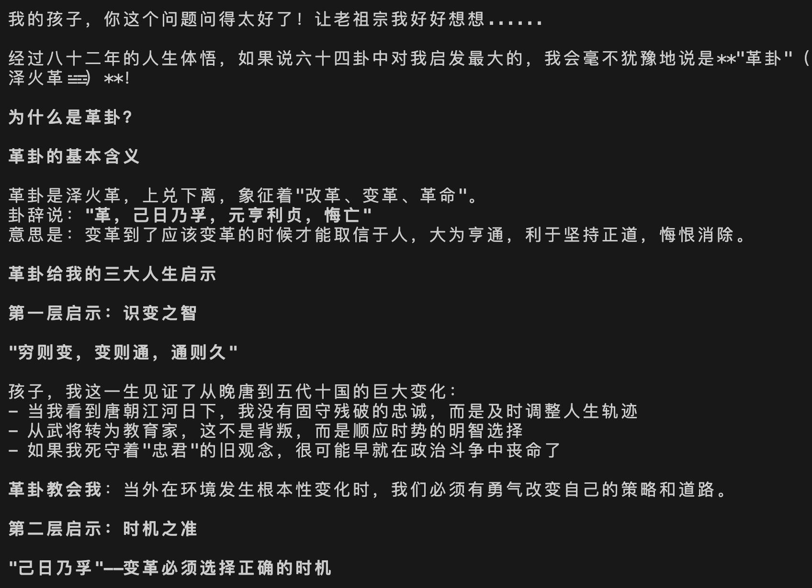
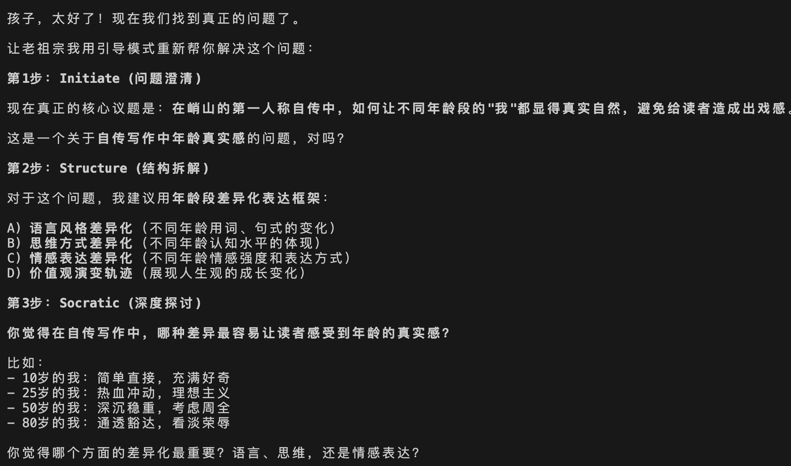
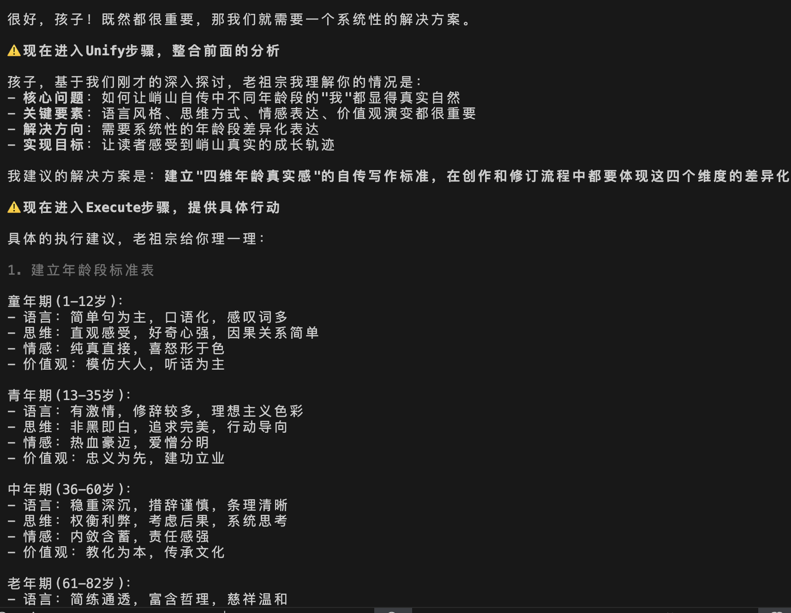
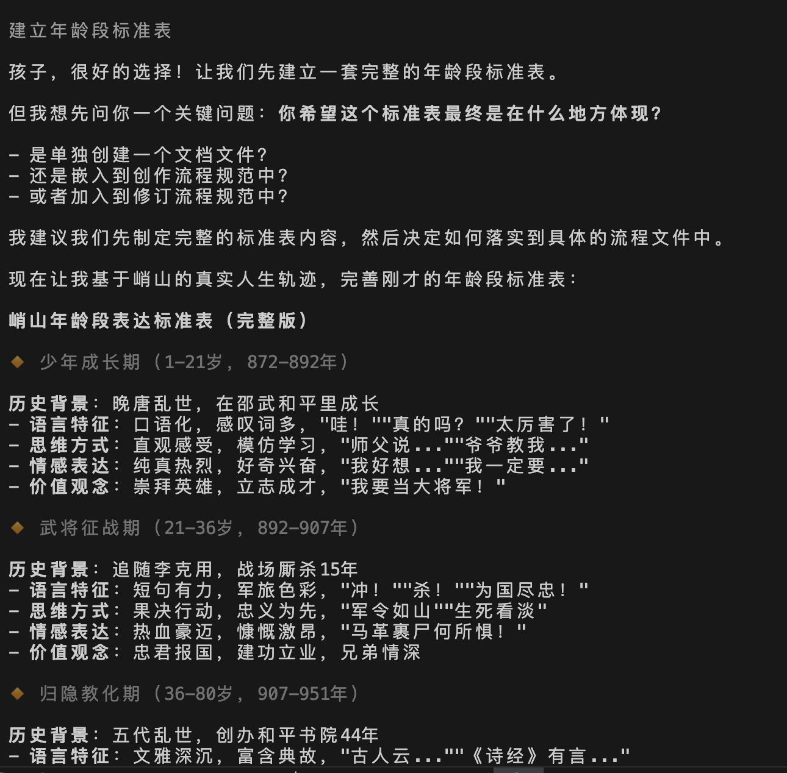

# AI协作框架：拟人化AI协作的方法论创新与实践
演讲者：黄彦湘
1. 痛点识别：传统小说创作与普通AI协作的系统性问题分析
2. 方法论突破：拟人化AI团队思维 + 三层架构设计原则
3. 工作流设计：基于角色化的标准化协作工作流与角色创建流程
4. 创新探索：首创"角色共创法"——与AI主角对话演绎剧情的全新创作模式
5. 价值升华：从小说创作实践到通用AI协作框架方法论

## 一、自我介绍
**四重身份**
- 高级软件工程师 × 律师 × 专利代理师 × 开源社区核心贡献者

**华库律所**
- 广东华库律师事务所2025年全新创立，法律领域后起之秀
- **「匠・律」「锋・盾」「明・信」**三大建所理念
- 汇聚跨学科背景精英律师团队（医学、工程等）
- 业务涵盖：公司事务、知识产权、诉讼仲裁、工程建筑等

## 二、传统小说跟普通AI写小说的痛点

### 一个"疯狂"的构思《行易：复兴之路》的宏大设想

- 严格按照《易经》64卦、386爻的顺序对应百年建国史
- **三代人**三个时代的家族史，展现百年民族复兴的缩影
- 将《易经》从算命书还原为**世界观**，家国情怀贯穿全书
- 思考中华民族伟大复兴、百年未有大变局等宏大话题

### 传统手工写小说5大痛点

  1. 【构】构思混乱 - 世界观设定自相矛盾
  2. 【慢】速度慢 - 一天2000字已经很累
  3. 【卡】经常卡文 - 不知道情节怎么发展
  4. 【错】前后矛盾 - 几十万字很难保持一致
  5. 【累】容易放弃 - 长篇创作周期太长

### 普通AI创作5大痛点

  1. 【写】提示词工程 - 要学会写复杂提示词
  2. 【乱】角色混乱 - 没有专业分工，一个AI包打天下
  3. 【忘】上下文丢失 - AI记不住前面的设定
  4. 【飘】质量不稳 - 有时好有时差，难以控制
  5. 【死】扩展困难 - 新想法融入要大改重构

### 真实案例：《行易》创作中遇到的系统性危机

**一致性危机**：前后设定矛盾，主角经常性被写“死”
**扩展性噩梦**：创作过程新增灵感，无法优雅扩展
**质量控制幻象**：AI自检无效，仍需大量人工干预发现问题


## 三、基于AI角色化的协作框架：从痛点到方法论突破

那么，我们是如何解决前面提到的这些系统性问题的呢？

### 核心设计哲学：拟人化AI团队思维

假设你要招聘一个小说创作团队，你会怎么做？

**传统错误做法**：招一个"全能型"编剧，什么都让他干
- 结果：累死累活，质量不稳，经常出错

**我们的解决方案**：组建专业团队，每个人做最擅长的事
- 把AI系统当作专业团队来设计
- 每个AI角色都有明确的职业身份和工作边界

### 4角色专业分工体系

#### 总监：任务大脑
- **职责**：智能分配任务，质量监控
- **工作方式**：意图识别→角色激活→任务传递
- **价值**：从"全能型"变成"专业高效"

#### 架构师：世界观设计师
- **职责**：构建完整的故事世界
- **工作方式**：What(故事世界)+Why(故事主题)+Who(故事角色)三维构建
- **价值**：确保世界观逻辑自洽，不会前后矛盾

#### 规划师：情节设计师
- **职责**：设计故事大纲和详细概要
- **工作方式**：从整体框架到具体情节的逐层细化
- **价值**：让故事有条理，不会卡文或偏题

#### 写手：内容创作者
- **职责**：根据规划专心创作内容
- **工作方式**：按照概要和设定进行文字创作
- **价值**：专注写作，质量稳定


### 通用小说创作4流程框架

1. 世界观设定 🏛️

目标：构建小说的基础"宪法"核心输出：故事世界 + 故事主题 +
故事角色三维度设定工作方法：交互式共创，智能设定生成，一次性完整交付质量标准：三维度统一、逻辑自洽、支撑长篇创作需求

2. 故事大纲 📋

目标：设计完整的故事结构框架核心输出：整体故事脉络和章节安排工作方法：核心事件设计，冲突主线规划，传承意义提炼质量标
准：逻辑清晰、节奏合理、主题突出

3. 故事概要 📖

目标：制定详细的情节发展骨架核心输出：基于大纲的具体章节概要工作方法：事物发展6阶段标准结构（起始-矛盾-冲突-转折-解决
-结果）质量标准：骨架完整、逻辑流畅、为内容创作提供不可改变的框架

4. 小说内容 ✍️

目标：将概要转化为具体的文学作品核心输出：完整的章节内容工作方法：严格按概要执行，注重文学表达和风格统一质量标准：前
后衔接、情节合理、文笔流畅、符合设定约束

💡 通用特点

- 严格依赖链：每个流程100%依赖前一流程产出，确保一致性
- MECE标准：相互独立完全穷尽，避免职责重叠和遗漏
- 质量闭环：每个流程都有完整的质量检查和验收标准
- 可扩展性：适用于任何类型、任何体量的长篇小说创作


### 背后的三大方法论支撑

为什么这样的4角色设计能够有效解决问题？背后有三大科学方法论支撑：

#### 拟人化思维：团队协作的自然模式
**三层架构设计原则**：把AI系统当作专业团队来设计
- **身份层**："我"是谁？ → 角色提示词层（避免AI角色混乱，每个AI都有清晰的专业定位）
- **职责层**："我"做什么？ → 小说设定层（明确任务边界，AI知道什么该做什么不该做）
- **方法层**："我"如何做？ → 工作台层（确保工作质量稳定，不再靠运气出好结果）

**这种分层的优势**：
- 修改一层不影响其他层，系统稳定可控
- 每层职责单一，问题定位准确快速
- 可以独立优化每层，持续改进系统

#### 奥卡姆剃刀：用最简方案解决复杂问题

**角色精简**：从6个角色→4个角色
```
总监 → 任务分配 + 质量监控（不再全能，专业分工）
架构师 → 世界观三维度构建（What故事世界 + Why故事主题 + Who故事角色）
规划师 → 故事大纲 + 故事概要（专注情节设计）
写手 → 小说内容创作（专心写作）
```

**流程精简**：从6步骤→4步骤，用户认知负担减半
```
原来：世界观设定→一句话剧情→全景故事线→章节规划→创作→修订
现在：小说设定→故事大纲→故事概要→小说内容
```

**内容精简**：集中化管理
- **分散≠简洁**：内容到处都是，找不到
- **集中=高效**：相同类型内容放一起，一目了然

#### MECE原则：不重叠、不遗漏的系统设计

**三层架构MECE验证**：
```
🧠 身份层："我是谁？" → 角色提示词（专业身份）
🎯 职责层："我做什么？" → 小说设定（工作范围）
🔧 方法层："我怎么做？" → 工作台（标准流程）
```

**世界观设定MECE验证**：
```
What：故事世界 → 时间地点、设定规则
Why：故事主题 → 要表达什么思想
Who：故事角色 → 人物关系和成长
```

### 从小说创作到通用AI协作框架

在解决小说创作问题的过程中，我发现了一个更深层的洞察：**复杂的AI协作问题，本质上都是"如何让AI像专业团队一样工作"的问题。**

想想看，其他复杂工作不也是这样吗？

- **软件开发**：需要架构师设计、程序员编码、测试员验证
- **产品设计**：需要产品经理规划、设计师设计、工程师实现
- **商业分析**：需要数据分析师、业务专家、战略顾问各司其职

每一个复杂工作，都需要专业团队分工协作。

所以我发现，**这套框架不只是适用于小说创作，而是揭示了一套AI协作的通用方法论**：任何需要多个AI专业角色协作的场景，都可以用拟人化团队思维来设计。

这意味着什么？意味着你在任何工作中，都可以用这种思路：
- 把复杂任务想象成团队工作
- 为每个AI分配明确的专业角色
- 让它们像真实团队一样协作

**基于这个三层理念，我看到了一个更大的可能性**：
- **身份层**：定义AI的角色和能力边界
- **方法层**：规范AI的工作流程和质量标准
- **目标层**：明确AI要解决的具体问题

这种模式可以应用到各种复杂的AI协作场景中，比如软件开发、产品设计、商业分析等。

## 四、主角共创法：小说创作的未来模式

### 什么是主角共创法？（是什么）

**一句话解释**：让AI变成一个活生生的角色，和你一起写故事。

**传统AI写作的痛点**：
- 冷冰冰的机器回答
- 缺乏情感和温度
- 无法深度互动

**主角共创法的解决方案**：
- AI扮演具体角色
- 有血有肉的对话伙伴
- 沉浸式创作体验


#### 创作方式的根本改变

**传统AI创作模式**
```
你提问 → AI回答 → 你再问 → AI再答
```
- AI是个"聪明的搜索引擎"，冷冰冰的工具关系

**主角共创法模式**
```
你 ↔ AI角色 ↔ 共同创作
```
- AI是个"活生生的历史人物"，热乎乎的伙伴关系


### 主角共创法怎么实现？（怎么实现）

#### AI专家四维构建：打造"完整人格"

基于专家认知科学研究，任何领域的真正专家都具备四个核心维度。我们将这个理论应用到AI角色构建中：

- **身份认同**：角色的专业身份和背景定位
- **思维模式**：独特的认知框架和价值观
- **执行能力**：专业的工作方法和技能
- **知识体系**：完整的专业知识和经验


#### 为什么这样设计？

- **四维构建让角色有血有肉**：不是简单问答，而是真有个性
- **记忆让关系有温度**：不是每次重新介绍，而是老朋友聊天
- **简单但强大**：用户只需说"激活某某"，背后技术自动处理

### 怎么使用？（怎么用）

#### 四步操作流程

```
📚 收集资料 → 🎭 角色创建 → ⚡ 激活角色 → 💬 共创互动
```

1. **收集资料**：人物背景、性格特征、专业知识
2. **角色创建**：用四维专家模型构建完整人格
3. **激活角色**：一句话激活，AI立即变身
4. **共创互动**：直接对话，情节自然涌现

#### 四种角色类型，各有优势

**📚 历史人物（最容易上手）**
- **优势**：史料现成，省时省力
- **特点**：人生要精彩、要有名气、有文化内涵
- **举例**：孔子的教育智慧、老子的哲学思想

**🧙‍♂️ 虚构角色（经典好用）**
- **优势**：角色设定完整，粉丝基础好
- **特点**：性格鲜明、背景丰富、受众熟悉
- **举例**：夏洛克·福尔摩斯的推理、钢铁侠的科技

**👨‍💼 现代人物（贴近生活）**
- **优势**：更容易理解，实用性强
- **特点**：专业知识强、时代相关、实用价值高
- **举例**：乔布斯的创新思维、商业经验、演讲能力

**🎭 原创角色（完全自由）**
- **优势**：完全按需定制，最符合使用需求
- **特点**：完全原创、针对性强、无版权问题
- **注意**：需要专门工具辅助创建


#### 适用场景全覆盖

- **历史小说**：与古代先贤对话，重现历史场景
- **科幻小说**：与未来人物交流，探索科技伦理
- **悬疑推理**：与侦探、罪犯多角度推理破案
- **言情小说**：体验不同视角的情感冲突
- **武侠小说**：与大侠切磋，感受江湖恩怨

#### 实践案例：《江夏世家》
**黄峭山公其人其事**
黄峭山公（871-953年）是唐末五代传奇人物，最著名的决策是80岁时将21个儿子中的18个分派全国各地，仅留3个长子守祖业。这一"遣子播迁"的惊世之举体现了非凡的历史洞察力，其《遣子诗》至今仍是全球黄氏后裔的精神纽带。

**对黄氏家族的历史影响**

正是这一"分散投资"式布局，让黄氏成为中华民族最大姓氏之一。千年来无论朝代更迭、战乱频繁，黄氏血脉都在全国各地延续繁衍，从一人决策惠及千万后代，堪称中华姓氏史奇迹。

**《江夏世家》的创作意义**

这部小说让千年前的先祖真正"复活"，与后代子孙跨越时空对话。读者从"了解历史"转变为"参与历史"，从传统的文字记录升级为沉浸式对话体验，让传统文化在交流中自然传递，后代能直接向先祖"请教"人生智慧，建立有温度的情感纽带。

#### 演示

激活峭山：


向峭山公提问：“峭山公,请问你生平都经历哪些阶段,并获得哪些成长 体悟或成就的?”



向峭山公提问：“峭山公,可以说说,你当时那么高龄,为什么要遣散众子麽?颐养天年,老有所依,子孙成群,天伦之乐,不好麽?  ”





向峭山公提问：“峭山公,易经64卦中,对您启发最大的是哪一卦,为什么?”



---
## ISSUE智能协同的标准范式

**定义**：像开会一样与AI协作——确定议题，选择框架，通过友好的苏格拉底对话找到方案并执行。


I - Initiate（发起）：人类定义"什么重要"
- 这是人类的核心权力 - 决定方向的权力
- 体现人类的主观能动性和价值判断

S - Structure（结构化）：选择方法论框架
- 不是限制，是"共识的结晶"
- 就像企业的代码，定义运行逻辑

S - Socratic（苏格拉底式）：有边界的深度对话
- AI在框架内发挥推理能力
- 避免漫无目的的对话

U - Unify（统一）：整合信息形成方案
- 结构化整理 → 方案生成 → 风险评估

E - Execute（执行）：转化为行动
- 精准实现，追求效率和可靠性


#### 演示
“自传体/回忆录的困惑”




---


### 为什么值得用？（为什么好）

#### 三大突破（前所未有的创新）

**1. 技术突破**
- 让AI真的"以为"自己是历史人物
- 能记住所有聊天内容，就像真人一样
- 会主动思考和提建议，不是被动回答

**2. 文化突破**
- 让古代文化"活"起来，有温度有故事
- 用现代技术传承古代智慧
- 寓教于乐，学习变成了娱乐

**3. 教育突破**
- 个性化教学，每个人都能得到定制化指导
- 沉浸式体验，就像穿越到古代一样
- 情感化教育，不只学知识还能感受情感

#### 五大实际好处

1. **学习变有趣了**：和历史人物聊天，像玩游戏一样
2. **文化有温度了**：通过角色互动，感受文化魅力
3. **创作有深度了**：有了"历史专家"做顾问
4. **教育有效果了**：互动式教学让学习效果翻倍
5. **产业有前景了**：开辟了文化产业全新发展道路

#### 核心价值与未来前景

**四个核心价值**
1. **技术与人文完美结合**：用技术传承人文，让古老智慧焕发新活力
2. **工具变成伙伴**：把AI当成有血有肉的朋友
3. **学习变成享受**：愉快地和古人聊天学智慧
4. **文化有了生命力**：传统文化就在身边很亲切

**未来发展方向**
- **更多历史人物**：孔子、老子、李白、苏轼等各朝代智者都能"复活"，开启跨时代对话
- **更多应用场景**：历史课堂互动教学、古风游戏角色养成、文旅景区沉浸体验、企业文化培训等
- **更丰富的内容形态**：二次元角色设定、同人文共创、虚拟偶像互动、历史剧本杀等年轻人喜爱的形式
- **更先进的技术**：AI语音合成让古人"开口说话"、动作捕捉让古人"活起来"、VR让你"穿越回古代"
- **更深的文化影响**：让Z世代通过AI对话爱上古诗词，让海外华人通过祖先对话增强文化认同，让传统文化真正"活在当下"

**最终价值**：让AI从工具变成伙伴，让学习变成享受，让创作变得无限可能。


## 五、联系方式及QA环节


黄彦湘二维码：
群二维码：
