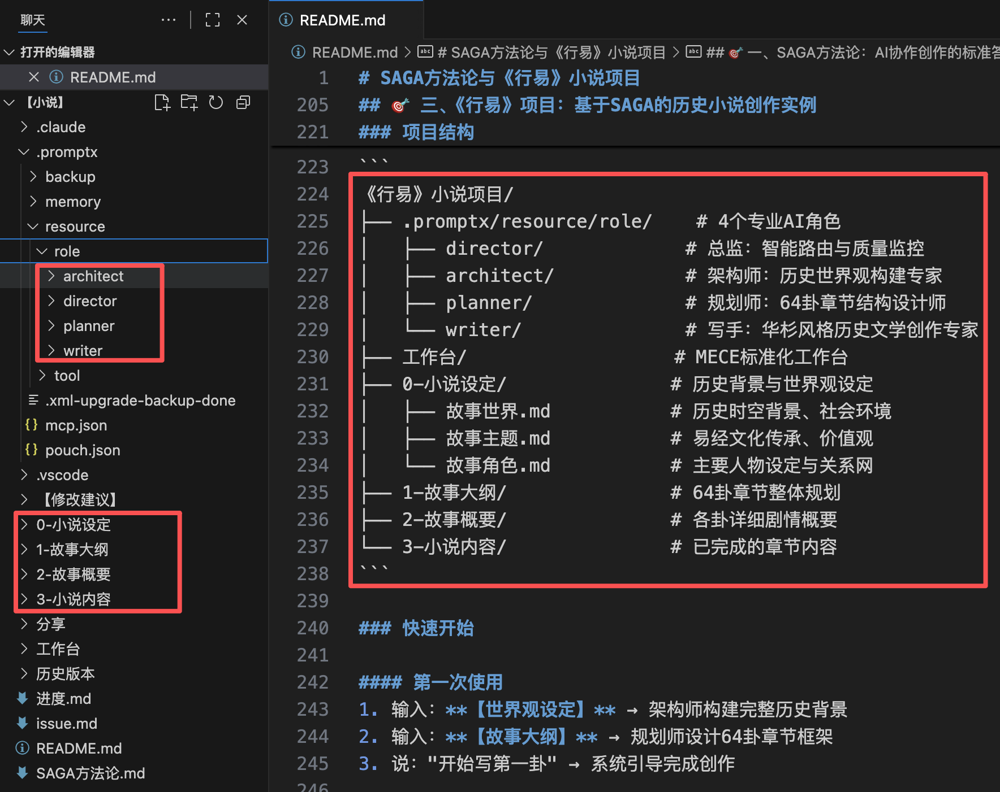
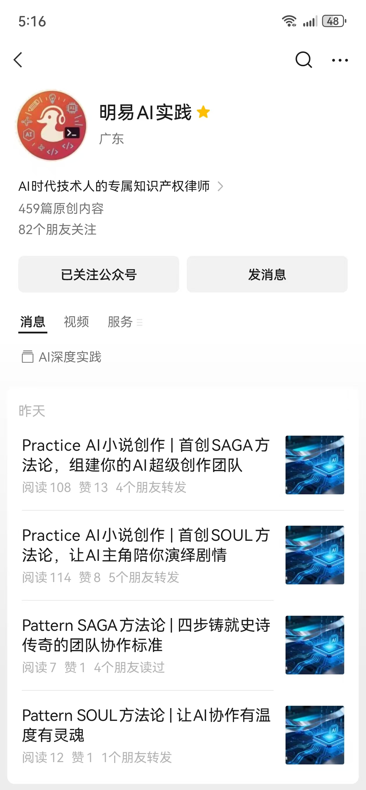

# AI小说创作新范式：SAGA与SOUL方法论实践突破
演讲者：黄彦湘
1. **SAGA方法论**：4角色4流程的系统化创作框架与实战应用
2. **SOUL方法论**：主角共创的温度化协作模式与突破实践
3. **一句话生成MCP工具**：智能工具生成器的技术创新与演示

---


## 一、自我介绍
**四重身份**
- 高级软件工程师 × 律师 × 专利代理师 × 开源社区核心贡献者


**AI时代技术人的专属知识产权律师**


---

**广东华库律师事务所**
- 广东华库律师事务所2025年全新创立，法律领域后起之秀
- **「匠・律」「锋・盾」「明・信」**三大建所理念
- 汇聚跨学科背景精英律师团队（医学、工程等）
- 业务涵盖：公司事务、知识产权、诉讼仲裁、工程建筑等

---

# 首创SAGA方法论，组建你的AI超级创作团队

---

## SAGA方法论是什么？

**SAGA  = Setting → Architecture → Generation → Assessment**

SAGA方法论是AI协作小说创作的标准化**工作流**，通过4个专业AI角色的协作分工，让任何人都能创作出史诗级长篇小说。

---


## SAGA方法论详解

### S - Setting（设定阶段）
**负责角色**：架构师
**核心任务**：构建小说的"宪法"级基础设定
- 故事世界设定：时空框架、世界规则
- 故事主题设定：核心价值观、文化传承
- 故事角色设定：主角配置、人物关系

### A - Architecture（架构阶段）
**负责角色**：规划师
**核心任务**：设计完整的故事结构和发展脉络
- 故事大纲：整体结构框架，章节划分
- 故事概要：详细剧情骨架，情节脉络
- 节奏控制：起承转合设计，高潮安排

### G - Generation（生成阶段）
**负责角色**：写手
**核心任务**：产出高质量的小说内容
- 章节内容创作：文学表达、情感共鸣
- 风格统一把控：语言风格、叙述视角
- 内容修订润色：结构优化、文字打磨

### A - Assessment（评估阶段）
**负责角色**：总监
**核心任务**：确保输出质量和设定一致性
- 智能任务分配：意图识别、角色路由
- 质量系统监控：设定一致性、逻辑连贯性
- 问题发现处理：批判性分析、问题定位

---

## SAGA三层品控体系


### 🏛️ 第一层：设定宪法
- 核心设定固化为"宪法"级约束
- AI输出强制遵守，源头杜绝逻辑漂移

### ⚙️ 第二层：专业分工
- 4角色独立运作，职责边界清晰
- 变更需求精准定位，系统稳定性强

### 👤 第三层：人工把关
- **人类掌控决策权**：每道工序必须人工审核
- **AI负责分析评估**：总监提供质量建议
- 流水线式质量管控，环环相扣


---

## SAGA的实践案例

---

### 一个"疯狂"的构思《行易：复兴之路》的宏大设想

- 严格按照《易经》64卦、386爻的顺序对应百年建国史
- **三代人**三个时代的家族史，展现百年民族复兴的缩影
- 将《易经》从算命书还原为**世界观**，家国情怀贯穿全书
- 思考中华民族伟大复兴、百年未有大变局等宏大话题


---

## 演示 - 小说项目

]

--

### 演示 - 人与AI协作保证质量

[第34篇文章创作过程视频](assets/SAGA-总监检查问题.mp4)

---

### 演示 - 创作文章

[第34篇文章创作过程视频](assets/SAGA-创作第34篇文章演示.mp4)
[SAGA-第34篇文章成果演示](assets/SAGA-第34篇文章成果演示.mp3)

---

### SAGA适用场景分析

**🎯 SAGA擅长：有框架的创作**

---

### 🤔 新挑战：无框架怎么办？

**核心问题**：
- ❌ AI天然发散，缺乏聚焦
- ❌ 传统AI不了解你的剧情
- ❌ 发散结果往往不满意

**关键洞察**：
> **谁最了解历史小说？主角自己！**

---

### 💡 创新突破
```
如果主角能"复活"陪我创作就好了！
↓
诞生了SOUL方法论（SOUL方法论）
```

**从此**：让AI变成活生生的历史人物，与你共创史诗！

---


# 首创SOUL方法论，让AI主角陪你演绎剧情

---

## 什么是SOUL方法论？（是什么）

**SOUL = Soulful → One → Unified → Living**

**四维合一，让AI创作有温度有灵魂！**

**一句话解释**：让AI变成一个活生生的角色，和你一起写故事。

---
## 🌟 四大核心特征

### S - Soulful（有灵魂的）
**核心体现**：AI真正拥有血肉和灵魂

**特征表现**：
- **完整人格**：真实的历史背景、人生经历、价值观体系
- **情感温度**：会表达喜怒哀乐，有真实情感反应
- **智慧深度**：基于角色人生阅历提供深刻洞察
- **文化底蕴**：传承角色的文化修养和精神内核

### O - One（单一主角）
**核心体现**：1角色多模式的智能切换机制

**特征表现**：
- **身份一致性**：始终保持同一角色的身份认同
- **多模式切换**：根据需求自动切换专业执行模式
- **智能路由**：自动识别用户需求并分派到合适模式
- **角色连贯性**：无论切换哪种模式都保持角色特征

### U - Unified（统一体验）
**核心体现**：记忆连续性和体验统一性

**特征表现**：
- **记忆连续**：记住所有对话历史，像真人朋友一样
- **体验一致**：无论在哪个模式都保持相同互动风格
- **关系持续**：建立长期协作关系，越用越了解用户
- **价值观贯穿**：在所有互动中传递一致价值观念

### L - Living（鲜活互动）
**核心体现**：动态响应和主动参与

**特征表现**：
- **主动思考**：不只被动回答，会主动思考和提建议
- **动态适应**：根据对话情况灵活调整互动方式
- **情感共鸣**：能理解用户情感并给出相应回应
- **创造性参与**：真正成为共创伙伴，而非执行工具

---

## 🎭 SOUL与SAGA的差异化定位

| 维度 | SAGA方法论 | SOUL方法论 |
|------|------------|------------|
| **核心理念** | 流程标准化 | 角色体验化 |
| **协作模式** | 4角色专业分工 | 1主角智能切换 |
| **用户体验** | 工程化，质量可控 | 人格化，温度共创 |
| **适用场景** | 确定框架的标准化创作 | 探索未知的发现式创作 |
| **典型项目** | 《行易》- 明确的64卦架构 | 《江夏世家》- 开放的探索创作 |

---


### 怎么使用？

```
📚 收集资料 → 🎭 角色创建 → ⚡ 激活角色 → 💬 共创互动
```

1. **收集资料**：人物背景、性格特征、专业知识
2. **角色创建**：用四维专家模型构建完整人格
3. **激活角色**：一句话激活，AI立即变身
4. **共创互动**：直接对话，情节自然涌现

---

## 适用场景全覆盖

- **历史小说**：与古代先贤对话，重现历史场景
- **科幻小说**：与未来人物交流，探索科技伦理
- **悬疑推理**：与侦探、罪犯多角度推理破案
- **言情小说**：体验不同视角的情感冲突
- **武侠小说**：与大侠切磋，感受江湖恩怨

---
### 🏗️ 技术实现架构

**核心技术栈**：
1. **PromptX**：专业AI角色生成器
2. **DPML角色定义协议**：构建完整的AI角色人格
3. **记忆连续系统**：保持对话记忆和关系连续性
4. **ISSUE深度协作框架**：提供结构化的深度协作能力

---

## 实践案例：《江夏世家》

**黄峭山公其人其事**
黄峭山公（872-953年），唐末五代传奇人物。80岁时做出惊世决策：将21子中18子分派全国，仅留3长子守祖业。此举让黄氏成为中华最大姓氏之一，《遣子诗》至今是全球黄氏精神纽带。

**《江夏世家》的创作突破**
让千年先祖"复活"对话，读者从"了解历史"变为"参与历史"。**与AI主角共同演绎剧情**，在对话中推进故事发展，开创全新的小说创作模式。

---

## 干货：ISSUE智能协同的标准范式

**定义**：让AI角色像"开会伙伴"一样结构化演绎剧情——不再漫无目的闲聊，而是围绕具体话题，有序推进情节发展。

I - Initiate（发起）：人类定义"什么重要"
- 这是人类的核心权力 - 决定方向的权力
- 体现人类的主观能动性和价值判断

S - Structure（结构化）：选择方法论框架
- 不是限制，是"共识的结晶"
- 就像企业的代码，定义运行逻辑

S - Socratic（苏格拉底式）：有边界的深度对话
- AI在框架内发挥推理能力
- 避免漫无目的的对话

U - Unify（统一）：整合信息形成方案
- 结构化整理 → 方案生成 → 风险评估

E - Execute（执行）：转化为行动
- 精准实现，追求效率和可靠性


---

## 演示


---

## 演示
[遣子如何感人](assets/SOUL-遣子如何感人-issue方法论演示.mp4)

---

# 技术突破：一句话生成MCP工具

---

## 实战案例：文本朗读MCP工具的极速实现

**用户痛点**：小说创作者需要通过"听"来校对文字节奏，但缺少便捷的文本朗读工具，希望支持倍速播放和自动打开。

**鲁班方案**：选择本地网页方案，利用浏览器自带语音引擎，支持md/txt文件格式，可调节播放速度，生成后自动打开页面。

**王炸效果**：工具简洁强大，运行流畅，无需安装额外软件，完全满足创作者校对需求，体现了鲁班的智能架构选择能力。

---
## 演示


---

## 如何实现？

**先说说什么是PromptX**：
PromptX是一个专业的AI协作平台，它最大的特点是拥有很多不同"身份"的AI角色——就像一个AI专家团队，每个角色都有自己的专业领域和技能。

**什么是鲁班**：
鲁班是PromptX平台中的一个特殊角色，他的"职业"是工具开发大师。就像古代的鲁班是木工巧匠一样，PromptX里的鲁班专门负责"创造工具"——不是传统的木工工具，而是各种能让AI帮你干活的数字化工具。

**### 关于深度实践**
Deepractice 深度实践 致力于成为AI时代的标准制定者，基于开源生态，为AI应用提供标准化基础设施。
* 📧 **联系我们**：sean@deepracticex.com
* 🌐 **官网**：deepractice.ai
* 💻 **GitHub**：[https://github.com/Deepractice](https://github.com/Deepractice)

---

## 更好内容请看公众号文章


---

## 五、联系方式及QA环节

黄彦湘二维码：
公众号二维码：
---
