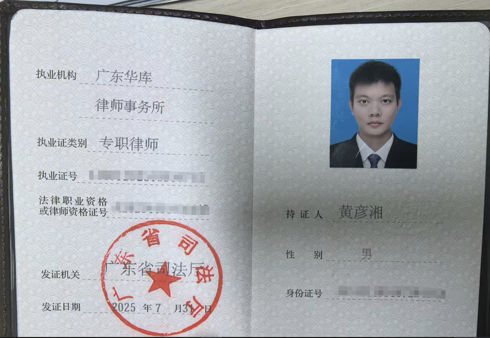

# 从〈大规模语言模型：从理论到实践〉看大学生未来发展的新维度

**书籍简介：**《大规模语言模型：从理论到实践》 | 张奇等复旦大学计算机学院教授团队 | 2024年
**核心价值：**国内首本系统性大模型技术专著,全流程覆盖预训练→指令微调→奖励建模→强化学习

**分享目的：**AI时代不是威胁,它可能是我们这一代人最大的机会。打破理论与实践的鸿沟,让AI成为我们真正可用的协作伙伴。

---

## 自我介绍：AI时代技术人的专属知识产权律师

**四重身份：**高级软件工程师 × 律师 × 专利代理师 × AI实践者
占位符：
占位符：

**广东华库律师事务所**
- 2025年全新创立,法律领域后起之秀
- **「匠・律」「锋・盾」「明・信」**三大建所理念
- 跨学科背景精英律师团队(医学、工程等)
- 业务涵盖:公司事务、知识产权、诉讼仲裁、工程建筑等

---

## 先给你看个震撼的

一个9岁小朋友,自己"写"了个游戏——

占位符：

---

## 你肯定想问:他怎么做到的？

既然你诚心诚意地发问了,那我就大发慈悲地告诉你

**其实就三步**

---

## 第1步:打开网站,说出你的想法

打开 https://v0.app/
输入:"帮我写一个贪吃蛇游戏"
然后...就没了

占位符：

---

## 第2步:不满意？边玩边改

"给我画一个太空皮肤"
AI:安排!

占位符：

---

## 第3步:代码归你,随便用

保存到自己的GitHub
下载到本地部署
**这代码,是你的了**

占位符：

---

## 律师遇到AI，又会发生什么？

有一天我突发奇想：
如果用AI提前演练法庭辩论...
那不就是**开了上帝视角**？

---

## 说干就干——结果把我自己吓到了

占位符：[AI法庭演示](../assets/AI模拟法庭.mp4)

---

## 等等——这跟大学生有啥关系？

你可能在想:律师用AI很牛,但我又不当律师...

**别急,再看两个例子**

---

## 例子1:写论文需要工具链？AI帮你搞定

占位符：[工具链使用](assets/工具链使用.mp4)

---

## 例子2:做演讲要炫酷PPT？AI也能搞定

占位符：[炫酷PPT](../assets/炫酷PPT.mp4)

---

## 所以...AI是不是无敌了？

**来,现在立刻——**
拿出你的手机
打开计算器
准备好了吗？

---

## 我数三个数:1...2...3!

**快算:4291×9831**

占位符：[心算](../assets/心算.mp4)

---

## 震惊!AI连9块9的计算器都算不过？

**为什么会这样？**

---

## 揭秘:AI为啥连乘法都算不对?

先说答案——

**计算器**:用电路做精确运算(硬件级别的数学家)
**AI**:靠统计规律"猜"答案(文科生硬算数学题)

> AI看到4291×9831,它不是在算
> 而是在猜:"这串数字看起来像什么?"
> 就像你猜英语完形填空一样

**所以AI不是不聪明,是用错地方了**

---

## 那AI是怎么训练出来的?

三个阶段,一步步教会AI——

---

## 阶段1:像婴儿学说话(无监督学习)

**场景还原:**
宝宝听爸妈说话
没人教语法
但慢慢就会说了

**AI也一样:**
- 给它3000亿本书(整个互联网的文字)
- 它自己找规律:"天空"后面经常跟"蓝色"
- 慢慢学会:"什么词后面通常跟什么词"

**这阶段AI学会了什么?**
→ 海量的语言知识库(但还不会用)

---

## 阶段2:像学生做作业(有监督学习)

**场景还原:**
老师给题目+标准答案
学生做错了,老师纠正
做多了,学生就会了

**AI也一样:**
- 人类给它大量"问题-答案"对
  - 问:"天为什么是蓝的?"
  - 答:"因为光的散射"
- AI不断调整,直到答对为止

**这阶段AI学会了什么?**
→ "看到这种问题,应该给这种答案"

---

## 阶段3:像学生考试(强化学习)

**场景还原:**
考试答对了→高分,老师表扬
答跑题了→低分,老师摇头
学生慢慢摸清了:"怎么答能拿高分"

**AI也一样:**
- 回答得好→给"高分"
- 回答得烂→给"低分"
- AI学会了:"怎样回答能拿高分"

**这阶段AI学会了什么?**
→ 不只是对,还要符合"评分标准"

**小结:AI是怎么炼成的**
婴儿学说话(攒知识) → 学生做作业(学答题) → 学生考试(迎合标准)

**所以AI不是在"思考",而是在"猜评分标准"**
这也解释了:为什么AI算不对乘法(没训练过数学运算)、为什么AI会一本正经地胡说八道(猜错了标准)

---

## 问个问题:AI怎么"想"问题的?

很多人以为——
AI = 超级搜索引擎
你问问题,它去"查书"

**大错特错!**

真相是:
**AI把书吃进肚子里了**

训练时:读3000亿本书
回答时:凭记忆"吐"答案

---

## 不信?我带你看一遍AI的大脑

你问:"天为什么是蓝的?"

AI大脑0.1秒内发生的事——

---

## Step 1:切词

"天为什么是蓝的"
→ 天/为什么/是/蓝/的

(AI只认"词",不认"句子")

---

## Step 2:查词典

天→1234号
为什么→5678号
...

(每个词都有专属编号)

---

## Step 3:转密码(核心!)

1234号→[0.23,-0.45,0.67,...]
5678号→[0.12,0.89,-0.34,...]

**这是AI能看懂的语言**

---

## Step 4:密码开启记忆库

密码一输入
→ 像钥匙开锁
→ "天空""蓝色""物理"相关记忆被激活
→ 就像你看到老照片,往事涌上心头

---

## Step 5:一个字一个字"蹦"答案

AI开始输出:
- 第一个字:"光"(90%概率会说这个)
- 第二个字:"的"(95%概率)
- 第三个字:"散射"(85%概率)
- ...一直"蹦"到说完

**注意!这不是一次性输出的**
**而是一个字一个字"猜"出来的**

---

## 所以你看

**AI不是在"找"答案**
**而是在"生成"答案**

就像:
- 你凭记忆复述一本书
- 而不是翻开书念原文

**这就是为什么AI会"一本正经地胡说八道"**
→ 因为它是凭"记忆"在说
→ 记忆可能模糊、混淆、甚至瞎编
→ 就像你讲故事时会"脑补"细节

---

## 所以,AI到底行不行?

先说结论——

> "就像文学天才心算不如小学生"
> **专长领域不同,别用错地方**

---

## AI的三大超能力

### 1. 知识量碾压人类
你读100本书算博学
AI读了3000亿本书(全人类的书)

### 2. 找规律的天才
数据里藏着的模式
人类看不出来,AI一眼就看穿

### 3. 瞬间调用全球知识
你去图书馆找资料要1小时
AI 0.1秒搞定

**AI就像拥有全人类记忆的百科全书**

---

## 但AI有三个致命弱点

### 1. 只会"猜",不会"懂"
AI基于概率说话
不是真正理解意思
就像鹦鹉学舌

### 2. 没法在现实世界试错
人类:尝试→失败→学习→成长
AI:训练完就"冻结"了,不能自己去试

### 3. 会一本正经地胡说八道
网上谣言多?
AI可能把谣言当真理
因为它分不清真假,只看"出现频率"

---

## 记住这个

**AI不是万能的**
**但用对地方,它就是超能力**

---

## 那人类、AI、计算机,到底是怎样的关系?

一个比喻说清楚——**写毕业论文时:**

### 计算机:精确工具人
- 帮你算数据:1+1绝对等于2
- 存储文件:不会丢,不会错
- 跑统计软件:SPSS、Python
**定位:精确执行者**

### AI:超级实习生
- 帮你找资料:瞬间检索全网
- 给你提建议:"这个角度可以试试"
- 帮你润色:语言更通顺
**定位:智能助手**

### 你(人类):最终拍板者
- 定论文方向:"我要研究这个"
- 判断资料靠不靠谱:"这个AI说的不对"
- 决定逻辑结构:"我这样安排"
- **最后签名负责**
**定位:价值创造者**

---

## 关键!AI不是万能的,也不是废物

**四种错误姿势:**
1. "AI啥都不是"→太小看它了
2. "AI万能无敌"→想多了
3. "AI就是个工具"→低估了它的理解能力
4. "AI说的都对"→危险!

**正确姿势:**
> "把AI当成非常厉害的实习生"

什么意思?
- 它很聪明,但需要你指导
- 它能干活,但你得把关
- 它会犯错,你要负责

---

## 黄金法则:人决策,AI执行,人承责

**人类负责:**
- 定方向(做什么)
- 做判断(对不对)
- 担责任(出事我负责)

**AI负责:**
- 想办法(怎么做)
- 提建议(有几个方案)
- 干活(帮你执行)

**计算机负责:**
- 精确算(数学题交给我)
- 存数据(不会丢)

**核心:**
> 人类的经验智慧 + AI的统计智慧 = 1+1>2

---

## 前沿展望:AI还能进化成什么样?

---

## 先来三个灵魂拷问

**问题1:**：中国承诺2035年前温室气体排放量从峰值减少多少?

**问题2:**：最新发布的中国PMI数据是多少?

**问题3:**：第四届全球数字贸易博览会本月在哪举办的?

AI知道吗?

---

## 答案:AI全不知道!

为什么?

---

## AI的三大"硬伤"

还记得AI是"凭记忆生成答案"吗?
这个机制有三个天然BUG:

### 硬伤1:记忆会过期
- DeepSeek V3的记忆停在2024年7月
- 之后发生的事?不知道
- 就像你脑子里的知识永远停在高考那天

### 硬伤2:只会说不会做
- AI只能给建议:"你应该这样..."
- 但它没有"手",不能帮你执行
- 就像军师只出主意,不能上战场

### 硬伤3:健忘症晚期
- 聊久了就忘了开头说啥
- 角色设定会漂移
- 就像金鱼,只有7秒记忆

---

## 怎么破?四大"外挂"来了

### 外挂1:RAG(给AI装个Google)

**问题:**记忆过期怎么办?
**方案:**让AI能"实时查资料"

**打个比方:**
- 普通AI:闭卷考试,全靠背的
- RAG增强AI:开卷考试,不会就查

DeepSeek V3记忆停在2024年7月?
没关系,装个RAG,实时查今天的新闻!

---

## 外挂2:Tool Use(给AI装上手)

**问题:**只会说不会做怎么办?
**方案:**让AI能操作工具

**AI能用的工具:**
- 计算器:解决算不对乘法的问题
- 浏览器:自己上网搜信息
- Python:自己写代码跑数据
- Midjourney:自己画图
- 文件系统:自己读写文件

**现在AI不只会说,还会做了**

---

## 外挂3:Memory(给AI装个硬盘)

**问题:**健忘症怎么办?
**方案:**让AI记住你们的对话

**两种记忆:**
- 短期记忆:今天聊了啥
- 长期记忆:你的习惯、偏好、历史对话

**效果:**
用得越久,AI越懂你

---

## 外挂4:Agent(四合一终极形态)

**Agent = 大脑 + 记忆 + 规划 + 手**

| 组件 | 作用 | 就像人的... |
|------|------|------------|
| LLM | 理解和说话 | 语言中枢 |
| Memory | 记住东西 | 海马体 |
| Planning | 拆解任务 | 前额叶 |
| Tool Use | 操作工具 | 手 |

**普通AI vs Agent:**

| 对比 | 普通AI | Agent |
|-----|--------|-------|
| 记忆 | 金鱼记忆 | 记得你 |
| 任务 | 只能聊天 | 能干活 |
| 工具 | 没有手 | 有手有工具 |
| 专业 | 万金油 | 专家级 |

**Agent就是有"手"能干活、有"脑"会规划、有"记忆"懂你的AI**

---

## 但是!RAG也不是万能的

来看两个例子:

**例子1:"我喜欢苹果"
- 在手机店说→指iPhone
- 在水果店说→指水果

**RAG能解决吗?**
不能!因为RAG只会"找相似的词",它分不清你在哪个情境

**例子2:"我喜欢吃热狗"
- 人类理解:hot dog(面包夹香肠)
- AI分词:我/喜欢/吃/热/狗
- AI理解:吃温暖的狗???

**RAG能解决吗?**
不能!因为"热狗"不是"热"+"狗"
这是个完整概念

---

## RAG的本质问题

**RAG做了三件事:**
1. 检索:找到相似的文档
2. 拼接:把文档塞进提示词
3. 生成:基于拼接内容回答

**问题在哪?**
- 检索≠理解(只是找文字相似的)
- 拼接≠消化(没有真正吸收)
- 生成≠认知(还是在"猜")

**打个比方:**
> RAG就像开卷考试
> 你能翻书找答案
> 但不代表你真懂了知识

---

## 下一代AI:从"查书"到"真懂"

**三个进化方向:**

### 进化1:从向量到语义
- 现在:把"苹果"变成一串数字
- 未来:理解"苹果"在不同情境的真实意思
- **让AI有"情境感知"能力**

### 进化2:从拼接到消化
- 现在:查资料然后复述
- 未来:真正"吃进肚子里"形成自己的知识
- **让AI能用自己的话解释**

### 进化3:从统计到理解
- 现在:"这个词后面通常跟什么词"
- 未来:理解概念之间的真实关系
- **让AI知道"草莓"不是"草"+"莓"**

---

## 下一代AI:从"查书"到"真懂"

**三个进化方向:**

**进化1:从向量到语义** - 让AI有"情境感知"能力,理解"苹果"在不同情境的真实意思

**进化2:从拼接到消化** - 让AI能用自己的话解释,真正"吃进肚子里"形成自己的知识

**进化3:从统计到理解** - 让AI知道"热狗"不是"热"+"狗",理解概念之间的真实关系

**PromptX的探索:**
我们在研究让AI拥有更像人的认知系统——不只是统计智慧,更有语义理解和情境感知。让你的AI有自己的"知识体系",而不是所有人共用一个"向量空间",它会真正"懂"你的意思。**这是AI的下一个时代**

---

## 说了这么多理论,给你看点实在的

**我的真实经历:2个月从零到"专家"**

**2个月前的我:**
- 律师一个,从不读小说
- 零文学天赋,零创作经验
- 就是个普通人

**2个月后的我:**
- 6场分享(3场线下+3场线上)
- 定义了SAGA方法论+SOUL方法论
- 从"小白"到"能教别人"

**关键是什么?**
→ 干中学!边用AI边学习

---

**证据在这:**

20250830 广州分享
占位符：

20250920 长沙分享
占位符：

20250927 广州分享
占位符：

**你也可以!**

---

## Deepractice社区介绍

**一句话:让AI成为每个人的超能力**

我们是谁?
- 不只是知识分享社区
- 更是AI智能协作平台
- 帮你把想法变成现实

---

**创始人:姜山(Sean)** - 中南民族大学自动化专业 | 微众银行技术背景 | 连续创业者 | 矛盾论驱动的产品思维 | 理念:开放、分享、共创

**我们的"秘密武器":PromptX**

**三大核心能力:**
1. AI角色创造平台(让AI变专家)
2. 智能工具平台(让AI能干活)
3. 认知记忆系统(让AI懂你)

**成绩单:**
- 2025年5月15日开源
- 已获2.7K+ GitHub Stars
- MacOS/Windows桌面端已发布

**项目地址:**
https://github.com/Deepractice/PromptX

---

### 想深入了解?来这里

**社区论坛**
2K+ AI爱好者聚集地
→ x.deepractice.ai

**播客频道**
AI探讨和行业洞察
→ xiaoyuzhoufm.com/podcast/67bc12b63347fd01f19109ab

**哔哩哔哩**
项目教程、视频、直播回放
→ space.bilibili.com/277448879

**公众号**
AI深度实践

---

## 最后,送你们一句话

**AI时代,最大的风险不是AI太强**
**而是你还在观望**
**机会,属于行动者!**

---

## 联系我们

占位符：
占位符：

**扫码加入,一起探索AI的无限可能**
